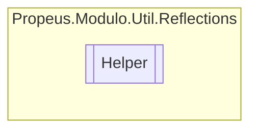

# Helper `class`

## Description
Classe de ajuda para reflection

## Diagram


## Members
### Methods
#### Public Static methods
| Returns | Name |
| --- | --- |
| `void` | [`DisposeILGenerator`](#disposeilgenerator)(`ILGenerator` ilGen)<br>Libera objetos da memoria durante a utlizacao do ILGenerator |
| `void` | [`DisposeMethod`](#disposemethod)(`MethodBuilder` mb)<br>Libera objetos da memoria durante a utlizacao do MethodBuilder |
| `void` | [`DisposeModuleBuilder`](#disposemodulebuilder)(`ModuleBuilder` modBuild, `string` nome)<br>Libera objetos da memoria durante a utlizacao do ModuleBuilder |
| `void` | [`DisposeSignature`](#disposesignature)(`SignatureHelper` sh)<br>Libera objetos da memoria durante a utlizacao do SignatureHelper |
| `void` | [`DisposeTypeBuilder`](#disposetypebuilder)(`TypeBuilder` tb)<br>Libera objetos da memoria durante a utlizacao do TypeBuilder |
| `string` | [`HashMetodoMethodInfo`](#hashmetodomethodinfo)(`MethodInfo` methodInfo) |
| `IEnumerable`&lt;`Type`&gt; | [`ObterTipoParametros`](#obtertipoparametros-12)(`...`)<br>Obtem os tipos dos parametros do construtor selecionado |

## Details
### Summary
Classe de ajuda para reflection

### Methods
#### ObterTipoParametros [1/2]
```csharp
public static IEnumerable<Type> ObterTipoParametros(ConstructorInfo action)
```
##### Arguments
| Type | Name | Description |
| --- | --- | --- |
| `ConstructorInfo` | action |  |

##### Summary
Obtem os tipos dos parametros do construtor selecionado

##### Returns


##### Exceptions
| Name | Description |
| --- | --- |
| ArgumentNullException | Argumento nulo |

#### ObterTipoParametros [2/2]
```csharp
public static IEnumerable<Type> ObterTipoParametros(MethodInfo action)
```
##### Arguments
| Type | Name | Description |
| --- | --- | --- |
| `MethodInfo` | action |  |

##### Summary
Obtem os tipos dos parametros do metodo selecionado

##### Returns


##### Exceptions
| Name | Description |
| --- | --- |
| ArgumentNullException | Argumento nulo |

#### DisposeTypeBuilder
```csharp
public static void DisposeTypeBuilder(TypeBuilder tb)
```
##### Arguments
| Type | Name | Description |
| --- | --- | --- |
| `TypeBuilder` | tb | A instancia do TypeBuilder |

##### Summary
Libera objetos da memoria durante a utlizacao do TypeBuilder

##### Remarks
Este metodo e necessario para evitar vazamentos de memoria

#### DisposeMethod
```csharp
public static void DisposeMethod(MethodBuilder mb)
```
##### Arguments
| Type | Name | Description |
| --- | --- | --- |
| `MethodBuilder` | mb | A instancia do MethodBuilder |

##### Summary
Libera objetos da memoria durante a utlizacao do MethodBuilder

##### Remarks
Este metodo e necessario para evitar vazamentos de memoria

#### DisposeSignature
```csharp
public static void DisposeSignature(SignatureHelper sh)
```
##### Arguments
| Type | Name | Description |
| --- | --- | --- |
| `SignatureHelper` | sh | A instancia do SignatureHelper |

##### Summary
Libera objetos da memoria durante a utlizacao do SignatureHelper

##### Remarks
Este metodo e necessario para evitar vazamentos de memoria

#### DisposeILGenerator
```csharp
public static void DisposeILGenerator(ILGenerator ilGen)
```
##### Arguments
| Type | Name | Description |
| --- | --- | --- |
| `ILGenerator` | ilGen | A instancia do ILGenerator |

##### Summary
Libera objetos da memoria durante a utlizacao do ILGenerator

##### Remarks
Este metodo e necessario para evitar vazamentos de memoria

#### DisposeModuleBuilder
```csharp
public static void DisposeModuleBuilder(ModuleBuilder modBuild, string nome)
```
##### Arguments
| Type | Name | Description |
| --- | --- | --- |
| `ModuleBuilder` | modBuild | A instancia do ModuleBuilder |
| `string` | nome | Nome do tipo que possui o metodo |

##### Summary
Libera objetos da memoria durante a utlizacao do ModuleBuilder

##### Remarks
Este metodo e necessario para evitar vazamentos de memoria

#### HashMetodoMethodInfo
```csharp
public static string HashMetodoMethodInfo(MethodInfo methodInfo)
```
##### Arguments
| Type | Name | Description |
| --- | --- | --- |
| `MethodInfo` | methodInfo |   |

*Generated with* [*ModularDoc*](https://github.com/hailstorm75/ModularDoc)
