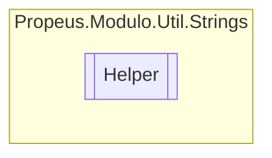

# Helper `class`

## Description
Classe de ajuda para string

## Diagram


## Members
### Methods
#### Public Static methods
| Returns | Name |
| --- | --- |
| `byte``[]` | [`ToArrayByte`](#toarraybyte)(`string` obj)<br>Converte uma String em um array de bytes |

## Details
### Summary
Classe de ajuda para string

### Methods
#### ToArrayByte
```csharp
public static byte ToArrayByte(string obj)
```
##### Arguments
| Type | Name | Description |
| --- | --- | --- |
| `string` | obj | Qualquer objeto do tipo String |

##### Summary
Converte uma String em um array de bytes

##### Returns


##### Exceptions
| Name | Description |
| --- | --- |
| ArgumentNullException | Argumento nulo |

*Generated with* [*ModularDoc*](https://github.com/hailstorm75/ModularDoc)
