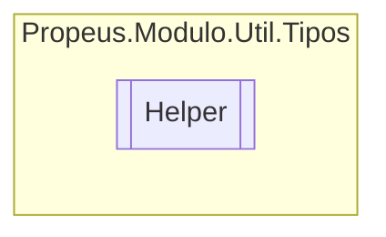

# Helper `class`

## Description
Classe de ajuda para o tipo Type

## Diagram


## Members
### Methods
#### Public Static methods
| Returns | Name |
| --- | --- |
| `object` | [`Default`](#default)(`Type` obj)<br>Obtem o valor padrão do tipo passado no parametro `obj` |
| `bool` | [`Herdado`](#herdado-12)(`...`)<br>Verifica se o tipo é herdado do tipo passado no parametro `comparacao` |
| `bool` | [`Is`](#is-12)(`...`) |
| `bool` | [`IsVoid`](#isvoid)(`Type` type)<br>Verifica se o tipo é void |

## Details
### Summary
Classe de ajuda para o tipo Type

### Methods
#### Herdado [1/2]
```csharp
public static bool Herdado(Type obj, Type comparacao)
```
##### Arguments
| Type | Name | Description |
| --- | --- | --- |
| `Type` | obj | Tipo a ser verificado |
| `Type` | comparacao | Tipo a ser comparado |

##### Summary
Verifica se o tipo é herdado do tipo passado no parametro `comparacao`

##### Returns


##### Exceptions
| Name | Description |
| --- | --- |
| ArgumentNullException | Argumento nulo |
| ArgumentException | Argumento invalido |

#### Herdado [2/2]
```csharp
public static bool Herdado<T>(Type type)
where T : 
```
##### Arguments
| Type | Name | Description |
| --- | --- | --- |
| `Type` | type |   |

#### Is [1/2]
```csharp
public static bool Is<T>(Type obj)
where T : 
```
##### Arguments
| Type | Name | Description |
| --- | --- | --- |
| `Type` | obj |   |

#### Is [2/2]
```csharp
public static bool Is(Type obj, Type comparacao)
```
##### Arguments
| Type | Name | Description |
| --- | --- | --- |
| `Type` | obj | Tipo a ser validado |
| `Type` | comparacao | Tipo a ser comparado |

##### Summary
Verifica se o tipo do parâmetro `obj` é igual ou herdado de `comparacao`

##### Returns


##### Exceptions
| Name | Description |
| --- | --- |
| ArgumentNullException | Argumento nulo |
| ArgumentException | Argumento invalido |

#### IsVoid
```csharp
public static bool IsVoid(Type type)
```
##### Arguments
| Type | Name | Description |
| --- | --- | --- |
| `Type` | type |  |

##### Summary
Verifica se o tipo é void

##### Returns


#### Default
```csharp
public static object Default(Type obj)
```
##### Arguments
| Type | Name | Description |
| --- | --- | --- |
| `Type` | obj |  |

##### Summary
Obtem o valor padrão do tipo passado no parametro `obj`

##### Returns


*Generated with* [*ModularDoc*](https://github.com/hailstorm75/ModularDoc)
