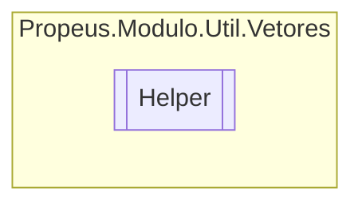

# Helper `class`

## Description
Classe de ajuda para vetores

## Diagram


## Members
### Methods
#### Public Static methods
| Returns | Name |
| --- | --- |
| `string` | [`Hash`](#hash-12)(`...`)<br>Obtem o hash de um array de bytes |

## Details
### Summary
Classe de ajuda para vetores

### Methods
#### Hash [1/2]
```csharp
public static string Hash(byte[] bytes)
```
##### Arguments
| Type | Name | Description |
| --- | --- | --- |
| `byte``[]` | bytes |  |

##### Summary
Obtem o hash de um array de bytes

##### Returns


##### Exceptions
| Name | Description |
| --- | --- |
| ArgumentNullException |  |

#### Hash [2/2]
```csharp
public static string Hash(ReadOnlySpan<byte> bytes)
```
##### Arguments
| Type | Name | Description |
| --- | --- | --- |
| `ReadOnlySpan`&lt;`byte`&gt; | bytes |   |

*Generated with* [*ModularDoc*](https://github.com/hailstorm75/ModularDoc)
