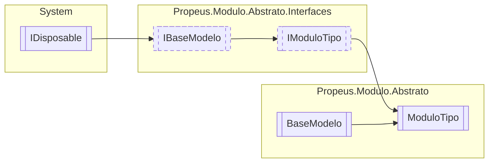

# ModuloTipo `class`

## Description
Informa detalhes sobre o modulo instanciado

## Diagram


## Members
### Properties
#### Public  properties
| Type | Name | Methods |
| --- | --- | --- |
| `bool` | [`Coletado`](#coletado)<br>Informa se o modulo foi coletado pelo GC | `get` |
| `bool` | [`Elimindado`](#elimindado)<br>Informa se o modulo foi eliminado da aplicação | `get` |
| `string` | [`IdModulo`](#idmodulo) | `get` |
| `bool` | [`InstanciaUnica`](#instanciaunica)<br>Informa se o modulo é instancia unica | `get` |
| [`IModulo`](./propeusmoduloabstratointerfaces-IModulo) | [`Modulo`](#modulo)<br>Instancia do modulo | `get` |
| `Type` | [`TipoModulo`](#tipomodulo)<br>Tipo do modulo | `get` |
| `Type` | [`TipoModuloDinamico`](#tipomodulodinamico) | `get, set` |
| `string` | [`Versao`](#versao) | `get` |
| `WeakReference` | [`WeakReference`](#weakreference)<br>Informações sobre o modulo na visão do GC | `get, protected set` |

### Methods
#### Public  methods
| Returns | Name |
| --- | --- |
| `string` | [`ToString`](#tostring)() |

#### Protected  methods
| Returns | Name |
| --- | --- |
| `void` | [`Dispose`](#dispose)(`bool` disposing) |

## Details
### Summary
Informa detalhes sobre o modulo instanciado

### Inheritance
 - [
`IModuloTipo`
](./propeusmoduloabstratointerfaces-IModuloTipo)
 - [
`IBaseModelo`
](./propeusmoduloabstratointerfaces-IBaseModelo)
 - `IDisposable`
 - [
`BaseModelo`
](./propeusmoduloabstrato-BaseModelo)

### Constructors
#### ModuloTipo
```csharp
public ModuloTipo(IModulo modulo)
```
##### Arguments
| Type | Name | Description |
| --- | --- | --- |
| [`IModulo`](./propeusmoduloabstratointerfaces-IModulo) | modulo |   |

### Methods
#### ToString
```csharp
public override string ToString()
```

#### Dispose
```csharp
protected override void Dispose(bool disposing)
```
##### Arguments
| Type | Name | Description |
| --- | --- | --- |
| `bool` | disposing |   |

### Properties
#### Versao
```csharp
public override string Versao { get; }
```

#### Coletado
```csharp
public virtual bool Coletado { get; }
```
##### Summary
Informa se o modulo foi coletado pelo GC

#### Elimindado
```csharp
public virtual bool Elimindado { get; }
```
##### Summary
Informa se o modulo foi eliminado da aplicação

#### WeakReference
```csharp
public WeakReference WeakReference { get; protected set; }
```
##### Summary
Informações sobre o modulo na visão do GC

#### Modulo
```csharp
public virtual IModulo Modulo { get; }
```
##### Summary
Instancia do modulo

#### TipoModulo
```csharp
public virtual Type TipoModulo { get; }
```
##### Summary
Tipo do modulo

#### InstanciaUnica
```csharp
public virtual bool InstanciaUnica { get; }
```
##### Summary
Informa se o modulo é instancia unica

#### IdModulo
```csharp
public virtual string IdModulo { get; }
```

#### TipoModuloDinamico
```csharp
public Type TipoModuloDinamico { get; set; }
```

*Generated with* [*ModularDoc*](https://github.com/hailstorm75/ModularDoc)
