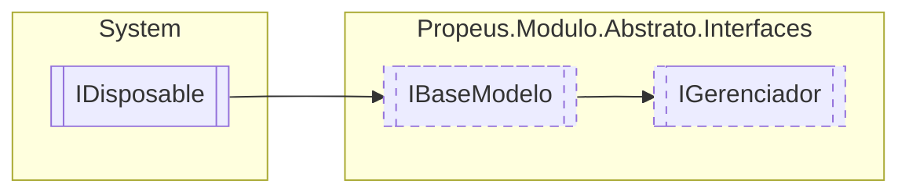

# IGerenciador `interface`

## Description
Modelo base para criação de gerenciadores

## Diagram


## Members
### Methods
#### Public  methods
| Returns | Name |
| --- | --- |
| `T` | [`Criar`](#criar-13)(`...`) |
| `bool` | [`Existe`](#existe-13)(`...`)<br>Verifica se a instancia do modulo existe no genrenciador |
| `IEnumerable`&lt;[`IModulo`](./propeusmoduloabstratointerfaces-IModulo)&gt; | [`Listar`](#listar)()<br>Lista todos os modulos |
| `Task` | [`ManterVivoAsync`](#mantervivoasync)()<br>Mantem o gerenciador vivo durante o uso da aplicação |
| `T` | [`Obter`](#obter-13)(`...`) |
| `T` | [`Reiniciar`](#reiniciar-12)(`...`) |
| `void` | [`Remover`](#remover-12)(`...`)<br>Remove um modulo pelo seu ID |
| `void` | [`RemoverTodos`](#removertodos)()<br>Remove todos os modulos |

## Details
### Summary
Modelo base para criação de gerenciadores

### Inheritance
 - [
`IBaseModelo`
](./propeusmoduloabstratointerfaces-IBaseModelo)
 - `IDisposable`

### Methods
#### Criar [1/3]
```csharp
public T Criar<T>(object[] args)
where T : IModulo
```
##### Arguments
| Type | Name | Description |
| --- | --- | --- |
| `object``[]` | args |   |

#### Criar [2/3]
```csharp
public IModulo Criar(Type modulo, object[] args)
```
##### Arguments
| Type | Name | Description |
| --- | --- | --- |
| `Type` | modulo |  |
| `object``[]` | args |  |

##### Summary
Cria uma nova instancia do modulo usando o tipo do parametro `modulo`

##### Returns


#### Criar [3/3]
```csharp
public IModulo Criar(string nomeModulo, object[] args)
```
##### Arguments
| Type | Name | Description |
| --- | --- | --- |
| `string` | nomeModulo | Nome do modulo |
| `object``[]` | args | Argumentos a serem enviadoss |

##### Summary
Cria uma nova instancia do modulo buscando o tipo pelo nome

##### Returns


#### Remover [1/2]
```csharp
public void Remover(string id)
```
##### Arguments
| Type | Name | Description |
| --- | --- | --- |
| `string` | id | Identificação unica do modulo |

##### Summary
Remove um modulo pelo seu ID

#### Remover [2/2]
```csharp
public void Remover<T>(T modulo)
where T : IModulo
```
##### Arguments
| Type | Name | Description |
| --- | --- | --- |
| `T` | modulo |   |

#### RemoverTodos
```csharp
public void RemoverTodos()
```
##### Summary
Remove todos os modulos

#### Obter [1/3]
```csharp
public T Obter<T>()
where T : IModulo
```

#### Obter [2/3]
```csharp
public IModulo Obter(Type type)
```
##### Arguments
| Type | Name | Description |
| --- | --- | --- |
| `Type` | type |  |

##### Summary
Obtem a instancia de `type` caso exista 


##### Returns


#### Obter [3/3]
```csharp
public IModulo Obter(string id)
```
##### Arguments
| Type | Name | Description |
| --- | --- | --- |
| `string` | id | Identificação unica do modulo |

##### Summary
Obtem a instancia do modulo pelo id

##### Returns


#### Existe [1/3]
```csharp
public bool Existe(IModulo modulo)
```
##### Arguments
| Type | Name | Description |
| --- | --- | --- |
| [`IModulo`](./propeusmoduloabstratointerfaces-IModulo) | modulo |  |

##### Summary
Verifica se a instancia do modulo existe no genrenciador

##### Returns


#### Existe [2/3]
```csharp
public bool Existe(Type type)
```
##### Arguments
| Type | Name | Description |
| --- | --- | --- |
| `Type` | type |  |

##### Summary
Verifica se existe alguma instancia do tipo no gerenciador

##### Returns


#### Existe [3/3]
```csharp
public bool Existe(string id)
```
##### Arguments
| Type | Name | Description |
| --- | --- | --- |
| `string` | id | Identificação unica do modulo |

##### Summary
Verifica se existe alguma instancia com o id no gerenciador

##### Returns


#### Reiniciar [1/2]
```csharp
public T Reiniciar<T>(T modulo)
where T : IModulo
```
##### Arguments
| Type | Name | Description |
| --- | --- | --- |
| `T` | modulo |   |

#### Reiniciar [2/2]
```csharp
public IModulo Reiniciar(string id)
```
##### Arguments
| Type | Name | Description |
| --- | --- | --- |
| `string` | id | Identificação unica do modulo |

##### Summary
Realiza uma reciclagem do modulo

##### Returns


#### Listar
```csharp
public IEnumerable<IModulo> Listar()
```
##### Summary
Lista todos os modulos

##### Returns


#### ManterVivoAsync
```csharp
public Task ManterVivoAsync()
```
##### Summary
Mantem o gerenciador vivo durante o uso da aplicação

##### Returns


*Generated with* [*ModularDoc*](https://github.com/hailstorm75/ModularDoc)
