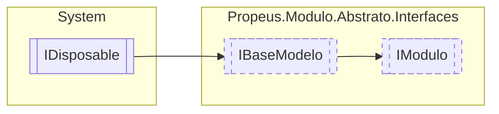

# IModulo `interface`

## Description
Modelo base para criação de modulos

## Diagram


## Members
### Properties
#### Public  properties
| Type | Name | Methods |
| --- | --- | --- |
| `bool` | [`InstanciaUnica`](#instanciaunica)<br>Informa se o modulo é instancia unica | `get` |

## Details
### Summary
Modelo base para criação de modulos

### Inheritance
 - [
`IBaseModelo`
](./propeusmoduloabstratointerfaces-IBaseModelo)
 - `IDisposable`

### Properties
#### InstanciaUnica
```csharp
public bool InstanciaUnica { get; }
```
##### Summary
Informa se o modulo é instancia unica

*Generated with* [*ModularDoc*](https://github.com/hailstorm75/ModularDoc)
