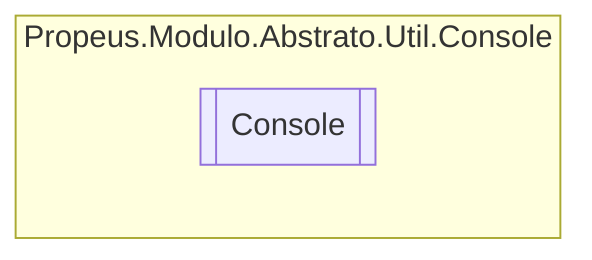

# Console `class`

## Diagram


## Members
### Methods
#### Public Static methods
| Returns | Name |
| --- | --- |
| `string` | [`ReadLine`](#readline)(`CancellationToken` cancellationToken) |

## Details
### Methods
#### ReadLine
```csharp
public static string ReadLine(CancellationToken cancellationToken)
```
##### Arguments
| Type | Name | Description |
| --- | --- | --- |
| `CancellationToken` | cancellationToken |   |

*Generated with* [*ModularDoc*](https://github.com/hailstorm75/ModularDoc)
