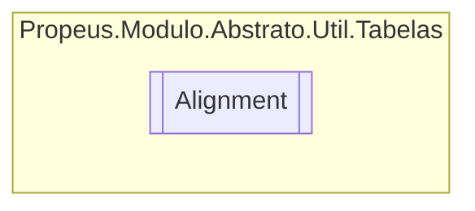

# Alignment `enum`

## Diagram

```mermaid
  flowchart LR
  classDef interfaceStyle stroke-dasharray: 5 5;
  classDef abstractStyle stroke-width:4px
  subgraph Propeus.Modulo.Abstrato.Util.Tabelas
  Propeus.Modulo.Abstrato.Util.Tabelas.Alignment[[Alignment]]
  end
```

## Details
### Fields
#### Left

#### Right

*Generated with* [*ModularDoc*](https://github.com/hailstorm75/ModularDoc)
