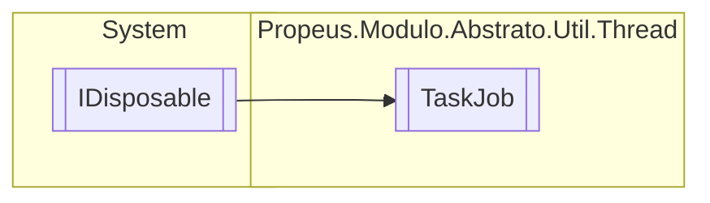

# TaskJob `class`

## Diagram


## Members
### Properties
#### Public  properties
| Type | Name | Methods |
| --- | --- | --- |
| `int` | [`Aguardando`](#aguardando) | `get` |
| `int` | [`Completado`](#completado) | `get` |
| `int` | [`EmExecucao`](#emexecucao) | `get` |

### Methods
#### Public  methods
| Returns | Name |
| --- | --- |
| `Task` | [`AddJob`](#addjob)(`Action`&lt;`object`&gt; action, `TimeSpan` period, `string` nomeJob) |
| `void` | [`Dispose`](#dispose-22)() |
| `bool` | [`IsCompleted`](#iscompleted)() |
| `string` | [`ToString`](#tostring)() |
| `string` | [`ToStringRunning`](#tostringrunning)() |
| `Task` | [`WaitAll`](#waitall)() |

#### Protected  methods
| Returns | Name |
| --- | --- |
| `void` | [`Dispose`](#dispose-12)(`bool` disposing) |

## Details
### Inheritance
 - `IDisposable`

### Constructors
#### TaskJob
```csharp
public TaskJob(int threads)
```
##### Arguments
| Type | Name | Description |
| --- | --- | --- |
| `int` | threads |   |

### Methods
#### WaitAll
```csharp
public Task WaitAll()
```

#### IsCompleted
```csharp
public bool IsCompleted()
```

#### AddJob
```csharp
public Task AddJob(Action<object> action, TimeSpan period, string nomeJob)
```
##### Arguments
| Type | Name | Description |
| --- | --- | --- |
| `Action`&lt;`object`&gt; | action |   |
| `TimeSpan` | period |   |
| `string` | nomeJob |   |

#### ToStringRunning
```csharp
public string ToStringRunning()
```

#### ToString
```csharp
public override string ToString()
```

#### Dispose [1/2]
```csharp
protected virtual void Dispose(bool disposing)
```
##### Arguments
| Type | Name | Description |
| --- | --- | --- |
| `bool` | disposing |   |

#### Dispose [2/2]
```csharp
public virtual void Dispose()
```

### Properties
#### EmExecucao
```csharp
public int EmExecucao { get; }
```

#### Completado
```csharp
public int Completado { get; }
```

#### Aguardando
```csharp
public int Aguardando { get; }
```

*Generated with* [*ModularDoc*](https://github.com/hailstorm75/ModularDoc)
