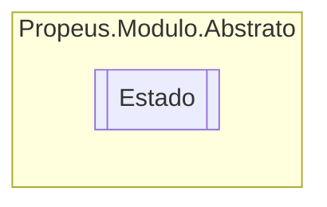

# Estado `enum`

## Description
Informa o estado do modulo

## Diagram

## Details
### Summary
Informa o estado do modulo

### Fields
#### Desligado
##### Summary
Define que o modulo foi eliminado pelo gerenciador ou foi chamado o IDisposable externamente

#### Inicializado
##### Summary
Define que o modulo foi inicializado com sucesso.

#### Erro
##### Summary
Define que durante a execução do modulo acionado alguma Exception

#### DesligamentoForcado
##### Summary
Define que durante o desligamento do modulo houve alguma exceção

*Generated with* [*ModularDoc*](https://github.com/hailstorm75/ModularDoc)
