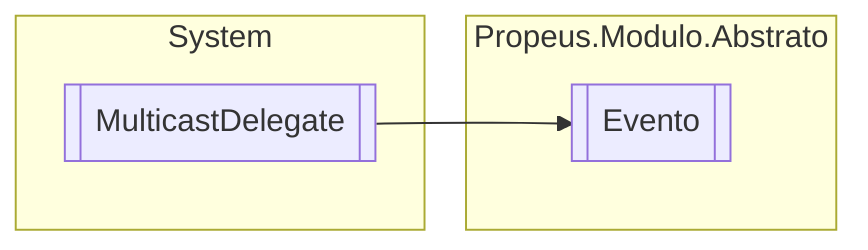

# Evento `class`

## Description
Delegate base para invocação de eventos

## Diagram


## Members
### Methods
#### Public  methods
| Returns | Name |
| --- | --- |
| `IAsyncResult` | [`BeginInvoke`](#begininvoke)(`object``[]` args, `AsyncCallback` callback, `object` object) |
| `void` | [`EndInvoke`](#endinvoke)(`IAsyncResult` result) |
| `void` | [`Invoke`](#invoke)(`object``[]` args) |

## Details
### Summary
Delegate base para invocação de eventos

### Inheritance
 - `MulticastDelegate`

### Constructors
#### Evento
[*Source code*](https://github.com///blob//src/Propeus.Modulo.Dinamico/Gerenciador.cs#L118)
```csharp
public Evento(object object, IntPtr method)
```
##### Arguments
| Type | Name | Description |
| --- | --- | --- |
| `object` | object |   |
| `IntPtr` | method |   |

### Methods
#### Invoke
[*Source code*](https://github.com///blob//src/Propeus.Modulo.Dinamico/Gerenciador.cs#L178)
```csharp
public virtual void Invoke(object[] args)
```
##### Arguments
| Type | Name | Description |
| --- | --- | --- |
| `object``[]` | args |   |

#### BeginInvoke
[*Source code*](https://github.com///blob//src/Propeus.Modulo.Dinamico/Gerenciador.cs#L182)
```csharp
public virtual IAsyncResult BeginInvoke(object[] args, AsyncCallback callback, object object)
```
##### Arguments
| Type | Name | Description |
| --- | --- | --- |
| `object``[]` | args |   |
| `AsyncCallback` | callback |   |
| `object` | object |   |

#### EndInvoke
[*Source code*](https://github.com///blob//src/Propeus.Modulo.Dinamico/Gerenciador.cs#L189)
```csharp
public virtual void EndInvoke(IAsyncResult result)
```
##### Arguments
| Type | Name | Description |
| --- | --- | --- |
| `IAsyncResult` | result |   |

*Generated with* [*ModularDoc*](https://github.com/hailstorm75/ModularDoc)
