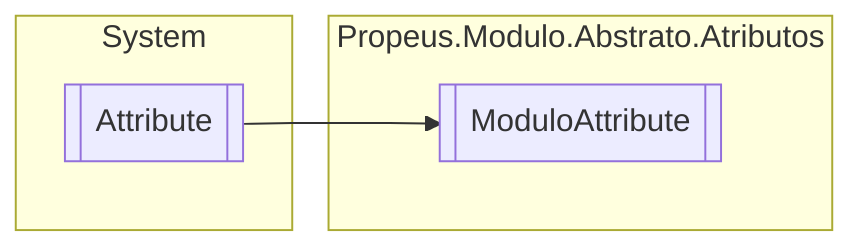

# ModuloAttribute `class`

## Description
Identificador de extremidade de um modulo

## Diagram


## Details
### Summary
Identificador de extremidade de um modulo

### Inheritance
 - `Attribute`

### Constructors
#### ModuloAttribute
[*Source code*](https://github.com///blob//src/Propeus.Modulo.IL/Geradores/ILCampo.cs#L21)
```csharp
public ModuloAttribute()
```

*Generated with* [*ModularDoc*](https://github.com/hailstorm75/ModularDoc)
