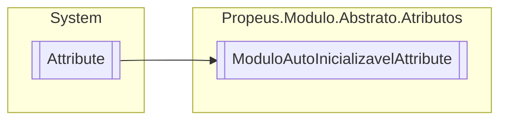

# ModuloAutoInicializavelAttribute `class`

## Description
Indica se o modulo marcado deve ser inicializado após o mapeamento

## Diagram


## Details
### Summary
Indica se o modulo marcado deve ser inicializado após o mapeamento

### Inheritance
 - `Attribute`

### Constructors
#### ModuloAutoInicializavelAttribute
[*Source code*](https://github.com///blob//src/Propeus.Modulo.IL/Geradores/ILGerador.cs#L15)
```csharp
public ModuloAutoInicializavelAttribute()
```

*Generated with* [*ModularDoc*](https://github.com/hailstorm75/ModularDoc)
