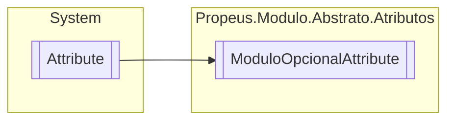

# ModuloOpcionalAttribute `class`

## Description
Informa se o modulo atual é opcional a sua instancia

## Diagram


## Details
### Summary
Informa se o modulo atual é opcional a sua instancia

### Inheritance
 - `Attribute`

### Constructors
#### ModuloOpcionalAttribute
[*Source code*](https://github.com///blob//src/Propeus.Modulo.Abstrato/Atributos/ModuloOpcionalAttribute.cs#L11)
```csharp
public ModuloOpcionalAttribute()
```

*Generated with* [*ModularDoc*](https://github.com/hailstorm75/ModularDoc)
