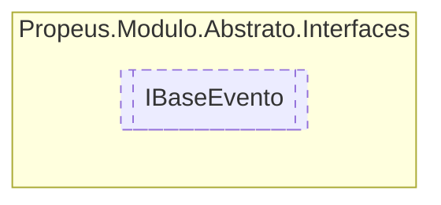

# IBaseEvento `interface`

## Description
Interface base para utilização de eventos

## Diagram


## Details
### Summary
Interface base para utilização de eventos

### Events
#### OnEvento
```csharp
public event Evento OnEvento
```
##### Summary
Evento base para qualquer ação não especificado

*Generated with* [*ModularDoc*](https://github.com/hailstorm75/ModularDoc)
