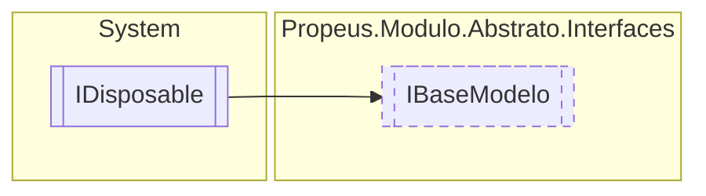

# IBaseModelo `interface`

## Description
Modelo base para todos os objetos do projeto

## Diagram


## Members
### Properties
#### Public  properties
| Type | Name | Methods |
| --- | --- | --- |
| [`Estado`](../Estado.md) | [`Estado`](#estado)<br>Representa o estado do objeto. | `get` |
| `string` | [`Id`](#id)<br>Representação alfanumerica e unica do objeto. | `get` |
| `string` | [`Nome`](#nome)<br>Representação amigavel do ojeto. <br><br> | `get` |
| `string` | [`Versao`](#versao)<br>Versao do modelo | `get` |

## Details
### Summary
Modelo base para todos os objetos do projeto

### Inheritance
 - `IDisposable`

### Properties
#### Versao
```csharp
public string Versao { get; }
```
##### Summary
Versao do modelo

#### Estado
```csharp
public Estado Estado { get; }
```
##### Summary
Representa o estado do objeto.

#### Nome
```csharp
public string Nome { get; }
```
##### Summary
Representação amigavel do ojeto. 


#### Id
```csharp
public string Id { get; }
```
##### Summary
Representação alfanumerica e unica do objeto.

*Generated with* [*ModularDoc*](https://github.com/hailstorm75/ModularDoc)
