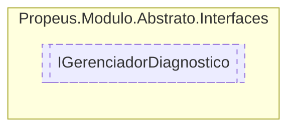

# IGerenciadorDiagnostico `interface`

## Description
Obtem informacoes de diagnostico do gerenciador

## Diagram


## Members
### Properties
#### Public  properties
| Type | Name | Methods |
| --- | --- | --- |
| `DateTime` | [`DataInicio`](#datainicio)<br>Retorna data e hora que o gerenciador iniciou | `get` |
| `int` | [`ModulosInicializados`](#modulosinicializados)<br>Indica a quantidade de modulos inicializados pelo gerenciador | `get` |
| `DateTime` | [`UltimaAtualizacao`](#ultimaatualizacao)<br>Data e hora do ultimo evento realizado no gerenciador | `get` |

## Details
### Summary
Obtem informacoes de diagnostico do gerenciador

### Properties
#### DataInicio
```csharp
public DateTime DataInicio { get; }
```
##### Summary
Retorna data e hora que o gerenciador iniciou

#### UltimaAtualizacao
```csharp
public DateTime UltimaAtualizacao { get; }
```
##### Summary
Data e hora do ultimo evento realizado no gerenciador

##### Remarks
Os eventos sao o CRUD (Criar, Reiniciar, Atualizar ou Remover) do genreciador

#### ModulosInicializados
```csharp
public int ModulosInicializados { get; }
```
##### Summary
Indica a quantidade de modulos inicializados pelo gerenciador

*Generated with* [*ModularDoc*](https://github.com/hailstorm75/ModularDoc)
