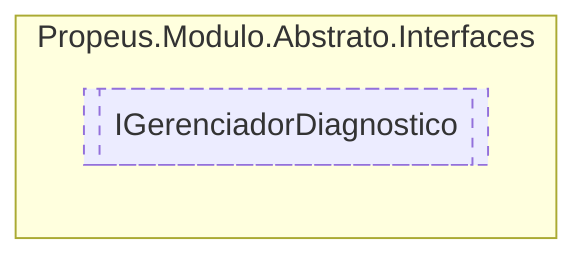

# IGerenciadorDiagnostico `interface`

## Description
Obtem informacoes de diagnostico do gerenciador

## Diagram


## Members
### Properties
#### Public  properties
| Type | Name | Methods |
| --- | --- | --- |
| `DateTime` | [`DataInicio`](#datainicio) | `get` |
| `int` | [`ModulosInicializados`](#modulosinicializados) | `get` |
| `DateTime` | [`UltimaAtualizacao`](#ultimaatualizacao) | `get` |

## Details
### Summary
Obtem informacoes de diagnostico do gerenciador

### Properties
#### DataInicio
```csharp
public DateTime DataInicio { get; }
```

#### UltimaAtualizacao
```csharp
public DateTime UltimaAtualizacao { get; }
```

#### ModulosInicializados
```csharp
public int ModulosInicializados { get; }
```

*Generated with* [*ModularDoc*](https://github.com/hailstorm75/ModularDoc)
