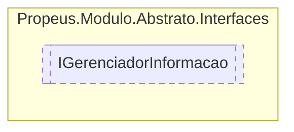

# IGerenciadorInformacao `interface`

## Description
Modelo base para criação de gerenciadores

## Diagram


## Members
### Methods
#### Public  methods
| Returns | Name |
| --- | --- |
| [`IModuloTipo`](./IModuloTipo.md) | [`ObterInfo`](#obterinfo-13)(`...`) |

## Details
### Summary
Modelo base para criação de gerenciadores

### Methods
#### ObterInfo [1/3]
[*Source code*](https://github.com///blob//src/Propeus.Modulo.IL/Helpers/MetodoHelper.cs#L96)
```csharp
public IModuloTipo ObterInfo<T>()
where T : IModulo
```

#### ObterInfo [2/3]
[*Source code*](https://github.com///blob//src/Propeus.Modulo.IL/Helpers/MetodoHelper.cs#L103)
```csharp
public IModuloTipo ObterInfo(Type type)
```
##### Arguments
| Type | Name | Description |
| --- | --- | --- |
| `Type` | type | Qualquer tipo herdado de [IModulo](./IModulo.md) |

##### Summary
Obtem o [IModuloTipo](./IModuloTipo.md) de `type` caso exista 


##### Returns
[IModuloTipo](./IModuloTipo.md)

#### ObterInfo [3/3]
[*Source code*](https://github.com///blob//src/Propeus.Modulo.IL/Helpers/MetodoHelper.cs#L110)
```csharp
public IModuloTipo ObterInfo(string id)
```
##### Arguments
| Type | Name | Description |
| --- | --- | --- |
| `string` | id | Identificação unica do modulo |

##### Summary
Obtem  o [IModuloTipo](./IModuloTipo.md) do modulo pelo id

##### Returns
[IModuloTipo](./IModuloTipo.md)

*Generated with* [*ModularDoc*](https://github.com/hailstorm75/ModularDoc)
