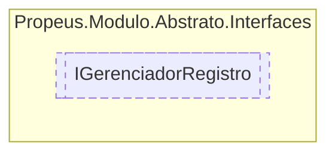

# IGerenciadorRegistro `interface`

## Description
Modelo base para criação de gerenciadores

## Diagram


## Members
### Methods
#### Public  methods
| Returns | Name |
| --- | --- |
| `void` | [`Registrar`](#registrar)([`IModulo`](./IModulo.md) modulo)<br>Registra o modulo no gerenciador |

## Details
### Summary
Modelo base para criação de gerenciadores

### Methods
#### Registrar
```csharp
public void Registrar(IModulo modulo)
```
##### Arguments
| Type | Name | Description |
| --- | --- | --- |
| [`IModulo`](./IModulo.md) | modulo | Instancia do modulo |

##### Summary
Registra o modulo no gerenciador

*Generated with* [*ModularDoc*](https://github.com/hailstorm75/ModularDoc)
