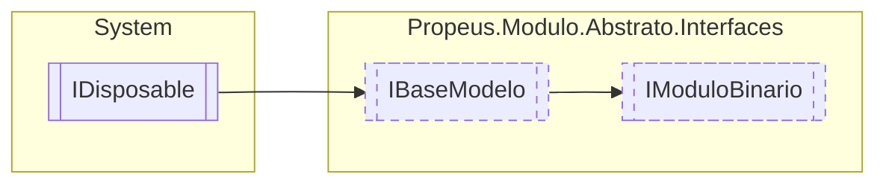

# IModuloBinario `interface`

## Description
Interface de modelo para obter informações do binario do modulo

## Diagram


## Members
### Properties
#### Public  properties
| Type | Name | Methods |
| --- | --- | --- |
| `bool` | [`BinarioValido`](#binariovalido) | `get` |
| `string` | [`Caminho`](#caminho)<br>Caminho onde se encontra o binario do modulo | `get` |
| `string` | [`Hash`](#hash)<br>Hash do binario do modulo | `get` |
| `MemoryStream` | [`Memoria`](#memoria)<br>Conteudo do modulo armazenado em memoria | `get` |
| [`IModuloInformacao`](./IModuloInformacao.md) | [`ModuloInformacao`](#moduloinformacao)<br>ModuloInformacao mapeados do binario | `get` |
| `Span`&lt;`byte`&gt; | [`Referencia`](#referencia)<br>"Ponteiro" onde se encontra o binario em memoria | `get` |

## Details
### Summary
Interface de modelo para obter informações do binario do modulo

### Inheritance
 - [
`IBaseModelo`
](./IBaseModelo.md)
 - `IDisposable`

### Properties
#### Caminho
```csharp
public string Caminho { get; }
```
##### Summary
Caminho onde se encontra o binario do modulo

#### Hash
```csharp
public string Hash { get; }
```
##### Summary
Hash do binario do modulo

#### Memoria
```csharp
public MemoryStream Memoria { get; }
```
##### Summary
Conteudo do modulo armazenado em memoria

#### ModuloInformacao
```csharp
public IModuloInformacao ModuloInformacao { get; }
```
##### Summary
ModuloInformacao mapeados do binario

#### Referencia
```csharp
public Span<byte> Referencia { get; }
```
##### Summary
"Ponteiro" onde se encontra o binario em memoria

#### BinarioValido
```csharp
public bool BinarioValido { get; }
```

*Generated with* [*ModularDoc*](https://github.com/hailstorm75/ModularDoc)
