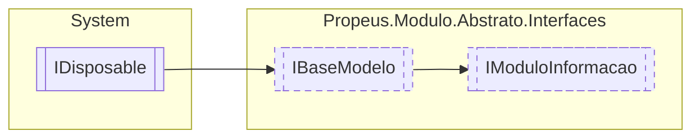

# IModuloInformacao `interface`

## Description
Interface de modelo para detalhar informações sobre o modulo

## Diagram


## Members
### Properties
#### Public  properties
| Type | Name | Methods |
| --- | --- | --- |
| `Assembly` | [`Assembly`](#assembly)<br>Assembly a qual o modulo pertence | `get` |
| `AssemblyName` | [`AssemblyName`](#assemblyname)<br>Informações sobre o assembly do modulo | `get` |
| `string` | [`Caminho`](#caminho)<br>Caminho do modulo em disco | `get` |
| `string` | [`Hash`](#hash)<br>Hash obtido de ModuloBinario | `get` |
| [`IModuloTipo`](./IModuloTipo.md) | [`Item`](#item) | `get, set` |
| `Dictionary`&lt;`string`, [`IModuloTipo`](./IModuloTipo.md)&gt; | [`Modulos`](#modulos)<br>ModuloInformacao mapeados do assembly | `get` |
| `int` | [`ModulosCarregados`](#moduloscarregados)<br>Informa a quantidade de modulos criados. | `get` |
| `int` | [`ModulosDescobertos`](#modulosdescobertos)<br>Informa a quantidade de modulos disponiveis dentro de uma DLL | `get` |
| `int` | [`NumeroVersaoAssembly`](#numeroversaoassembly)<br>Concatenação da versão | `get` |

### Methods
#### Public  methods
| Returns | Name |
| --- | --- |
| `void` | [`AdicionarContrato`](#adicionarcontrato)(`string` nomeModulo, `Type` contrato) |
| `Type` | [`CarregarTipoModulo`](#carregartipomodulo)(`string` nomeModulo) |
| `List`&lt;`Type`&gt; | [`ObterContratos`](#obtercontratos)(`string` nomeModulo) |
| `bool` | [`PossuiModulo`](#possuimodulo)(`string` nomeModulo) |

## Details
### Summary
Interface de modelo para detalhar informações sobre o modulo

### Inheritance
 - [
`IBaseModelo`
](./IBaseModelo.md)
 - `IDisposable`

### Methods
#### AdicionarContrato
[*Source code*](https://github.com///blob//src/Propeus.Modulo.IL/Helpers/MetodoHelper.cs#L245)
```csharp
public void AdicionarContrato(string nomeModulo, Type contrato)
```
##### Arguments
| Type | Name | Description |
| --- | --- | --- |
| `string` | nomeModulo |   |
| `Type` | contrato |   |

#### CarregarTipoModulo
[*Source code*](https://github.com///blob//src/Propeus.Modulo.IL/Helpers/MetodoHelper.cs#L253)
```csharp
public Type CarregarTipoModulo(string nomeModulo)
```
##### Arguments
| Type | Name | Description |
| --- | --- | --- |
| `string` | nomeModulo |   |

#### ObterContratos
[*Source code*](https://github.com///blob//src/Propeus.Modulo.IL/Helpers/ClasseHelpers.cs#L18)
```csharp
public List<Type> ObterContratos(string nomeModulo)
```
##### Arguments
| Type | Name | Description |
| --- | --- | --- |
| `string` | nomeModulo |   |

#### PossuiModulo
[*Source code*](https://github.com///blob//src/Propeus.Modulo.IL/Helpers/ClasseHelpers.cs#L158)
```csharp
public bool PossuiModulo(string nomeModulo)
```
##### Arguments
| Type | Name | Description |
| --- | --- | --- |
| `string` | nomeModulo |   |

### Properties
#### Item
```csharp
public IModuloTipo Item { get; set; }
```

#### NumeroVersaoAssembly
```csharp
public int NumeroVersaoAssembly { get; }
```
##### Summary
Concatenação da versão

#### Assembly
```csharp
public Assembly Assembly { get; }
```
##### Summary
Assembly a qual o modulo pertence

#### AssemblyName
```csharp
public AssemblyName AssemblyName { get; }
```
##### Summary
Informações sobre o assembly do modulo

#### Modulos
```csharp
public Dictionary<string, IModuloTipo> Modulos { get; }
```
##### Summary
ModuloInformacao mapeados do assembly

#### Caminho
```csharp
public string Caminho { get; }
```
##### Summary
Caminho do modulo em disco

#### Hash
```csharp
public string Hash { get; }
```
##### Summary
Hash obtido de ModuloBinario

#### ModulosDescobertos
```csharp
public int ModulosDescobertos { get; }
```
##### Summary
Informa a quantidade de modulos disponiveis dentro de uma DLL

#### ModulosCarregados
```csharp
public int ModulosCarregados { get; }
```
##### Summary
Informa a quantidade de modulos criados.

*Generated with* [*ModularDoc*](https://github.com/hailstorm75/ModularDoc)
