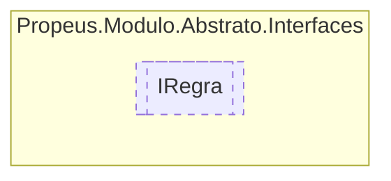

# IRegra `interface`

## Description
Interface basica para execução de regras de negocio

## Diagram


## Members
### Methods
#### Public  methods
| Returns | Name |
| --- | --- |
| `bool` | [`Executar`](#executar)(`object``[]` args)<br>Função basica para execução de regras de negocio |

## Details
### Summary
Interface basica para execução de regras de negocio

### Methods
#### Executar
[*Source code*](https://github.com///blob//src/Propeus.Modulo.IL/Helpers/GeradorHelper.cs#L18)
```csharp
public bool Executar(object[] args)
```
##### Arguments
| Type | Name | Description |
| --- | --- | --- |
| `object``[]` | args |  |

##### Summary
Função basica para execução de regras de negocio

##### Returns


*Generated with* [*ModularDoc*](https://github.com/hailstorm75/ModularDoc)
