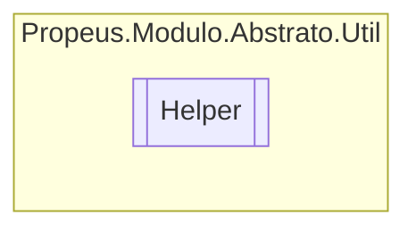

# Helper `class`

## Diagram


## Members
### Methods
#### Public Static methods
| Returns | Name |
| --- | --- |
| `T` | [`As`](#as-12)(`...`) |
| `TEnum` | [`ConcatenarEnum`](#concatenarenum)(`TEnum``[]` enum) |
| `bool` | [`ContainsAll`](#containsall)(`IEnumerable`&lt;`T`&gt; obj, `T``[]` params) |
| `IEnumerable`&lt;`TSaida`&gt; | [`Converter`](#converter)(`IEnumerable` obj) |
| `object` | [`Default`](#default)(`Type` obj)<br>Obtem o valor padrão do tipo passado no parametro `obj` |
| `void` | [`Dispose`](#dispose-15)(`...`)<br>Libera objetos da memoria durante a utlizacao do TypeBuilder |
| `TEnum``[]` | [`DividirEnum`](#dividirenum)(`TEnum` enum) |
| `string` | [`Hash`](#hash-12)(`...`)<br>Obtem o hash de um objeto serializavel |
| `bool` | [`Herdado`](#herdado-14)(`...`)<br>Verifica se o objeto é herdado do tipo passado no parametro `comparacao` |
| `bool` | [`Is`](#is-14)(`...`) |
| `bool` | [`IsDefault`](#isdefault)(`object` obj)<br>Verifica se o objeto possui o valor padrão |
| `bool` | [`IsNullOrDefault`](#isnullordefault)(`object` obj)<br>Verifica se o objeto é nulo ou possui um valor padrão |
| `bool` | [`IsNullOrEmpty`](#isnullorempty)(`string` str)<br>Verifica se a string esta vazia ou nula |
| `bool` | [`IsStruct`](#isstruct)(`object` obj)<br>Verifica se o objeto é struct |
| `bool` | [`IsVoid`](#isvoid)(`Type` type)<br>Verifica se o tipo é void |
| `IEnumerable`&lt;`T`&gt; | [`Join`](#join)(`IEnumerable`&lt;`T`&gt; esquerda, `IEnumerable`&lt;`T`&gt; direita) |
| `T` | [`ObterAtributo`](#obteratributo-12)(`...`) |
| `ConstructorInfo` | [`ObterConstrutor`](#obterconstrutor)(`Type` type, `Type``[]` parametros)<br>Obtem o construtor que possua os mesmos tipos de parametro |
| `string` | [`ObterDescricaoEnum`](#obterdescricaoenum)(`TEnum` enum) |
| `TEnum``[]` | [`ObterEnumsConcatenadoBitaBit`](#obterenumsconcatenadobitabit)(`TEnum` enum) |
| `IEnumerable`&lt;`Type`&gt; | [`ObterInterfaces`](#obterinterfaces)(`Type` obj)<br>Obtem as interfaces do tipo selecionado |
| [`ModuloAttribute`](../atributos/ModuloAttribute.md) | [`ObterModuloAtributo`](#obtermoduloatributo)(`Type` objeto)<br>Obtem o atributo [ModuloAttribute](../atributos/ModuloAttribute.md) de um objeto |
| [`ModuloContratoAttribute`](../atributos/ModuloContratoAttribute.md) | [`ObterModuloContratoAtributo`](#obtermodulocontratoatributo)(`Type` objeto)<br>Obtem o atributo [ModuloContratoAttribute](../atributos/ModuloContratoAttribute.md) de um objeto |
| `Type` | [`ObterTipo`](#obtertipo)(`string` nomeTipo)<br>Obtem o tipo pelo nome |
| `IEnumerable`&lt;`Type`&gt; | [`ObterTipoParametros`](#obtertipoparametros-12)(`...`)<br>Obtem os tipos dos parametros do construtor selecionado |
| `TNovoEnum``[]` | [`ParseEnum`](#parseenum)(`TAntigoEnum``[]` enum) |
| `bool` | [`PossuiAtributo`](#possuiatributo)(`Type` obj) |
| `byte``[]` | [`Serializar`](#serializar)(`object` obj)<br>Serializa um objeto em array de Byte |
| `T` | [`To`](#to-12)(`...`) |
| `byte``[]` | [`ToArrayByte`](#toarraybyte)(`string` obj)<br>Converte uma String em um array de bytes |

## Details
### Methods
#### ObterAtributo [1/2]
[*Source code*](https://github.com///blob//src/Propeus.Modulo.Abstrato/Util/Atributos/Helper.cs#L27)
```csharp
public static T ObterAtributo<T>(Type obj)
where T : Attribute
```
##### Arguments
| Type | Name | Description |
| --- | --- | --- |
| `Type` | obj |   |

#### ObterAtributo [2/2]
[*Source code*](https://github.com///blob//src/Propeus.Modulo.Abstrato/Util/Atributos/Helper.cs#L55)
```csharp
public static T ObterAtributo<T>(object obj)
where T : Attribute
```
##### Arguments
| Type | Name | Description |
| --- | --- | --- |
| `object` | obj |   |

#### PossuiAtributo
[*Source code*](https://github.com///blob//src/Propeus.Modulo.Abstrato/Util/Atributos/Helper.cs#L69)
```csharp
public static bool PossuiAtributo<T>(Type obj)
where T : Attribute
```
##### Arguments
| Type | Name | Description |
| --- | --- | --- |
| `Type` | obj |   |

#### ObterModuloAtributo
[*Source code*](https://github.com///blob//src/Propeus.Modulo.Abstrato/Util/Atributos/ModuloAtributoHelper.cs#L22)
```csharp
public static ModuloAttribute ObterModuloAtributo(Type objeto)
```
##### Arguments
| Type | Name | Description |
| --- | --- | --- |
| `Type` | objeto | Qualquer objeto do tipo Type |

##### Summary
Obtem o atributo [ModuloAttribute](../atributos/ModuloAttribute.md) de um objeto

##### Returns


##### Exceptions
| Name | Description |
| --- | --- |
| ArgumentException | Argumeto obj vazio ou nulo |
| InvalidOperationException | [ModuloAttribute](../atributos/ModuloAttribute.md) não encontrado |

#### ObterModuloContratoAtributo
[*Source code*](https://github.com///blob//src/Propeus.Modulo.Abstrato/Util/Atributos/ModuloAtributoHelper.cs#L36)
```csharp
public static ModuloContratoAttribute ObterModuloContratoAtributo(Type objeto)
```
##### Arguments
| Type | Name | Description |
| --- | --- | --- |
| `Type` | objeto | Qualquer objeto do tipo Type |

##### Summary
Obtem o atributo [ModuloContratoAttribute](../atributos/ModuloContratoAttribute.md) de um objeto

##### Returns


##### Exceptions
| Name | Description |
| --- | --- |
| ArgumentException | Argumeto obj vazio ou nulo |
| InvalidOperationException | [ModuloContratoAttribute](../atributos/ModuloContratoAttribute.md) não encontrado |

#### ParseEnum
[*Source code*](https://github.com///blob//src/Propeus.Modulo.Abstrato/Util/Enumerados/Helper.cs#L27)
```csharp
public static TNovoEnum ParseEnum<TAntigoEnum, TNovoEnum>(TAntigoEnum[] enum)
where TAntigoEnum : Enum, ValueType
where TNovoEnum : Enum, ValueType
```
##### Arguments
| Type | Name | Description |
| --- | --- | --- |
| `TAntigoEnum``[]` | enum |   |

#### DividirEnum
[*Source code*](https://github.com///blob//src/Propeus.Modulo.Abstrato/Util/Enumerados/Helper.cs#L63)
```csharp
public static TEnum DividirEnum<TEnum>(TEnum enum)
where TEnum : ValueType
```
##### Arguments
| Type | Name | Description |
| --- | --- | --- |
| `TEnum` | enum |   |

#### ObterEnumsConcatenadoBitaBit
[*Source code*](https://github.com///blob//src/Propeus.Modulo.Abstrato/Util/Enumerados/Helper.cs#L83)
```csharp
public static TEnum ObterEnumsConcatenadoBitaBit<TEnum>(TEnum enum)
where TEnum : Enum
```
##### Arguments
| Type | Name | Description |
| --- | --- | --- |
| `TEnum` | enum |   |

#### ConcatenarEnum
[*Source code*](https://github.com///blob//src/Propeus.Modulo.Abstrato/Util/Enumerados/Helper.cs#L111)
```csharp
public static TEnum ConcatenarEnum<TEnum>(TEnum[] enum)
where TEnum : 
```
##### Arguments
| Type | Name | Description |
| --- | --- | --- |
| `TEnum``[]` | enum |   |

#### ObterDescricaoEnum
[*Source code*](https://github.com///blob//src/Propeus.Modulo.Abstrato/Util/Enumerados/Helper.cs#L138)
```csharp
public static string ObterDescricaoEnum<TEnum>(TEnum enum)
where TEnum : 
```
##### Arguments
| Type | Name | Description |
| --- | --- | --- |
| `TEnum` | enum |   |

#### Join
[*Source code*](https://github.com///blob//src/Propeus.Modulo.Abstrato/Util/Listas/Helper.cs#L24)
```csharp
public static IEnumerable<T> Join<T>(IEnumerable<T> esquerda, IEnumerable<T> direita)
where T : 
```
##### Arguments
| Type | Name | Description |
| --- | --- | --- |
| `IEnumerable`&lt;`T`&gt; | esquerda |   |
| `IEnumerable`&lt;`T`&gt; | direita |   |

#### ContainsAll
[*Source code*](https://github.com///blob//src/Propeus.Modulo.Abstrato/Util/Listas/Helper.cs#L59)
```csharp
public static bool ContainsAll<T>(IEnumerable<T> obj, T[] params)
where T : 
```
##### Arguments
| Type | Name | Description |
| --- | --- | --- |
| `IEnumerable`&lt;`T`&gt; | obj |   |
| `T``[]` | params |   |

#### Converter
```csharp
public static IEnumerable<TSaida> Converter<TSaida>(IEnumerable obj)
where TSaida : 
```
##### Arguments
| Type | Name | Description |
| --- | --- | --- |
| `IEnumerable` | obj |   |

#### Serializar
[*Source code*](https://github.com///blob//src/Propeus.Modulo.Abstrato/Util/Objetos/Helper.cs#L25)
```csharp
public static byte Serializar(object obj)
```
##### Arguments
| Type | Name | Description |
| --- | --- | --- |
| `object` | obj | Qualuer objeto do tipo Object |

##### Summary
Serializa um objeto em array de Byte

##### Returns


##### Exceptions
| Name | Description |
| --- | --- |
| ArgumentNullException | Argumento nulo |
| SerializationException | Objeto não serializavel |

#### Herdado [1/4]
[*Source code*](https://github.com///blob//src/Propeus.Modulo.Abstrato/Util/Objetos/Helper.cs#L54)
```csharp
public static bool Herdado(object obj, Type comparacao)
```
##### Arguments
| Type | Name | Description |
| --- | --- | --- |
| `object` | obj | Classe a ser verificado |
| `Type` | comparacao | Tipo a ser comparado |

##### Summary
Verifica se o objeto é herdado do tipo passado no parametro `comparacao`

##### Returns


##### Exceptions
| Name | Description |
| --- | --- |
| ArgumentNullException | Argumento nulo |
| ArgumentException | Argumento invalido |

#### Herdado [2/4]
[*Source code*](https://github.com///blob//src/Propeus.Modulo.Abstrato/Util/Objetos/Helper.cs#L70)
```csharp
public static bool Herdado<T>(object obj)
where T : 
```
##### Arguments
| Type | Name | Description |
| --- | --- | --- |
| `object` | obj |   |

#### IsStruct
[*Source code*](https://github.com///blob//src/Propeus.Modulo.Abstrato/Util/Objetos/Helper.cs#L80)
```csharp
public static bool IsStruct(object obj)
```
##### Arguments
| Type | Name | Description |
| --- | --- | --- |
| `object` | obj | Qualquer objeto a ser analisado |

##### Summary
Verifica se o objeto é struct

##### Returns


#### Is [1/4]
[*Source code*](https://github.com///blob//src/Propeus.Modulo.Abstrato/Util/Objetos/Helper.cs#L96)
```csharp
public static bool Is<T>(object obj)
where T : 
```
##### Arguments
| Type | Name | Description |
| --- | --- | --- |
| `object` | obj |   |

#### Is [2/4]
[*Source code*](https://github.com///blob//src/Propeus.Modulo.Abstrato/Util/Objetos/Helper.cs#L110)
```csharp
public static bool Is(object obj, Type comparacao)
```
##### Arguments
| Type | Name | Description |
| --- | --- | --- |
| `object` | obj | Objeto a ser verificado |
| `Type` | comparacao | Tipo a ser validado |

##### Summary
Verifica se o objeto `obj` é igual ou herdado de `comparacao`

##### Returns


##### Exceptions
| Name | Description |
| --- | --- |
| ArgumentNullException | Argumento nulo |
| ArgumentException | Argumento invalido |

#### To [1/2]
[*Source code*](https://github.com///blob//src/Propeus.Modulo.Abstrato/Util/Objetos/Helper.cs#L124)
```csharp
public static T To<T>(object obj)
where T : 
```
##### Arguments
| Type | Name | Description |
| --- | --- | --- |
| `object` | obj |   |

#### To [2/2]
[*Source code*](https://github.com///blob//src/Propeus.Modulo.Abstrato/Util/Objetos/Helper.cs#L138)
```csharp
public static object To(object obj, Type para)
```
##### Arguments
| Type | Name | Description |
| --- | --- | --- |
| `object` | obj | Objeto a ser convertido |
| `Type` | para | Tipo a ser convertido |

##### Summary
Converte qualquer objeto para o tipo desejado

##### Returns


##### Exceptions
| Name | Description |
| --- | --- |
| ArgumentNullException | Argumento nulo |
| ArgumentException | Argumento invalido |
| OverflowException |  |

#### As [1/2]
[*Source code*](https://github.com///blob//src/Propeus.Modulo.Abstrato/Util/Objetos/Helper.cs#L197)
```csharp
public static T As<T>(object obj, T padrao)
where T : 
```
##### Arguments
| Type | Name | Description |
| --- | --- | --- |
| `object` | obj |   |
| `T` | padrao |   |

#### As [2/2]
[*Source code*](https://github.com///blob//src/Propeus.Modulo.Abstrato/Util/Objetos/Helper.cs#L210)
```csharp
public static object As(object obj, Type como, object padrao)
```
##### Arguments
| Type | Name | Description |
| --- | --- | --- |
| `object` | obj | Objeto a ser convertido no tipo do parametro `como` |
| `Type` | como | Tipo a ser convertido |
| `object` | padrao | Valor padrão em caso de erro. |

##### Summary
Tenta converter o `obj` em `como` , caso não consiga será retornado nulo ou o valor passado no parametro `padrao`

##### Returns


##### Exceptions
| Name | Description |
| --- | --- |
| ArgumentNullException | Argumento nulo |
| ArgumentException | Argumento invalido |

#### IsNullOrDefault
[*Source code*](https://github.com///blob//src/Propeus.Modulo.Abstrato/Util/Objetos/Helper.cs#L242)
```csharp
public static bool IsNullOrDefault(object obj)
```
##### Arguments
| Type | Name | Description |
| --- | --- | --- |
| `object` | obj |  |

##### Summary
Verifica se o objeto é nulo ou possui um valor padrão

##### Returns


##### Exceptions
| Name | Description |
| --- | --- |
| ArgumentNullException | Argumento nulo |

#### IsDefault
[*Source code*](https://github.com///blob//src/Propeus.Modulo.Abstrato/Util/Objetos/Helper.cs#L253)
```csharp
public static bool IsDefault(object obj)
```
##### Arguments
| Type | Name | Description |
| --- | --- | --- |
| `object` | obj |  |

##### Summary
Verifica se o objeto possui o valor padrão

##### Returns


##### Exceptions
| Name | Description |
| --- | --- |
| ArgumentNullException | Argumento nulo |

#### Hash [1/2]
[*Source code*](https://github.com///blob//src/Propeus.Modulo.Abstrato/Util/Objetos/Helper.cs#L267)
```csharp
public static string Hash(object obj)
```
##### Arguments
| Type | Name | Description |
| --- | --- | --- |
| `object` | obj |  |

##### Summary
Obtem o hash de um objeto serializavel

##### Returns


##### Exceptions
| Name | Description |
| --- | --- |
| ArgumentNullException |  |
| SerializationException |  |

#### ObterConstrutor
[*Source code*](https://github.com///blob//src/Propeus.Modulo.Abstrato/Util/Reflections/Helper.cs#L16707566)
```csharp
public static ConstructorInfo ObterConstrutor(Type type, Type[] parametros)
```
##### Arguments
| Type | Name | Description |
| --- | --- | --- |
| `Type` | type | Tipo que sera obtido o construtor |
| `Type``[]` | parametros | Os tipos do parametro do construtor |

##### Summary
Obtem o construtor que possua os mesmos tipos de parametro

##### Returns
Retorna o ConstructorInfo caso encontrado

##### Exceptions
| Name | Description |
| --- | --- |
| Exception | Caso nao existe o contrutor com os parametros informado |

#### ObterTipoParametros [1/2]
[*Source code*](https://github.com///blob//src/Propeus.Modulo.Abstrato/Util/Reflections/Helper.cs#L63)
```csharp
public static IEnumerable<Type> ObterTipoParametros(ConstructorInfo action)
```
##### Arguments
| Type | Name | Description |
| --- | --- | --- |
| `ConstructorInfo` | action |  |

##### Summary
Obtem os tipos dos parametros do construtor selecionado

##### Returns


##### Exceptions
| Name | Description |
| --- | --- |
| ArgumentNullException | Argumento nulo |

#### ObterTipoParametros [2/2]
[*Source code*](https://github.com///blob//src/Propeus.Modulo.Abstrato/Util/Reflections/Helper.cs#L76)
```csharp
public static IEnumerable<Type> ObterTipoParametros(MethodInfo action)
```
##### Arguments
| Type | Name | Description |
| --- | --- | --- |
| `MethodInfo` | action |  |

##### Summary
Obtem os tipos dos parametros do metodo selecionado

##### Returns


##### Exceptions
| Name | Description |
| --- | --- |
| ArgumentNullException | Argumento nulo |

#### Dispose [1/5]
[*Source code*](https://github.com///blob//src/Propeus.Modulo.Abstrato/Util/Reflections/Helper.cs#L91)
```csharp
public static void Dispose(TypeBuilder tb)
```
##### Arguments
| Type | Name | Description |
| --- | --- | --- |
| `TypeBuilder` | tb | A instancia do TypeBuilder |

##### Summary
Libera objetos da memoria durante a utlizacao do TypeBuilder

##### Remarks
Este metodo e necessario para evitar vazamentos de memoria

#### Dispose [2/5]
[*Source code*](https://github.com///blob//src/Propeus.Modulo.Abstrato/Util/Reflections/Helper.cs#L145)
```csharp
public static void Dispose(MethodBuilder mb)
```
##### Arguments
| Type | Name | Description |
| --- | --- | --- |
| `MethodBuilder` | mb | A instancia do MethodBuilder |

##### Summary
Libera objetos da memoria durante a utlizacao do MethodBuilder

##### Remarks
Este metodo e necessario para evitar vazamentos de memoria

#### Dispose [3/5]
[*Source code*](https://github.com///blob//src/Propeus.Modulo.Abstrato/Util/Reflections/Helper.cs#L184)
```csharp
public static void Dispose(SignatureHelper sh)
```
##### Arguments
| Type | Name | Description |
| --- | --- | --- |
| `SignatureHelper` | sh | A instancia do SignatureHelper |

##### Summary
Libera objetos da memoria durante a utlizacao do SignatureHelper

##### Remarks
Este metodo e necessario para evitar vazamentos de memoria

#### Dispose [4/5]
[*Source code*](https://github.com///blob//src/Propeus.Modulo.Abstrato/Util/Reflections/Helper.cs#L204)
```csharp
public static void Dispose(ILGenerator ilGen)
```
##### Arguments
| Type | Name | Description |
| --- | --- | --- |
| `ILGenerator` | ilGen | A instancia do ILGenerator |

##### Summary
Libera objetos da memoria durante a utlizacao do ILGenerator

##### Remarks
Este metodo e necessario para evitar vazamentos de memoria

#### Dispose [5/5]
[*Source code*](https://github.com///blob//src/Propeus.Modulo.Abstrato/Util/Reflections/Helper.cs#L225)
```csharp
public static void Dispose(ModuleBuilder modBuild, string nome)
```
##### Arguments
| Type | Name | Description |
| --- | --- | --- |
| `ModuleBuilder` | modBuild | A instancia do ModuleBuilder |
| `string` | nome | Nome do tipo que possui o metodo |

##### Summary
Libera objetos da memoria durante a utlizacao do ModuleBuilder

##### Remarks
Este metodo e necessario para evitar vazamentos de memoria

#### ToArrayByte
[*Source code*](https://github.com///blob//src/Propeus.Modulo.Abstrato/Util/Strings/Helper.cs#L20)
```csharp
public static byte ToArrayByte(string obj)
```
##### Arguments
| Type | Name | Description |
| --- | --- | --- |
| `string` | obj | Qualquer objeto do tipo String |

##### Summary
Converte uma String em um array de bytes

##### Returns


##### Exceptions
| Name | Description |
| --- | --- |
| ArgumentNullException | Argumento nulo |

#### IsNullOrEmpty
[*Source code*](https://github.com///blob//src/Propeus.Modulo.Abstrato/Util/Strings/Helper.cs#L42)
```csharp
public static bool IsNullOrEmpty(string str)
```
##### Arguments
| Type | Name | Description |
| --- | --- | --- |
| `string` | str |  |

##### Summary
Verifica se a string esta vazia ou nula

##### Returns


#### ObterTipo
[*Source code*](https://github.com///blob//src/Propeus.Modulo.Abstrato/Util/Strings/Helper.cs#L52)
```csharp
public static Type ObterTipo(string nomeTipo)
```
##### Arguments
| Type | Name | Description |
| --- | --- | --- |
| `string` | nomeTipo | Nome do tipo |

##### Summary
Obtem o tipo pelo nome

##### Returns
Retorna o Type

#### Herdado [3/4]
[*Source code*](https://github.com///blob//src/Propeus.Modulo.Abstrato/Util/Tipos/Helper.cs#L16707566)
```csharp
public static bool Herdado(Type obj, Type comparacao)
```
##### Arguments
| Type | Name | Description |
| --- | --- | --- |
| `Type` | obj | Tipo a ser verificado |
| `Type` | comparacao | Tipo a ser comparado |

##### Summary
Verifica se o tipo é herdado do tipo passado no parametro `comparacao`

##### Returns


##### Exceptions
| Name | Description |
| --- | --- |
| ArgumentNullException | Argumento nulo |
| ArgumentException | Argumento invalido |

#### Herdado [4/4]
[*Source code*](https://github.com///blob//src/Propeus.Modulo.Abstrato/Util/Tipos/Helper.cs#L80)
```csharp
public static bool Herdado<T>(Type type)
where T : 
```
##### Arguments
| Type | Name | Description |
| --- | --- | --- |
| `Type` | type |   |

#### Is [3/4]
[*Source code*](https://github.com///blob//src/Propeus.Modulo.Abstrato/Util/Tipos/Helper.cs#L93)
```csharp
public static bool Is<T>(Type obj)
where T : 
```
##### Arguments
| Type | Name | Description |
| --- | --- | --- |
| `Type` | obj |   |

#### Is [4/4]
[*Source code*](https://github.com///blob//src/Propeus.Modulo.Abstrato/Util/Tipos/Helper.cs#L106)
```csharp
public static bool Is(Type obj, Type comparacao)
```
##### Arguments
| Type | Name | Description |
| --- | --- | --- |
| `Type` | obj | Tipo a ser validado |
| `Type` | comparacao | Tipo a ser comparado |

##### Summary
Verifica se o tipo do parâmetro `obj` é igual ou herdado de `comparacao`

##### Returns


##### Exceptions
| Name | Description |
| --- | --- |
| ArgumentNullException | Argumento nulo |
| ArgumentException | Argumento invalido |

#### IsVoid
[*Source code*](https://github.com///blob//src/Propeus.Modulo.Abstrato/Util/Tipos/Helper.cs#L120)
```csharp
public static bool IsVoid(Type type)
```
##### Arguments
| Type | Name | Description |
| --- | --- | --- |
| `Type` | type |  |

##### Summary
Verifica se o tipo é void

##### Returns


#### Default
[*Source code*](https://github.com///blob//src/Propeus.Modulo.Abstrato/Util/Tipos/Helper.cs#L130)
```csharp
public static object Default(Type obj)
```
##### Arguments
| Type | Name | Description |
| --- | --- | --- |
| `Type` | obj |  |

##### Summary
Obtem o valor padrão do tipo passado no parametro `obj`

##### Returns


#### ObterInterfaces
[*Source code*](https://github.com///blob//src/Propeus.Modulo.Abstrato/Util/Tipos/Helper.cs#L154)
```csharp
public static IEnumerable<Type> ObterInterfaces(Type obj)
```
##### Arguments
| Type | Name | Description |
| --- | --- | --- |
| `Type` | obj |  |

##### Summary
Obtem as interfaces do tipo selecionado

##### Returns


##### Exceptions
| Name | Description |
| --- | --- |
| ArgumentNullException | Argumento nulo |

#### Hash [2/2]
[*Source code*](https://github.com///blob//src/Propeus.Modulo.Abstrato/Util/Vetores/Helper.cs#L24)
```csharp
public static string Hash(byte[] bytes)
```
##### Arguments
| Type | Name | Description |
| --- | --- | --- |
| `byte``[]` | bytes |  |

##### Summary
Obtem o hash de um array de bytes

##### Returns


##### Exceptions
| Name | Description |
| --- | --- |
| ArgumentNullException |  |

*Generated with* [*ModularDoc*](https://github.com/hailstorm75/ModularDoc)
