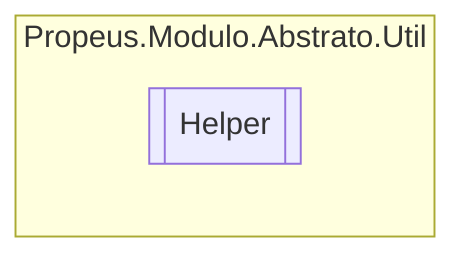

# Helper `class`

## Diagram


## Members
### Methods
#### Public Static methods
| Returns | Name |
| --- | --- |
| `T` | [`As`](#as-12)(`...`) |
| `IEnumerable`&lt;`T`&gt; | [`ConcatDistinct`](#concatdistinct)(`IEnumerable`&lt;`T`&gt; esquerda, `IEnumerable`&lt;`T`&gt; direita) |
| `TEnum` | [`ConcatenarEnum`](#concatenarenum-12)(`...`) |
| `bool` | [`ContainsAll`](#containsall)(`IEnumerable`&lt;`T`&gt; obj, `T``[]` params) |
| `IEnumerable`&lt;`TSaida`&gt; | [`Converter`](#converter)(`IEnumerable` obj) |
| `TPara` | [`CopiarPropriedades`](#copiarpropriedades)(`TDe` de) |
| `object` | [`Default`](#default)(`Type` obj)<br>Obtem o valor padrão do tipo passado no parametro `obj` |
| `TObjeto` | [`Deserializar`](#deserializar-12)(`...`) |
| `void` | [`Dispose`](#dispose-15)(`...`) |
| `TEnum``[]` | [`DividirEnum`](#dividirenum)(`TEnum` enum) |
| `bool` | [`ExisteMetodo`](#existemetodo-16)(`...`) |
| `string` | [`FirstReplace`](#firstreplace)(`string` str, `string` antigo, `string` novo)<br>Substitui a primeira ocorrencia de uma string pela mais recente |
| `string``[]` | [`FirstSplit`](#firstsplit)(`string` str, `char` separator)<br>Divide uma string na primeira ocorrência |
| `string` | [`Hash`](#hash-12)(`...`)<br>Obtem o hash de um objeto serializavel |
| `bool` | [`Herdado`](#herdado-14)(`...`)<br>Verifica se o objeto é herdado do tipo passado no parametro `comparacao` |
| `void` | [`InserirValorPropriedade`](#inserirvalorpropriedade)(`TClase` obj, `PropertyInfo` property, `object` valor) |
| `object` | [`InvocarMetodo`](#invocarmetodo)(`object` obj, `string` nome, `object``[]` args)<br>Realiza uma chamada a um metodo |
| `bool` | [`Is`](#is-14)(`...`) |
| `bool` | [`IsDefault`](#isdefault)(`object` obj)<br>Verifica se o objeto possui o valor padrão |
| `bool` | [`IsDictionary`](#isdictionary)(`object` obj)<br>Verifica se o objeto é um dicionario |
| `bool` | [`IsEmpty`](#isempty)(`IEnumerable`&lt;`T`&gt; obj) |
| `bool` | [`IsList`](#islist)(`object` obj)<br>Verifica se o objeto é uma lista |
| `bool` | [`IsNotEmpty`](#isnotempty)(`IEnumerable`&lt;`T`&gt; obj) |
| `bool` | [`IsNotNull`](#isnotnull-12)(`...`) |
| `bool` | [`IsNotNullAndNotVoid`](#isnotnullandnotvoid)(`Type` type)<br>Verifica se o tipo não é nulo e diferente de void |
| `bool` | [`IsNotNullOrEmpty`](#isnotnullorempty)(`IEnumerable`&lt;`T`&gt; obj) |
| `bool` | [`IsNotVoid`](#isnotvoid)(`Type` type)<br>Verifica se o tipo é diferente de void |
| `bool` | [`IsNull`](#isnull-12)(`...`) |
| `bool` | [`IsNullOrDefault`](#isnullordefault)(`object` obj)<br>Verifica se o objeto é nulo ou possui um valor padrão |
| `bool` | [`IsNullOrEmpty`](#isnullorempty-12)(`...`) |
| `bool` | [`IsStruct`](#isstruct)(`object` obj)<br>Verifica se o objeto é struct |
| `bool` | [`IsStructOrNull`](#isstructornull)(`object` obj)<br>Verifica se o objeto é struct, caso seja valida somente se é nulo |
| `bool` | [`IsVoid`](#isvoid)(`Type` type)<br>Verifica se o tipo é void |
| `IEnumerable`&lt;`T`&gt; | [`Join`](#join)(`IEnumerable`&lt;`T`&gt; esquerda, `IEnumerable`&lt;`T`&gt; direita) |
| `bool` | [`Not`](#not)(`bool` result)<br>Nega o resultado booleano |
| `T` | [`ObterAtributo`](#obteratributo-13)(`...`) |
| `IEnumerable`&lt;`T`&gt; | [`ObterAtributos`](#obteratributos)(`Type` obj) |
| `ConstructorInfo` | [`ObterConstrutor`](#obterconstrutor)(`Type` type, `Type``[]` parametros) |
| `string` | [`ObterDescricaoEnum`](#obterdescricaoenum-12)(`...`)<br>Obtém a descrição do enum |
| `TEnum``[]` | [`ObterEnumsConcatenadoBitaBit`](#obterenumsconcatenadobitabit)(`TEnum` valorConcatenado) |
| `EventInfo` | [`ObterEvento`](#obterevento)(`Type` obj, `EventInfo` evt)<br>Obtem o evento que possua a mesma assinatura |
| `IEnumerable`&lt;`Type`&gt; | [`ObterInterfaces`](#obterinterfaces-12)(`...`)<br>Obtem as interfaces do objeto selecionado |
| `MethodInfo` | [`ObterMetodo`](#obtermetodo-13)(`...`)<br>Obtem o metodo que possua o mesmo nome, quantidade e tipo de parametros |
| `MethodInfo` | [`ObterMetodoComMaiorParametros`](#obtermetodocommaiorparametros)(`Type` obj, `string` nome)<br>Obtem o metodo com maior quantidade de parametros. |
| `IEnumerable`&lt;`MethodInfo`&gt; | [`ObterMetodos`](#obtermetodos-14)(`...`)<br>Obtem todos os metodos do objeto que possuem o mesmo nome |
| [`ModuloAttribute`](../atributos/ModuloAttribute.md) | [`ObterModuloAtributo`](#obtermoduloatributo-12)(`...`)<br>Obtem o atributo [ModuloAttribute](../atributos/ModuloAttribute.md) de um objeto |
| [`ModuloContratoAttribute`](../atributos/ModuloContratoAttribute.md) | [`ObterModuloContratoAtributo`](#obtermodulocontratoatributo-12)(`...`)<br>Obtem o atributo [ModuloContratoAttribute](../atributos/ModuloContratoAttribute.md) de um objeto |
| `Type``[]` | [`ObterParametrosMetodo`](#obterparametrosmetodo)(`object` obj, `string` nome)<br>Obtem os parametros de um metodo |
| `string` | [`ObterPathProgramaAtual`](#obterpathprogramaatual)()<br>Obtem o caminho completo do arquivo .exe ou .dll que esta sendo executado no momento |
| `PropertyInfo` | [`ObterPropriedade`](#obterpropriedade)(`Type` obj, `PropertyInfo` prop)<br>Obtem a propriedade que possua a mesma assinatura |
| `IDictionary`&lt;`PropertyInfo`, `Type`&gt; | [`ObterPropriedadeInfoType`](#obterpropriedadeinfotype)(`T` obj) |
| `Type` | [`ObterTipo`](#obtertipo)(`string` nomeTipo) |
| `IEnumerable`&lt;`Type`&gt; | [`ObterTipoParametros`](#obtertipoparametros-13)(`...`)<br>Obtem os tipos dos parametros do construtor selecionado |
| `object` | [`ObterValorPropriedade`](#obtervalorpropriedade)(`TClase` obj, `PropertyInfo` property) |
| `TNovoEnum``[]` | [`ParseEnum`](#parseenum-12)(`...`) |
| `bool` | [`PossuiAtributo`](#possuiatributo-13)(`...`) |
| `byte``[]` | [`Serializar`](#serializar)(`object` obj)<br>Serializa um objeto em array de Byte |
| `T` | [`To`](#to-12)(`...`) |
| `byte``[]` | [`ToArrayByte`](#toarraybyte)(`string` obj)<br>Converte uma String em um array de bytes |
| `byte``[]` | [`ToBytes`](#tobytes)(`string` obj)<br>Converte uma string em um array de bytes |
| `string` | [`WriteTable`](#writetable)(`object``[]` data) |

## Details
### Methods
#### ObterAtributo [1/3]
[*Source code*](https://github.com///blob//src/Propeus.Modulo.Dinamico/ModuloBinario.cs#L56)
```csharp
public static T ObterAtributo<T>(IEnumerable<CustomAttributeData> obj)
where T : Attribute
```
##### Arguments
| Type | Name | Description |
| --- | --- | --- |
| `IEnumerable`&lt;`CustomAttributeData`&gt; | obj |   |

#### ObterAtributo [2/3]
[*Source code*](https://github.com///blob//src/Propeus.Modulo.Dinamico/ModuloBinario.cs#L61)
```csharp
public static T ObterAtributo<T>(Type obj)
where T : Attribute
```
##### Arguments
| Type | Name | Description |
| --- | --- | --- |
| `Type` | obj |   |

#### ObterAtributo [3/3]
[*Source code*](https://github.com///blob//src/Propeus.Modulo.Dinamico/ModuloBinario.cs#L66)
```csharp
public static T ObterAtributo<T>(object obj)
where T : Attribute
```
##### Arguments
| Type | Name | Description |
| --- | --- | --- |
| `object` | obj |   |

#### ObterAtributos
[*Source code*](https://github.com///blob//src/Propeus.Modulo.Dinamico/ModuloBinario.cs#L70)
```csharp
public static IEnumerable<T> ObterAtributos<T>(Type obj)
where T : Attribute
```
##### Arguments
| Type | Name | Description |
| --- | --- | --- |
| `Type` | obj |   |

#### PossuiAtributo [1/3]
[*Source code*](https://github.com///blob//src/Propeus.Modulo.Dinamico/ModuloBinario.cs#L73)
```csharp
public static bool PossuiAtributo<T>(object obj)
where T : Attribute
```
##### Arguments
| Type | Name | Description |
| --- | --- | --- |
| `object` | obj |   |

#### PossuiAtributo [2/3]
[*Source code*](https://github.com///blob//src/Propeus.Modulo.Dinamico/ModuloBinario.cs#L83)
```csharp
public static bool PossuiAtributo<T>(PropertyInfo obj)
where T : Attribute
```
##### Arguments
| Type | Name | Description |
| --- | --- | --- |
| `PropertyInfo` | obj |   |

#### PossuiAtributo [3/3]
[*Source code*](https://github.com///blob//src/Propeus.Modulo.Dinamico/ModuloInformacao.cs#L23)
```csharp
public static bool PossuiAtributo<T>(Type obj)
where T : Attribute
```
##### Arguments
| Type | Name | Description |
| --- | --- | --- |
| `Type` | obj |   |

#### ObterModuloAtributo [1/2]
[*Source code*](https://github.com///blob//src/Propeus.Modulo.Dinamico/ModuloInformacao.cs#L54)
```csharp
public static ModuloAttribute ObterModuloAtributo(object objeto)
```
##### Arguments
| Type | Name | Description |
| --- | --- | --- |
| `object` | objeto | Qualquer objeto do tipo Object |

##### Summary
Obtem o atributo [ModuloAttribute](../atributos/ModuloAttribute.md) de um objeto

##### Returns


##### Exceptions
| Name | Description |
| --- | --- |
| ArgumentException | Argumeto obj vazio ou nulo |
| InvalidOperationException | [ModuloAttribute](../atributos/ModuloAttribute.md) não encontrado |

#### ObterModuloAtributo [2/2]
[*Source code*](https://github.com///blob//src/Propeus.Modulo.Dinamico/ModuloInformacao.cs#L58)
```csharp
public static ModuloAttribute ObterModuloAtributo(Type objeto)
```
##### Arguments
| Type | Name | Description |
| --- | --- | --- |
| `Type` | objeto | Qualquer objeto do tipo Type |

##### Summary
Obtem o atributo [ModuloAttribute](../atributos/ModuloAttribute.md) de um objeto

##### Returns


##### Exceptions
| Name | Description |
| --- | --- |
| ArgumentException | Argumeto obj vazio ou nulo |
| InvalidOperationException | [ModuloAttribute](../atributos/ModuloAttribute.md) não encontrado |

#### ObterModuloContratoAtributo [1/2]
[*Source code*](https://github.com///blob//src/Propeus.Modulo.Dinamico/ModuloInformacao.cs#L62)
```csharp
public static ModuloContratoAttribute ObterModuloContratoAtributo(object objeto)
```
##### Arguments
| Type | Name | Description |
| --- | --- | --- |
| `object` | objeto | Qualquer objeto do tipo Object |

##### Summary
Obtem o atributo [ModuloContratoAttribute](../atributos/ModuloContratoAttribute.md) de um objeto

##### Returns


##### Exceptions
| Name | Description |
| --- | --- |
| ArgumentException | Argumeto obj vazio ou nulo |
| InvalidOperationException | [ModuloContratoAttribute](../atributos/ModuloContratoAttribute.md) não encontrado |

#### ObterModuloContratoAtributo [2/2]
[*Source code*](https://github.com///blob//src/Propeus.Modulo.Dinamico/ModuloInformacao.cs#L85)
```csharp
public static ModuloContratoAttribute ObterModuloContratoAtributo(Type objeto)
```
##### Arguments
| Type | Name | Description |
| --- | --- | --- |
| `Type` | objeto | Qualquer objeto do tipo Type |

##### Summary
Obtem o atributo [ModuloContratoAttribute](../atributos/ModuloContratoAttribute.md) de um objeto

##### Returns


##### Exceptions
| Name | Description |
| --- | --- |
| ArgumentException | Argumeto obj vazio ou nulo |
| InvalidOperationException | [ModuloContratoAttribute](../atributos/ModuloContratoAttribute.md) não encontrado |

#### ParseEnum [1/2]
[*Source code*](https://github.com///blob//src/Propeus.Modulo.Dinamico/ModuloInformacao.cs#L85)
```csharp
public static TNovoEnum ParseEnum<TAntigoEnum, TNovoEnum>(TAntigoEnum[] enum)
where TAntigoEnum : Enum, ValueType
where TNovoEnum : Enum, ValueType
```
##### Arguments
| Type | Name | Description |
| --- | --- | --- |
| `TAntigoEnum``[]` | enum |   |

#### ParseEnum [2/2]
[*Source code*](https://github.com///blob//src/Propeus.Modulo.Dinamico/ModuloInformacao.cs#L89)
```csharp
public static TNovoEnum ParseEnum<TAntigoEnum, TNovoEnum>(TAntigoEnum enum)
where TAntigoEnum : Enum, ValueType
where TNovoEnum : Enum, ValueType
```
##### Arguments
| Type | Name | Description |
| --- | --- | --- |
| `TAntigoEnum` | enum |   |

#### DividirEnum
[*Source code*](https://github.com///blob//src/Propeus.Modulo.Dinamico/ModuloInformacao.cs#L89)
```csharp
public static TEnum DividirEnum<TEnum>(TEnum enum)
where TEnum : ValueType
```
##### Arguments
| Type | Name | Description |
| --- | --- | --- |
| `TEnum` | enum |   |

#### ObterEnumsConcatenadoBitaBit
[*Source code*](https://github.com///blob//src/Propeus.Modulo.Dinamico/ModuloInformacao.cs#L93)
```csharp
public static TEnum ObterEnumsConcatenadoBitaBit<TEnum>(TEnum valorConcatenado)
where TEnum : Enum
```
##### Arguments
| Type | Name | Description |
| --- | --- | --- |
| `TEnum` | valorConcatenado |   |

#### ConcatenarEnum [1/2]
[*Source code*](https://github.com///blob//src/Propeus.Modulo.Dinamico/ModuloInformacao.cs#L93)
```csharp
public static TEnum ConcatenarEnum<TEnum>(TEnum[] enum)
where TEnum : 
```
##### Arguments
| Type | Name | Description |
| --- | --- | --- |
| `TEnum``[]` | enum |   |

#### ConcatenarEnum [2/2]
[*Source code*](https://github.com///blob//src/Propeus.Modulo.Dinamico/ModuloInformacao.cs#L97)
```csharp
public static TEnum ConcatenarEnum<TEnum>(IEnumerable<TEnum> enum)
where TEnum : 
```
##### Arguments
| Type | Name | Description |
| --- | --- | --- |
| `IEnumerable`&lt;`TEnum`&gt; | enum |   |

#### ObterDescricaoEnum [1/2]
[*Source code*](https://github.com///blob//src/Propeus.Modulo.Dinamico/ModuloInformacao.cs#L98)
```csharp
public static string ObterDescricaoEnum(Enum enum)
```
##### Arguments
| Type | Name | Description |
| --- | --- | --- |
| `Enum` | enum | Valor do Enum que será obtido a descrição |

##### Summary
Obtém a descrição do enum

##### Returns


##### Exceptions
| Name | Description |
| --- | --- |
| InvalidEnumArgumentException | Enum sem descrição |
| ArgumentException | Argumento `enum` nulo |

#### ObterDescricaoEnum [2/2]
[*Source code*](https://github.com///blob//src/Propeus.Modulo.Dinamico/ModuloInformacao.cs#L102)
```csharp
public static string ObterDescricaoEnum<TEnum>(TEnum enum)
where TEnum : 
```
##### Arguments
| Type | Name | Description |
| --- | --- | --- |
| `TEnum` | enum |   |

#### CopiarPropriedades
[*Source code*](https://github.com///blob//src/Propeus.Modulo.Dinamico/ModuloInformacao.cs#L106)
```csharp
public static TPara CopiarPropriedades<TDe, TPara>(TDe de)
where TDe : 
where TPara : 
```
##### Arguments
| Type | Name | Description |
| --- | --- | --- |
| `TDe` | de |   |

#### ObterPropriedadeInfoType
[*Source code*](https://github.com///blob//src/Propeus.Modulo.Dinamico/ModuloInformacao.cs#L106)
```csharp
public static IDictionary<PropertyInfo, Type> ObterPropriedadeInfoType<T>(T obj)
where T : 
```
##### Arguments
| Type | Name | Description |
| --- | --- | --- |
| `T` | obj |   |

#### ObterValorPropriedade
[*Source code*](https://github.com///blob//src/Propeus.Modulo.Dinamico/ModuloInformacao.cs#L108)
```csharp
public static object ObterValorPropriedade<TClase>(TClase obj, PropertyInfo property)
where TClase : 
```
##### Arguments
| Type | Name | Description |
| --- | --- | --- |
| `TClase` | obj |   |
| `PropertyInfo` | property |   |

#### InserirValorPropriedade
[*Source code*](https://github.com///blob//src/Propeus.Modulo.Dinamico/ModuloInformacao.cs#L110)
```csharp
public static void InserirValorPropriedade<TClase>(TClase obj, PropertyInfo property, object valor)
where TClase : 
```
##### Arguments
| Type | Name | Description |
| --- | --- | --- |
| `TClase` | obj |   |
| `PropertyInfo` | property |   |
| `object` | valor |   |

#### IsNull [1/2]
[*Source code*](https://github.com///blob//src/Propeus.Modulo.Dinamico/ModuloInformacao.cs#L111)
```csharp
public static bool IsNull<T>(T obj)
where T : 
```
##### Arguments
| Type | Name | Description |
| --- | --- | --- |
| `T` | obj |   |

#### IsNotNull [1/2]
[*Source code*](https://github.com///blob//src/Propeus.Modulo.Dinamico/ModuloInformacao.cs#L118)
```csharp
public static bool IsNotNull<T>(T obj)
where T : 
```
##### Arguments
| Type | Name | Description |
| --- | --- | --- |
| `T` | obj |   |

#### ExisteMetodo [1/6]
[*Source code*](https://github.com///blob//src/Propeus.Modulo.Dinamico/ModuloInformacao.cs#L150)
```csharp
public static bool ExisteMetodo<T>(T obj, Action action)
where T : 
```
##### Arguments
| Type | Name | Description |
| --- | --- | --- |
| `T` | obj |   |
| `Action` | action |   |

#### Join
[*Source code*](https://github.com///blob//src/Propeus.Modulo.Dinamico/ModuloInformacao.cs#L157)
```csharp
public static IEnumerable<T> Join<T>(IEnumerable<T> esquerda, IEnumerable<T> direita)
where T : 
```
##### Arguments
| Type | Name | Description |
| --- | --- | --- |
| `IEnumerable`&lt;`T`&gt; | esquerda |   |
| `IEnumerable`&lt;`T`&gt; | direita |   |

#### ConcatDistinct
[*Source code*](https://github.com///blob//src/Propeus.Modulo.Dinamico/ModuloInformacao.cs#L16707566)
```csharp
public static IEnumerable<T> ConcatDistinct<T>(IEnumerable<T> esquerda, IEnumerable<T> direita)
where T : 
```
##### Arguments
| Type | Name | Description |
| --- | --- | --- |
| `IEnumerable`&lt;`T`&gt; | esquerda |   |
| `IEnumerable`&lt;`T`&gt; | direita |   |

#### ContainsAll
[*Source code*](https://github.com///blob//src/Propeus.Modulo.Dinamico/ModuloInformacao.cs#L168)
```csharp
public static bool ContainsAll<T>(IEnumerable<T> obj, T[] params)
where T : 
```
##### Arguments
| Type | Name | Description |
| --- | --- | --- |
| `IEnumerable`&lt;`T`&gt; | obj |   |
| `T``[]` | params |   |

#### IsEmpty
[*Source code*](https://github.com///blob//src/Propeus.Modulo.Dinamico/ModuloInformacao.cs#L179)
```csharp
public static bool IsEmpty<T>(IEnumerable<T> obj)
where T : 
```
##### Arguments
| Type | Name | Description |
| --- | --- | --- |
| `IEnumerable`&lt;`T`&gt; | obj |   |

#### IsNotEmpty
[*Source code*](https://github.com///blob//src/Propeus.Modulo.Dinamico/ModuloInformacao.cs#L207)
```csharp
public static bool IsNotEmpty<T>(IEnumerable<T> obj)
where T : 
```
##### Arguments
| Type | Name | Description |
| --- | --- | --- |
| `IEnumerable`&lt;`T`&gt; | obj |   |

#### IsNullOrEmpty [1/2]
[*Source code*](https://github.com///blob//src/Propeus.Modulo.Abstrato/Util/Listas/Helper.cs#L130)
```csharp
public static bool IsNullOrEmpty<T>(IEnumerable<T> obj)
where T : 
```
##### Arguments
| Type | Name | Description |
| --- | --- | --- |
| `IEnumerable`&lt;`T`&gt; | obj |   |

#### IsNotNullOrEmpty
[*Source code*](https://github.com///blob//src/Propeus.Modulo.Dinamico/ModuloInformacao.cs#L235)
```csharp
public static bool IsNotNullOrEmpty<T>(IEnumerable<T> obj)
where T : 
```
##### Arguments
| Type | Name | Description |
| --- | --- | --- |
| `IEnumerable`&lt;`T`&gt; | obj |   |

#### Converter
[*Source code*](https://github.com///blob//src/Propeus.Modulo.Dinamico/Regras/ModuloAutoInicializavelRegra.cs#L13)
```csharp
public static IEnumerable<TSaida> Converter<TSaida>(IEnumerable obj)
where TSaida : 
```
##### Arguments
| Type | Name | Description |
| --- | --- | --- |
| `IEnumerable` | obj |   |

#### Serializar
[*Source code*](https://github.com///blob//src/Propeus.Modulo.Dinamico/Regras/ModuloAutoInicializavelRegra.cs#L13)
```csharp
public static byte Serializar(object obj)
```
##### Arguments
| Type | Name | Description |
| --- | --- | --- |
| `object` | obj | Qualuer objeto do tipo Object |

##### Summary
Serializa um objeto em array de Byte

##### Returns


##### Exceptions
| Name | Description |
| --- | --- |
| ArgumentNullException | Argumento nulo |
| SerializationException | Objeto não serializavel |

#### Herdado [1/4]
[*Source code*](https://github.com///blob//src/Propeus.Modulo.Dinamico/Regras/ModuloAutoInicializavelRegra.cs#L15)
```csharp
public static bool Herdado(object obj, Type comparacao)
```
##### Arguments
| Type | Name | Description |
| --- | --- | --- |
| `object` | obj | Classe a ser verificado |
| `Type` | comparacao | Tipo a ser comparado |

##### Summary
Verifica se o objeto é herdado do tipo passado no parametro `comparacao`

##### Returns


##### Exceptions
| Name | Description |
| --- | --- |
| ArgumentNullException | Argumento nulo |
| ArgumentException | Argumento invalido |

#### Herdado [2/4]
[*Source code*](https://github.com///blob//src/Propeus.Modulo.Dinamico/Regras/ModuloAutoInicializavelRegra.cs#L13)
```csharp
public static bool Herdado<T>(object obj)
where T : 
```
##### Arguments
| Type | Name | Description |
| --- | --- | --- |
| `object` | obj |   |

#### IsList
[*Source code*](https://github.com///blob//src/Propeus.Modulo.Dinamico/Regras/ModuloComAtributoRegra.cs#L12)
```csharp
public static bool IsList(object obj)
```
##### Arguments
| Type | Name | Description |
| --- | --- | --- |
| `object` | obj | Objeto a ser verificado |

##### Summary
Verifica se o objeto é uma lista

##### Remarks
https://stackoverflow.com/questions/17190204/check-if-object-is-dictionary-or-list

##### Returns


#### IsDictionary
[*Source code*](https://github.com///blob//src/Propeus.Modulo.Abstrato/Util/Objetos/Helper.cs#L99)
```csharp
public static bool IsDictionary(object obj)
```
##### Arguments
| Type | Name | Description |
| --- | --- | --- |
| `object` | obj | Objeto a ser verificado |

##### Summary
Verifica se o objeto é um dicionario

##### Remarks
https://stackoverflow.com/questions/17190204/check-if-object-is-dictionary-or-list

##### Returns


#### IsStruct
[*Source code*](https://github.com///blob//src/Propeus.Modulo.Dinamico/Regras/ModuloIgnorarRegra.cs#L11)
```csharp
public static bool IsStruct(object obj)
```
##### Arguments
| Type | Name | Description |
| --- | --- | --- |
| `object` | obj | Qualquer objeto a ser analisado |

##### Summary
Verifica se o objeto é struct

##### Returns


#### IsStructOrNull
[*Source code*](https://github.com///blob//src/Propeus.Modulo.Abstrato/Util/Objetos/Helper.cs#L131)
```csharp
public static bool IsStructOrNull(object obj)
```
##### Arguments
| Type | Name | Description |
| --- | --- | --- |
| `object` | obj | Qualquer objeto |

##### Summary
Verifica se o objeto é struct, caso seja valida somente se é nulo

##### Returns


#### Is [1/4]
[*Source code*](https://github.com///blob//src/Propeus.Modulo.Dinamico/Properties/Resources.Designer.cs#L32)
```csharp
public static bool Is<T>(object obj)
where T : 
```
##### Arguments
| Type | Name | Description |
| --- | --- | --- |
| `object` | obj |   |

#### Is [2/4]
[*Source code*](https://github.com///blob//src/Propeus.Modulo.Dinamico/Properties/Resources.Designer.cs#L40)
```csharp
public static bool Is(object obj, Type comparacao)
```
##### Arguments
| Type | Name | Description |
| --- | --- | --- |
| `object` | obj | Objeto a ser verificado |
| `Type` | comparacao | Tipo a ser validado |

##### Summary
Verifica se o objeto `obj` é igual ou herdado de `comparacao`

##### Returns


##### Exceptions
| Name | Description |
| --- | --- |
| ArgumentNullException | Argumento nulo |
| ArgumentException | Argumento invalido |

#### To [1/2]
[*Source code*](https://github.com///blob//src/Propeus.Modulo.Dinamico/Properties/Resources.Designer.cs#L55)
```csharp
public static T To<T>(object obj)
where T : 
```
##### Arguments
| Type | Name | Description |
| --- | --- | --- |
| `object` | obj |   |

#### To [2/2]
[*Source code*](https://github.com///blob//src/Propeus.Modulo.Dinamico/Properties/Resources.Designer.cs#L58)
```csharp
public static object To(object obj, Type para)
```
##### Arguments
| Type | Name | Description |
| --- | --- | --- |
| `object` | obj | Objeto a ser convertido |
| `Type` | para | Tipo a ser convertido |

##### Summary
Converte qualquer objeto para o tipo desejado

##### Returns


##### Exceptions
| Name | Description |
| --- | --- |
| ArgumentNullException | Argumento nulo |
| ArgumentException | Argumento invalido |
| OverflowException |  |

#### As [1/2]
[*Source code*](https://github.com///blob//src/Propeus.Modulo.Dinamico/Properties/Resources.Designer.cs#L67)
```csharp
public static T As<T>(object obj, T padrao)
where T : 
```
##### Arguments
| Type | Name | Description |
| --- | --- | --- |
| `object` | obj |   |
| `T` | padrao |   |

#### As [2/2]
[*Source code*](https://github.com///blob//src/Propeus.Modulo.Dinamico/Properties/Resources.Designer.cs#L76)
```csharp
public static object As(object obj, Type como, object padrao)
```
##### Arguments
| Type | Name | Description |
| --- | --- | --- |
| `object` | obj | Objeto a ser convertido no tipo do parametro `como` |
| `Type` | como | Tipo a ser convertido |
| `object` | padrao | Valor padrão em caso de erro. |

##### Summary
Tenta converter o `obj` em `como` , caso não consiga será retornado nulo ou o valor passado no parametro `padrao`

##### Returns


##### Exceptions
| Name | Description |
| --- | --- |
| ArgumentNullException | Argumento nulo |
| ArgumentException | Argumento invalido |

#### IsNullOrDefault
[*Source code*](https://github.com///blob//src/Propeus.Modulo.Dinamico/Properties/Resources.Designer.cs#L85)
```csharp
public static bool IsNullOrDefault(object obj)
```
##### Arguments
| Type | Name | Description |
| --- | --- | --- |
| `object` | obj |  |

##### Summary
Verifica se o objeto é nulo ou possui um valor padrão

##### Returns


##### Exceptions
| Name | Description |
| --- | --- |
| ArgumentNullException | Argumento nulo |

#### IsDefault
[*Source code*](https://github.com///blob//src/Propeus.Modulo.Dinamico/Properties/Resources.Designer.cs#L94)
```csharp
public static bool IsDefault(object obj)
```
##### Arguments
| Type | Name | Description |
| --- | --- | --- |
| `object` | obj |  |

##### Summary
Verifica se o objeto possui o valor padrão

##### Returns


##### Exceptions
| Name | Description |
| --- | --- |
| ArgumentNullException | Argumento nulo |

#### IsNotNull [2/2]
[*Source code*](https://github.com///blob//src/Propeus.Modulo.Dinamico/Properties/Resources.Designer.cs#L103)
```csharp
public static bool IsNotNull(object obj)
```
##### Arguments
| Type | Name | Description |
| --- | --- | --- |
| `object` | obj |  |

##### Summary
Verifica se o objeto não é nulo

##### Returns


#### IsNull [2/2]
[*Source code*](https://github.com///blob//src/Propeus.Modulo.Dinamico/Properties/Resources.Designer.cs#L112)
```csharp
public static bool IsNull(object obj)
```
##### Arguments
| Type | Name | Description |
| --- | --- | --- |
| `object` | obj |  |

##### Summary
Verifica se o objeto é nulo

##### Returns


#### Hash [1/2]
[*Source code*](https://github.com///blob//src/Propeus.Modulo.Dinamico/Properties/Resources.Designer.cs#L121)
```csharp
public static string Hash(object obj)
```
##### Arguments
| Type | Name | Description |
| --- | --- | --- |
| `object` | obj |  |

##### Summary
Obtem o hash de um objeto serializavel

##### Returns


##### Exceptions
| Name | Description |
| --- | --- |
| ArgumentNullException |  |
| SerializationException |  |

#### ObterInterfaces [1/2]
[*Source code*](https://github.com///blob//src/Propeus.Modulo.Dinamico/Properties/Resources.Designer.cs#L130)
```csharp
public static IEnumerable<Type> ObterInterfaces(object obj)
```
##### Arguments
| Type | Name | Description |
| --- | --- | --- |
| `object` | obj |  |

##### Summary
Obtem as interfaces do objeto selecionado

##### Returns


##### Exceptions
| Name | Description |
| --- | --- |
| ArgumentNullException | Argumento nulo |

#### ObterMetodos [1/4]
[*Source code*](https://github.com///blob//src/Propeus.Modulo.Dinamico/Properties/Resources.Designer.cs#L139)
```csharp
public static IEnumerable<MethodInfo> ObterMetodos(object obj, string nome)
```
##### Arguments
| Type | Name | Description |
| --- | --- | --- |
| `object` | obj |  |
| `string` | nome |  |

##### Summary
Obtem todos os metodos do objeto que possuem o mesmo nome

##### Returns


##### Exceptions
| Name | Description |
| --- | --- |
| ArgumentNullException | Argumento nulo ou vazio |

#### ObterMetodos [2/4]
[*Source code*](https://github.com///blob//src/Propeus.Modulo.Dinamico/Properties/Resources.Designer.cs#L148)
```csharp
public static IEnumerable<MethodInfo> ObterMetodos(object obj)
```
##### Arguments
| Type | Name | Description |
| --- | --- | --- |
| `object` | obj |  |

##### Summary
Obtem todos os metodos do objeto.

##### Returns


##### Exceptions
| Name | Description |
| --- | --- |
| ArgumentNullException | Argumento nulo |

#### ObterMetodo [1/3]
[*Source code*](https://github.com///blob//src/Propeus.Modulo.Dinamico/Properties/Resources.Designer.cs#L157)
```csharp
public static MethodInfo ObterMetodo(object obj, string nome, Type[] params)
```
##### Arguments
| Type | Name | Description |
| --- | --- | --- |
| `object` | obj |  |
| `string` | nome |  |
| `Type``[]` | params |  |

##### Summary
Obtem o metodo que possua o mesmo nome, quantidade e tipo de parametros

##### Returns


##### Exceptions
| Name | Description |
| --- | --- |
| ArgumentNullException | Argumento nulo ou vazio |

#### InvocarMetodo
[*Source code*](https://github.com///blob//src/Propeus.Modulo.Dinamico/Properties/Resources.Designer.cs#L166)
```csharp
public static object InvocarMetodo(object obj, string nome, object[] args)
```
##### Arguments
| Type | Name | Description |
| --- | --- | --- |
| `object` | obj |  |
| `string` | nome |  |
| `object``[]` | args |  |

##### Summary
Realiza uma chamada a um metodo

##### Returns


##### Exceptions
| Name | Description |
| --- | --- |
| ArgumentNullException | Argumento nulo ou vazio |

#### ObterParametrosMetodo
[*Source code*](https://github.com///blob//src/Propeus.Modulo.Dinamico/Properties/Resources.Designer.cs#L175)
```csharp
public static Type ObterParametrosMetodo(object obj, string nome)
```
##### Arguments
| Type | Name | Description |
| --- | --- | --- |
| `object` | obj |  |
| `string` | nome |  |

##### Summary
Obtem os parametros de um metodo

##### Returns


##### Exceptions
| Name | Description |
| --- | --- |
| ArgumentNullException | Argumento nulo ou vazio |

#### ExisteMetodo [2/6]
[*Source code*](https://github.com///blob//src/Propeus.Modulo.Dinamico/Properties/Resources.Designer.cs#L184)
```csharp
public static bool ExisteMetodo(object obj, string nome)
```
##### Arguments
| Type | Name | Description |
| --- | --- | --- |
| `object` | obj |  |
| `string` | nome |  |

##### Summary
Verifica se existe o metodo no objeto passado no parametro `obj`

##### Returns


##### Exceptions
| Name | Description |
| --- | --- |
| ArgumentNullException | Argumento nulo ou vazio |

#### Not
[*Source code*](https://github.com///blob//src/Propeus.Modulo.Dinamico/Properties/Resources.Designer.cs#L193)
```csharp
public static bool Not(bool result)
```
##### Arguments
| Type | Name | Description |
| --- | --- | --- |
| `bool` | result |  |

##### Summary
Nega o resultado booleano

##### Returns


#### ObterConstrutor
[*Source code*](https://github.com///blob//src/Propeus.Modulo.Dinamico/Properties/Resources.Designer.cs#L202)
```csharp
public static ConstructorInfo ObterConstrutor(Type type, Type[] parametros)
```
##### Arguments
| Type | Name | Description |
| --- | --- | --- |
| `Type` | type |   |
| `Type``[]` | parametros |   |

#### ObterTipoParametros [1/3]
[*Source code*](https://github.com///blob//src/Propeus.Modulo.Dinamico/Properties/Resources.Designer.cs#L211)
```csharp
public static IEnumerable<Type> ObterTipoParametros(ConstructorInfo action)
```
##### Arguments
| Type | Name | Description |
| --- | --- | --- |
| `ConstructorInfo` | action |  |

##### Summary
Obtem os tipos dos parametros do construtor selecionado

##### Returns


##### Exceptions
| Name | Description |
| --- | --- |
| ArgumentNullException | Argumento nulo |

#### ObterTipoParametros [2/3]
[*Source code*](https://github.com///blob//src/Propeus.Modulo.Abstrato/Util/Reflections/Helper.cs#L69)
```csharp
public static IEnumerable<Type> ObterTipoParametros(MethodInfo action)
```
##### Arguments
| Type | Name | Description |
| --- | --- | --- |
| `MethodInfo` | action |  |

##### Summary
Obtem os tipos dos parametros do metodo selecionado

##### Returns


##### Exceptions
| Name | Description |
| --- | --- |
| ArgumentNullException | Argumento nulo |

#### ObterTipoParametros [3/3]
[*Source code*](https://github.com///blob//src/Propeus.Modulo.Abstrato/Util/Reflections/Helper.cs#L82)
```csharp
public static IEnumerable<Type> ObterTipoParametros(PropertyInfo action)
```
##### Arguments
| Type | Name | Description |
| --- | --- | --- |
| `PropertyInfo` | action |  |

##### Summary
Obtem os tipos dos parametros da propriedade selecionada

##### Returns


##### Exceptions
| Name | Description |
| --- | --- |
| ArgumentNullException | Argumento nulo |

#### ExisteMetodo [3/6]
[*Source code*](https://github.com///blob//src/Propeus.Modulo.Dinamico/Gerenciador.cs#L66)
```csharp
public static bool ExisteMetodo<T>(Action action)
where T : 
```
##### Arguments
| Type | Name | Description |
| --- | --- | --- |
| `Action` | action |   |

#### ObterPathProgramaAtual
[*Source code*](https://github.com///blob//src/Propeus.Modulo.Abstrato/Util/Reflections/Helper.cs#L105)
```csharp
public static string ObterPathProgramaAtual()
```
##### Summary
Obtem o caminho completo do arquivo .exe ou .dll que esta sendo executado no momento

##### Returns


#### Dispose [1/5]
[*Source code*](https://github.com///blob//src/Propeus.Modulo.Dinamico/Gerenciador.cs#L113)
```csharp
public static void Dispose(TypeBuilder tb)
```
##### Arguments
| Type | Name | Description |
| --- | --- | --- |
| `TypeBuilder` | tb |   |

#### Dispose [2/5]
[*Source code*](https://github.com///blob//src/Propeus.Modulo.Abstrato/Util/Reflections/Helper.cs#L167)
```csharp
public static void Dispose(MethodBuilder mb)
```
##### Arguments
| Type | Name | Description |
| --- | --- | --- |
| `MethodBuilder` | mb |   |

#### Dispose [3/5]
[*Source code*](https://github.com///blob//src/Propeus.Modulo.Dinamico/Gerenciador.cs#L125)
```csharp
public static void Dispose(SignatureHelper sh)
```
##### Arguments
| Type | Name | Description |
| --- | --- | --- |
| `SignatureHelper` | sh |   |

#### Dispose [4/5]
[*Source code*](https://github.com///blob//src/Propeus.Modulo.Abstrato/Util/Reflections/Helper.cs#L212)
```csharp
public static void Dispose(ILGenerator ilGen)
```
##### Arguments
| Type | Name | Description |
| --- | --- | --- |
| `ILGenerator` | ilGen |   |

#### Dispose [5/5]
[*Source code*](https://github.com///blob//src/Propeus.Modulo.Dinamico/Gerenciador.cs#L16707566)
```csharp
public static void Dispose(ModuleBuilder modBuild, string nome)
```
##### Arguments
| Type | Name | Description |
| --- | --- | --- |
| `ModuleBuilder` | modBuild |   |
| `string` | nome |   |

#### ToArrayByte
[*Source code*](https://github.com///blob//src/Propeus.Modulo.Abstrato/Util/Strings/Helper.cs#L24)
```csharp
public static byte ToArrayByte(string obj)
```
##### Arguments
| Type | Name | Description |
| --- | --- | --- |
| `string` | obj | Qualquer objeto do tipo String |

##### Summary
Converte uma String em um array de bytes

##### Returns


##### Exceptions
| Name | Description |
| --- | --- |
| ArgumentNullException | Argumento nulo |

#### FirstSplit
[*Source code*](https://github.com///blob//src/Propeus.Modulo.Abstrato/Util/Strings/Helper.cs#L48)
```csharp
public static string FirstSplit(string str, char separator)
```
##### Arguments
| Type | Name | Description |
| --- | --- | --- |
| `string` | str | String a ser separado |
| `char` | separator | Delimitador que será utilizado para a quebra de string |

##### Summary
Divide uma string na primeira ocorrência

##### Returns


##### Exceptions
| Name | Description |
| --- | --- |
| ArgumentNullException | Argumento nulo ou vazio |

#### FirstReplace
[*Source code*](https://github.com///blob//src/Propeus.Modulo.Abstrato/Util/Strings/Helper.cs#L84)
```csharp
public static string FirstReplace(string str, string antigo, string novo)
```
##### Arguments
| Type | Name | Description |
| --- | --- | --- |
| `string` | str | Conteudo a ser manipulado |
| `string` | antigo | Conteudo antigo a ser substituido |
| `string` | novo | Novo conteudo a ser inserido |

##### Summary
Substitui a primeira ocorrencia de uma string pela mais recente

##### Returns


##### Exceptions
| Name | Description |
| --- | --- |
| ArgumentNullException | Argumento nulo ou vazio |

#### IsNullOrEmpty [2/2]
[*Source code*](https://github.com///blob//src/Propeus.Modulo.Dinamico/ModuloInformacao.cs#L111)
```csharp
public static bool IsNullOrEmpty(string str)
```
##### Arguments
| Type | Name | Description |
| --- | --- | --- |
| `string` | str |  |

##### Summary
Verifica se a string esta vazia ou nula

##### Returns


#### ExisteMetodo [4/6]
[*Source code*](https://github.com///blob//src/Propeus.Modulo.Dinamico/ModuloInformacao.cs#L227)
```csharp
public static bool ExisteMetodo<T>(string nome)
where T : 
```
##### Arguments
| Type | Name | Description |
| --- | --- | --- |
| `string` | nome |   |

#### WriteTable
[*Source code*](https://github.com///blob//src/Propeus.Modulo.Abstrato/Util/Strings/Helper.cs#L124)
```csharp
public static string WriteTable(object[] data)
```
##### Arguments
| Type | Name | Description |
| --- | --- | --- |
| `object``[]` | data |   |

#### ObterTipo
[*Source code*](https://github.com///blob//src/Propeus.Modulo.Dinamico/ModuloInformacao.cs#L162)
```csharp
public static Type ObterTipo(string nomeTipo)
```
##### Arguments
| Type | Name | Description |
| --- | --- | --- |
| `string` | nomeTipo |   |

#### Herdado [3/4]
[*Source code*](https://github.com///blob//src/Propeus.Modulo.Abstrato/Util/Tipos/Helper.cs#L16707566)
```csharp
public static bool Herdado(Type obj, Type comparacao)
```
##### Arguments
| Type | Name | Description |
| --- | --- | --- |
| `Type` | obj | Tipo a ser verificado |
| `Type` | comparacao | Tipo a ser comparado |

##### Summary
Verifica se o tipo é herdado do tipo passado no parametro `comparacao`

##### Returns


##### Exceptions
| Name | Description |
| --- | --- |
| ArgumentNullException | Argumento nulo |
| ArgumentException | Argumento invalido |

#### Herdado [4/4]
[*Source code*](https://github.com///blob//src/Propeus.Modulo.Abstrato/Util/Tipos/Helper.cs#L80)
```csharp
public static bool Herdado<T>(Type type)
where T : 
```
##### Arguments
| Type | Name | Description |
| --- | --- | --- |
| `Type` | type |   |

#### Is [3/4]
[*Source code*](https://github.com///blob//src/Propeus.Modulo.Dinamico/ModuloInformacao.cs#L16707566)
```csharp
public static bool Is<T>(Type obj)
where T : 
```
##### Arguments
| Type | Name | Description |
| --- | --- | --- |
| `Type` | obj |   |

#### Is [4/4]
[*Source code*](https://github.com///blob//src/Propeus.Modulo.Abstrato/Util/Tipos/Helper.cs#L106)
```csharp
public static bool Is(Type obj, Type comparacao)
```
##### Arguments
| Type | Name | Description |
| --- | --- | --- |
| `Type` | obj | Tipo a ser validado |
| `Type` | comparacao | Tipo a ser comparado |

##### Summary
Verifica se o tipo do parâmetro `obj` é igual ou herdado de `comparacao`

##### Returns


##### Exceptions
| Name | Description |
| --- | --- |
| ArgumentNullException | Argumento nulo |
| ArgumentException | Argumento invalido |

#### IsVoid
[*Source code*](https://github.com///blob//src/Propeus.Modulo.Abstrato/Util/Tipos/Helper.cs#L120)
```csharp
public static bool IsVoid(Type type)
```
##### Arguments
| Type | Name | Description |
| --- | --- | --- |
| `Type` | type |  |

##### Summary
Verifica se o tipo é void

##### Returns


#### IsNotVoid
[*Source code*](https://github.com///blob//src/Propeus.Modulo.Abstrato/Util/Tipos/Helper.cs#L130)
```csharp
public static bool IsNotVoid(Type type)
```
##### Arguments
| Type | Name | Description |
| --- | --- | --- |
| `Type` | type |  |

##### Summary
Verifica se o tipo é diferente de void

##### Returns


#### IsNotNullAndNotVoid
[*Source code*](https://github.com///blob//src/Propeus.Modulo.Abstrato/Util/Tipos/Helper.cs#L140)
```csharp
public static bool IsNotNullAndNotVoid(Type type)
```
##### Arguments
| Type | Name | Description |
| --- | --- | --- |
| `Type` | type |  |

##### Summary
Verifica se o tipo não é nulo e diferente de void

##### Returns


#### Default
[*Source code*](https://github.com///blob//src/Propeus.Modulo.Abstrato/Util/Tipos/Helper.cs#L150)
```csharp
public static object Default(Type obj)
```
##### Arguments
| Type | Name | Description |
| --- | --- | --- |
| `Type` | obj |  |

##### Summary
Obtem o valor padrão do tipo passado no parametro `obj`

##### Returns


#### ObterInterfaces [2/2]
[*Source code*](https://github.com///blob//src/Propeus.Modulo.Abstrato/Util/Tipos/Helper.cs#L174)
```csharp
public static IEnumerable<Type> ObterInterfaces(Type obj)
```
##### Arguments
| Type | Name | Description |
| --- | --- | --- |
| `Type` | obj |  |

##### Summary
Obtem as interfaces do tipo selecionado

##### Returns


##### Exceptions
| Name | Description |
| --- | --- |
| ArgumentNullException | Argumento nulo |

#### ObterMetodos [3/4]
[*Source code*](https://github.com///blob//src/Propeus.Modulo.Abstrato/Util/Tipos/Helper.cs#L16707566)
```csharp
public static IEnumerable<MethodInfo> ObterMetodos(Type obj, string nome)
```
##### Arguments
| Type | Name | Description |
| --- | --- | --- |
| `Type` | obj |  |
| `string` | nome |  |

##### Summary
Obtem todos os metodos do tipo que possuem o mesmo nome

##### Returns


##### Exceptions
| Name | Description |
| --- | --- |
| ArgumentNullException | Argumento nulo ou vazio |

#### ObterMetodos [4/4]
[*Source code*](https://github.com///blob//src/Propeus.Modulo.Abstrato/Util/Tipos/Helper.cs#L201)
```csharp
public static IEnumerable<MethodInfo> ObterMetodos(Type obj)
```
##### Arguments
| Type | Name | Description |
| --- | --- | --- |
| `Type` | obj |  |

##### Summary
Obtem todos os metodos do tipo.

##### Returns


##### Exceptions
| Name | Description |
| --- | --- |
| ArgumentNullException | Argumento nulo |

#### ExisteMetodo [5/6]
[*Source code*](https://github.com///blob//src/Propeus.Modulo.Dinamico/Regras/ModuloAutoInicializavelRegra.cs#L19)
```csharp
public static bool ExisteMetodo(Type obj, MethodInfo mth)
```
##### Arguments
| Type | Name | Description |
| --- | --- | --- |
| `Type` | obj |  |
| `MethodInfo` | mth |  |

##### Summary
Verifica se existe o metodo informado

##### Returns


##### Exceptions
| Name | Description |
| --- | --- |
| ArgumentNullException | Argumento nulo |

#### ExisteMetodo [6/6]
[*Source code*](https://github.com///blob//src/Propeus.Modulo.Abstrato/Util/Tipos/Helper.cs#L16707566)
```csharp
public static bool ExisteMetodo(Type obj, Action action)
```
##### Arguments
| Type | Name | Description |
| --- | --- | --- |
| `Type` | obj |  |
| `Action` | action |  |

##### Summary
Verifica se existe o procedimento informado

##### Returns


##### Exceptions
| Name | Description |
| --- | --- |
| ArgumentNullException | Argumento nulo |

#### ObterMetodoComMaiorParametros
[*Source code*](https://github.com///blob//src/Propeus.Modulo.Abstrato/Util/Tipos/Helper.cs#L247)
```csharp
public static MethodInfo ObterMetodoComMaiorParametros(Type obj, string nome)
```
##### Arguments
| Type | Name | Description |
| --- | --- | --- |
| `Type` | obj |  |
| `string` | nome |  |

##### Summary
Obtem o metodo com maior quantidade de parametros.

##### Returns


##### Exceptions
| Name | Description |
| --- | --- |
| ArgumentNullException | Argumento nulo ou vazio |

#### ObterMetodo [2/3]
[*Source code*](https://github.com///blob//src/Propeus.Modulo.Dinamico/Regras/ModuloComAtributoRegra.cs#L16)
```csharp
public static MethodInfo ObterMetodo(Type obj, string nome, Type[] params)
```
##### Arguments
| Type | Name | Description |
| --- | --- | --- |
| `Type` | obj |  |
| `string` | nome |  |
| `Type``[]` | params |  |

##### Summary
Obtem o metodo que possua o mesmo nome, quantidade e tipo de parametros

##### Returns


##### Exceptions
| Name | Description |
| --- | --- |
| ArgumentNullException | Argumento nulo ou vazio |

#### ObterMetodo [3/3]
[*Source code*](https://github.com///blob//src/Propeus.Modulo.Abstrato/Util/Tipos/Helper.cs#L280)
```csharp
public static MethodInfo ObterMetodo(Type obj, MethodInfo mth)
```
##### Arguments
| Type | Name | Description |
| --- | --- | --- |
| `Type` | obj |  |
| `MethodInfo` | mth |  |

##### Summary
Obtem o metodo que possua a mesma assinatura

##### Returns


##### Exceptions
| Name | Description |
| --- | --- |
| ArgumentNullException | Argumento nulo |

#### ObterPropriedade
[*Source code*](https://github.com///blob//src/Propeus.Modulo.Abstrato/Util/Tipos/Helper.cs#L16707566)
```csharp
public static PropertyInfo ObterPropriedade(Type obj, PropertyInfo prop)
```
##### Arguments
| Type | Name | Description |
| --- | --- | --- |
| `Type` | obj |  |
| `PropertyInfo` | prop |  |

##### Summary
Obtem a propriedade que possua a mesma assinatura

##### Returns


##### Exceptions
| Name | Description |
| --- | --- |
| ArgumentNullException | Argumento nulo |

#### ObterEvento
[*Source code*](https://github.com///blob//src/Propeus.Modulo.Dinamico/Regras/ModuloIgnorarRegra.cs#L15)
```csharp
public static EventInfo ObterEvento(Type obj, EventInfo evt)
```
##### Arguments
| Type | Name | Description |
| --- | --- | --- |
| `Type` | obj |  |
| `EventInfo` | evt |  |

##### Summary
Obtem o evento que possua a mesma assinatura

##### Returns


##### Exceptions
| Name | Description |
| --- | --- |
| ArgumentNullException | Argumento nulo |

#### Deserializar [1/2]
[*Source code*](https://github.com///blob//src/Propeus.Modulo.Abstrato/Util/Vetores/Helper.cs#L25)
```csharp
public static TObjeto Deserializar<TObjeto>(byte[] obj)
where TObjeto : 
```
##### Arguments
| Type | Name | Description |
| --- | --- | --- |
| `byte``[]` | obj |   |

#### Deserializar [2/2]
[*Source code*](https://github.com///blob//src/Propeus.Modulo.Abstrato/Util/Vetores/Helper.cs#L38)
```csharp
public static object Deserializar(byte[] obj, Type type)
```
##### Arguments
| Type | Name | Description |
| --- | --- | --- |
| `byte``[]` | obj | Array de Byte a serem convertidos |
| `Type` | type | Tipo a ser convertido |

##### Summary
Deserializa um array de Byte

##### Returns


##### Exceptions
| Name | Description |
| --- | --- |
| ArgumentNullException | Argumento nulo |
| SerializationException | Objeto não serializavel |

#### Hash [2/2]
[*Source code*](https://github.com///blob//src/Propeus.Modulo.Abstrato/Util/Vetores/Helper.cs#L54)
```csharp
public static string Hash(byte[] bytes)
```
##### Arguments
| Type | Name | Description |
| --- | --- | --- |
| `byte``[]` | bytes |  |

##### Summary
Obtem o hash de um array de bytes

##### Returns


##### Exceptions
| Name | Description |
| --- | --- |
| ArgumentNullException |  |

#### ToBytes
[*Source code*](https://github.com///blob//src/Propeus.Modulo.Abstrato/Util/Vetores/Helper.cs#L71)
```csharp
public static byte ToBytes(string obj)
```
##### Arguments
| Type | Name | Description |
| --- | --- | --- |
| `string` | obj | Uma string qualquer |

##### Summary
Converte uma string em um array de bytes

##### Returns


*Generated with* [*ModularDoc*](https://github.com/hailstorm75/ModularDoc)
