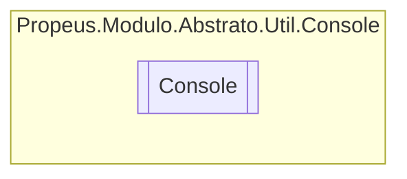

# Console `class`

## Description
Classe de extencao para o System.Configuration

## Diagram


## Members
### Methods
#### Public Static methods
| Returns | Name |
| --- | --- |
| `string` | [`ReadLine`](#readline)(`CancellationToken` cancellationToken)<br>Le uma linha no console de forma assincrona |

## Details
### Summary
Classe de extencao para o System.Configuration

### Methods
#### ReadLine
[*Source code*](https://github.com///blob//src/Propeus.Modulo.Abstrato/Util/Console/Helper.cs#L16707566)
```csharp
public static string ReadLine(CancellationToken cancellationToken)
```
##### Arguments
| Type | Name | Description |
| --- | --- | --- |
| `CancellationToken` | cancellationToken | Use o CancellationTokenSource para finalizar esta tarefa |

##### Summary
Le uma linha no console de forma assincrona

##### Returns
Texto inserido no console

*Generated with* [*ModularDoc*](https://github.com/hailstorm75/ModularDoc)
