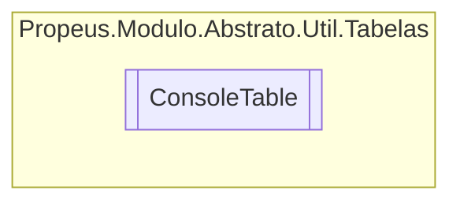

# ConsoleTable `class`

## Diagram


## Members
### Properties
#### Public  properties
| Type | Name | Methods |
| --- | --- | --- |
| `Type``[]` | [`ColumnTypes`](#columntypes) | `get` |
| `IList`&lt;`object`&gt; | [`Columns`](#columns) | `get, set` |
| [`ConsoleTableOptions`](./ConsoleTableOptions.md) | [`Options`](#options) | `get, protected set` |
| `IList`&lt;`object``[]`&gt; | [`Rows`](#rows) | `get, protected set` |

### Methods
#### Public  methods
| Returns | Name |
| --- | --- |
| [`ConsoleTable`](propeus/modulo/abstrato/util/tabelas/ConsoleTable.md) | [`AddColumn`](#addcolumn)(`IEnumerable`&lt;`string`&gt; names) |
| [`ConsoleTable`](propeus/modulo/abstrato/util/tabelas/ConsoleTable.md) | [`AddRow`](#addrow)(`object``[]` values) |
| [`ConsoleTable`](propeus/modulo/abstrato/util/tabelas/ConsoleTable.md) | [`Configure`](#configure)(`Action`&lt;[`ConsoleTableOptions`](./ConsoleTableOptions.md)&gt; action) |
| `string` | [`ToMarkDownString`](#tomarkdownstring)() |
| `string` | [`ToMinimalString`](#tominimalstring)() |
| `string` | [`ToString`](#tostring)() |
| `string` | [`ToStringAlternative`](#tostringalternative)() |
| `void` | [`Write`](#write)([`Format`](./Format.md) format) |

#### Public Static methods
| Returns | Name |
| --- | --- |
| [`ConsoleTable`](propeus/modulo/abstrato/util/tabelas/ConsoleTable.md) | [`From`](#from)(`IEnumerable`&lt;`T`&gt; values) |

## Details
### Constructors
#### ConsoleTable [1/2]
[*Source code*](https://github.com///blob//src/Propeus.Modulo.Abstrato/Util/Tabelas/Helper.cs#L28)
```csharp
public ConsoleTable(string[] columns)
```
##### Arguments
| Type | Name | Description |
| --- | --- | --- |
| `string``[]` | columns |   |

#### ConsoleTable [2/2]
[*Source code*](https://github.com///blob//src/Propeus.Modulo.Abstrato/Util/Tabelas/Helper.cs#L32)
```csharp
public ConsoleTable(ConsoleTableOptions options)
```
##### Arguments
| Type | Name | Description |
| --- | --- | --- |
| [`ConsoleTableOptions`](./ConsoleTableOptions.md) | options |   |

### Methods
#### AddColumn
[*Source code*](https://github.com///blob//src/Propeus.Modulo.Abstrato/Util/Tabelas/Helper.cs#L40)
```csharp
public ConsoleTable AddColumn(IEnumerable<string> names)
```
##### Arguments
| Type | Name | Description |
| --- | --- | --- |
| `IEnumerable`&lt;`string`&gt; | names |   |

#### AddRow
[*Source code*](https://github.com///blob//src/Propeus.Modulo.Abstrato/Util/Tabelas/Helper.cs#L50)
```csharp
public ConsoleTable AddRow(object[] values)
```
##### Arguments
| Type | Name | Description |
| --- | --- | --- |
| `object``[]` | values |   |

#### Configure
[*Source code*](https://github.com///blob//src/Propeus.Modulo.Abstrato/Util/Tabelas/Helper.cs#L72)
```csharp
public ConsoleTable Configure(Action<ConsoleTableOptions> action)
```
##### Arguments
| Type | Name | Description |
| --- | --- | --- |
| `Action`&lt;[`ConsoleTableOptions`](./ConsoleTableOptions.md)&gt; | action |   |

#### From
[*Source code*](https://github.com///blob//src/Propeus.Modulo.Abstrato/Util/Tabelas/Helper.cs#L16707566)
```csharp
public static ConsoleTable From<T>(IEnumerable<T> values)
where T : 
```
##### Arguments
| Type | Name | Description |
| --- | --- | --- |
| `IEnumerable`&lt;`T`&gt; | values |   |

#### ToString
[*Source code*](https://github.com///blob//src/Propeus.Modulo.Abstrato/Util/Tabelas/Helper.cs#L16707566)
```csharp
public override string ToString()
```

#### ToMarkDownString
[*Source code*](https://github.com///blob//src/Propeus.Modulo.Abstrato/Util/Tabelas/Helper.cs#L150)
```csharp
public string ToMarkDownString()
```

#### ToMinimalString
[*Source code*](https://github.com///blob//src/Propeus.Modulo.Abstrato/Util/Tabelas/Helper.cs#L181)
```csharp
public string ToMinimalString()
```

#### ToStringAlternative
[*Source code*](https://github.com///blob//src/Propeus.Modulo.Abstrato/Util/Tabelas/Helper.cs#L16707566)
```csharp
public string ToStringAlternative()
```

#### Write
[*Source code*](https://github.com///blob//src/Propeus.Modulo.Abstrato/Util/Tabelas/Helper.cs#L253)
```csharp
public void Write(Format format)
```
##### Arguments
| Type | Name | Description |
| --- | --- | --- |
| [`Format`](./Format.md) | format |   |

### Properties
#### Columns
```csharp
public IList<object> Columns { get; set; }
```

#### Rows
```csharp
public IList<object> Rows { get; protected set; }
```

#### Options
```csharp
public ConsoleTableOptions Options { get; protected set; }
```

#### ColumnTypes
```csharp
public Type ColumnTypes { get; }
```

*Generated with* [*ModularDoc*](https://github.com/hailstorm75/ModularDoc)
