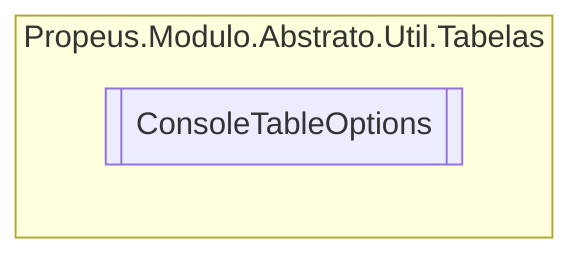

# ConsoleTableOptions `class`

## Diagram


## Members
### Properties
#### Public  properties
| Type | Name | Methods |
| --- | --- | --- |
| `IEnumerable`&lt;`string`&gt; | [`Columns`](#columns) | `get, set` |
| `bool` | [`EnableCount`](#enablecount) | `get, set` |
| [`Alignment`](./Alignment.md) | [`NumberAlignment`](#numberalignment)<br>Enable only from a list of objects | `get, set` |
| `TextWriter` | [`OutputTo`](#outputto)<br>The TextWriter to write to. Defaults to Console.Out . | `get, set` |

## Details
### Constructors
#### ConsoleTableOptions
[*Source code*](https://github.com///blob//src/Propeus.Modulo.Abstrato/Util/Tabelas/Helper.cs#L291)
```csharp
public ConsoleTableOptions()
```

### Properties
#### Columns
```csharp
public IEnumerable<string> Columns { get; set; }
```

#### EnableCount
```csharp
public bool EnableCount { get; set; }
```

#### NumberAlignment
```csharp
public Alignment NumberAlignment { get; set; }
```
##### Summary
Enable only from a list of objects

#### OutputTo
```csharp
public TextWriter OutputTo { get; set; }
```
##### Summary
The TextWriter to write to. Defaults to Console.Out .

*Generated with* [*ModularDoc*](https://github.com/hailstorm75/ModularDoc)
