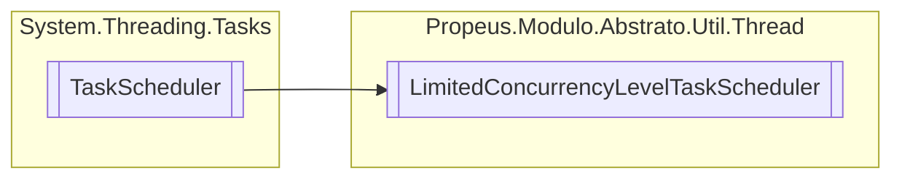

# LimitedConcurrencyLevelTaskScheduler `class`

## Description
https://docs.microsoft.com/pt-br/dotnet/api/system.threading._tasks.taskscheduler?view=netcore-3.1

## Diagram


## Members
### Properties
#### Public  properties
| Type | Name | Methods |
| --- | --- | --- |
| `int` | [`MaximumConcurrencyLevel`](#maximumconcurrencylevel)<br>Gets the maximum concurrency level supported by this _scheduler. | `get` |

### Methods
#### Protected  methods
| Returns | Name |
| --- | --- |
| `IEnumerable`&lt;`Task`&gt; | [`GetScheduledTasks`](#getscheduledtasks)()<br>Gets an enumerable of the _tasks currently scheduled on this _scheduler. |
| `void` | [`QueueTask`](#queuetask)(`Task` task)<br>Queues a task to the _scheduler. |
| `bool` | [`TryDequeue`](#trydequeue)(`Task` task)<br>Attempt to remove a previously scheduled task from the _scheduler. |
| `bool` | [`TryExecuteTaskInline`](#tryexecutetaskinline)(`Task` task, `bool` taskWasPreviouslyQueued)<br>Attempts to execute the specified task on the current thread. |

## Details
### Summary
https://docs.microsoft.com/pt-br/dotnet/api/system.threading._tasks.taskscheduler?view=netcore-3.1

### Inheritance
 - `TaskScheduler`

### Constructors
#### LimitedConcurrencyLevelTaskScheduler
[*Source code*](https://github.com///blob//src/Propeus.Modulo.Abstrato/Util/Thread/LimitedConcurrencyLevelTaskScheduler.cs#L17)
```csharp
public LimitedConcurrencyLevelTaskScheduler(int maxDegreeOfParallelism)
```
##### Arguments
| Type | Name | Description |
| --- | --- | --- |
| `int` | maxDegreeOfParallelism |  |

##### Summary
Creates a new instance with the specified degree of parallelism.

### Methods
#### QueueTask
[*Source code*](https://github.com///blob//src/Propeus.Modulo.Abstrato/Util/Thread/LimitedConcurrencyLevelTaskScheduler.cs#L44)
```csharp
protected override void QueueTask(Task task)
```
##### Arguments
| Type | Name | Description |
| --- | --- | --- |
| `Task` | task |  |

##### Summary
Queues a task to the _scheduler.

#### TryExecuteTaskInline
[*Source code*](https://github.com///blob//src/Propeus.Modulo.Abstrato/Util/Thread/LimitedConcurrencyLevelTaskScheduler.cs#L103)
```csharp
protected override bool TryExecuteTaskInline(Task task, bool taskWasPreviouslyQueued)
```
##### Arguments
| Type | Name | Description |
| --- | --- | --- |
| `Task` | task |  |
| `bool` | taskWasPreviouslyQueued |  |

##### Summary
Attempts to execute the specified task on the current thread.

##### Returns


#### TryDequeue
[*Source code*](https://github.com///blob//src/Propeus.Modulo.Abstrato/Util/Thread/LimitedConcurrencyLevelTaskScheduler.cs#L128)
```csharp
protected override bool TryDequeue(Task task)
```
##### Arguments
| Type | Name | Description |
| --- | --- | --- |
| `Task` | task |  |

##### Summary
Attempt to remove a previously scheduled task from the _scheduler.

##### Returns


#### GetScheduledTasks
[*Source code*](https://github.com///blob//src/Propeus.Modulo.Abstrato/Util/Thread/LimitedConcurrencyLevelTaskScheduler.cs#L145)
```csharp
protected override IEnumerable<Task> GetScheduledTasks()
```
##### Summary
Gets an enumerable of the _tasks currently scheduled on this _scheduler.

##### Returns


### Properties
#### MaximumConcurrencyLevel
```csharp
public override int MaximumConcurrencyLevel { get; }
```
##### Summary
Gets the maximum concurrency level supported by this _scheduler.

*Generated with* [*ModularDoc*](https://github.com/hailstorm75/ModularDoc)
