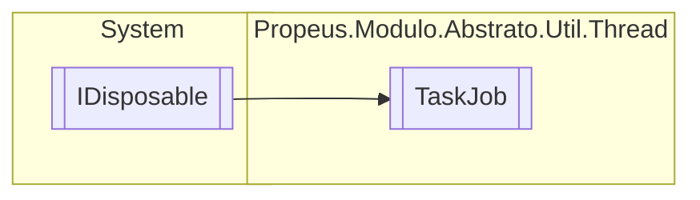

# TaskJob `class`

## Description
Gerenciador de Task

## Diagram


## Members
### Properties
#### Public  properties
| Type | Name | Methods |
| --- | --- | --- |
| `int` | [`Aguardando`](#aguardando)<br>Numero de tasks que aguardam a execucao | `get` |
| `int` | [`Completado`](#completado)<br>Indica quantas tasks ja foram executados | `get` |
| `int` | [`EmExecucao`](#emexecucao)<br>Indica quantas taks estao sendo executados no momento | `get` |

### Methods
#### Public  methods
| Returns | Name |
| --- | --- |
| `Task` | [`AddTask`](#addtask)(`Action`&lt;`object`&gt; action, `TimeSpan` period, `string` nomeJob) |
| `void` | [`Dispose`](#dispose-22)()<br>Cancela todas as tasks e limpa a lista |
| `bool` | [`IsCompleted`](#iscompleted)()<br>Indica se todas as tasks foram concluidas |
| `string` | [`ToString`](#tostring)()<br>Retorna a lista de tasks e seu estado atual |
| `string` | [`ToStringRunning`](#tostringrunning)()<br>Retorna o resumo das tasks em execucao, completados e em espera, alem da lista de tasks em execucao |
| `Task` | [`WaitAll`](#waitall)()<br>Aguarda todas as tasks serem executadas |

#### Protected  methods
| Returns | Name |
| --- | --- |
| `void` | [`Dispose`](#dispose-12)(`bool` disposing)<br>Cancela todas as tasks e limpa a lista |

## Details
### Summary
Gerenciador de Task

### Inheritance
 - `IDisposable`

### Constructors
#### TaskJob
[*Source code*](https://github.com///blob//src/Propeus.Modulo.Abstrato/Util/Thread/TaskJob.cs#L45)
```csharp
public TaskJob(int threads)
```
##### Arguments
| Type | Name | Description |
| --- | --- | --- |
| `int` | threads | Numereo de taks que podem ser executado ao mesmo tempo. Por padrao este valor e 2 |

##### Summary
Inicializa o gerenciador com uma quantidade de taks que podem ser executados ao mesmo tempo

### Methods
#### WaitAll
[*Source code*](https://github.com///blob//src/Propeus.Modulo.Abstrato/Util/Thread/TaskJob.cs#L76)
```csharp
public Task WaitAll()
```
##### Summary
Aguarda todas as tasks serem executadas

##### Remarks
Esta espera ignora a task de limpeza ' [TaskJob](propeus/modulo/abstrato/util/thread/TaskJob.md).NOME_JOB_COLETOR '

##### Returns
Retorna uma Task que sera concluida quando todas as tarafas forem finalizadas

#### IsCompleted
[*Source code*](https://github.com///blob//src/Propeus.Modulo.Abstrato/Util/Thread/TaskJob.cs#L89)
```csharp
public bool IsCompleted()
```
##### Summary
Indica se todas as tasks foram concluidas

##### Remarks
Esta funcao ignora a task de limpeza ' [TaskJob](propeus/modulo/abstrato/util/thread/TaskJob.md).NOME_JOB_COLETOR '

##### Returns
Retorna caso todas as tasks tenham sido concluidas, caso contrario retorna

#### AddTask
[*Source code*](https://github.com///blob//src/Propeus.Modulo.Abstrato/Util/Thread/TaskJob.cs#L16707566)
```csharp
public Task AddTask(Action<object> action, TimeSpan period, string nomeJob)
```
##### Arguments
| Type | Name | Description |
| --- | --- | --- |
| `Action`&lt;`object`&gt; | action |   |
| `TimeSpan` | period |   |
| `string` | nomeJob |   |

#### ToStringRunning
[*Source code*](https://github.com///blob//src/Propeus.Modulo.Abstrato/Util/Thread/TaskJob.cs#L141)
```csharp
public string ToStringRunning()
```
##### Summary
Retorna o resumo das tasks em execucao, completados e em espera, alem da lista de tasks em execucao

##### Returns


#### ToString
[*Source code*](https://github.com///blob//src/Propeus.Modulo.Abstrato/Util/Thread/TaskJob.cs#L161)
```csharp
public override string ToString()
```
##### Summary
Retorna a lista de tasks e seu estado atual

##### Returns
Retorna a lista de tasks e seu estado atual

#### Dispose [1/2]
[*Source code*](https://github.com///blob//src/Propeus.Modulo.Abstrato/Util/Thread/TaskJob.cs#L177)
```csharp
protected virtual void Dispose(bool disposing)
```
##### Arguments
| Type | Name | Description |
| --- | --- | --- |
| `bool` | disposing | Indica se deve realizar o dispose nos objetos gerenciados |

##### Summary
Cancela todas as tasks e limpa a lista

#### Dispose [2/2]
[*Source code*](https://github.com///blob//src/Propeus.Modulo.Abstrato/Util/Thread/TaskJob.cs#L202)
```csharp
public virtual void Dispose()
```
##### Summary
Cancela todas as tasks e limpa a lista

### Properties
#### EmExecucao
```csharp
public int EmExecucao { get; }
```
##### Summary
Indica quantas taks estao sendo executados no momento

#### Completado
```csharp
public int Completado { get; }
```
##### Summary
Indica quantas tasks ja foram executados

##### Remarks
Caso a task [TaskJob](propeus/modulo/abstrato/util/thread/TaskJob.md).NOME_JOB_COLETOR esteja em execucao, o numero de tasks completados sera igual a propriedade [TaskJob](propeus/modulo/abstrato/util/thread/TaskJob.md).[EmExecucao](#emexecucao) , 
            pois esta task remove as tasks que ja foram executadas

#### Aguardando
```csharp
public int Aguardando { get; }
```
##### Summary
Numero de tasks que aguardam a execucao

*Generated with* [*ModularDoc*](https://github.com/hailstorm75/ModularDoc)
