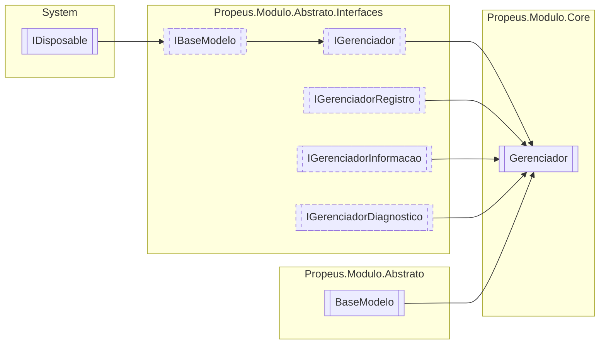

# Gerenciador `class`

## Diagram


## Members
### Properties
#### Public  properties
| Type | Name | Methods |
| --- | --- | --- |
| `DateTime` | [`DataInicio`](#datainicio) | `get` |
| `Task` | [`LimpezaAutomaticaTask`](#limpezaautomaticatask) | `get` |
| `IEnumerable`&lt;`string`&gt; | [`ModulosIgnorados`](#modulosignorados) | `get` |
| `int` | [`ModulosInicializados`](#modulosinicializados) | `get` |
| `IEnumerable`&lt;`string`&gt; | [`ModulosValidos`](#modulosvalidos) | `get` |
| `TimeSpan` | [`TempoExecucao`](#tempoexecucao) | `get` |
| `DateTime` | [`UltimaAtualizacao`](#ultimaatualizacao) | `get` |

#### Public Static properties
| Type | Name | Methods |
| --- | --- | --- |
| [`IGerenciador`](../abstrato/interfaces/IGerenciador.md) | [`Atual`](#atual) | `get` |

### Methods
#### Public  methods
| Returns | Name |
| --- | --- |
| [`IModulo`](../abstrato/interfaces/IModulo.md) | [`Criar`](#criar-13)(`...`)<br>Cria uma nova instancia do modulo buscando o tipo pelo nome |
| `bool` | [`Existe`](#existe-13)(`...`)<br>Verifica se existe alguma instancia do tipo no gerenciador |
| `IEnumerable`&lt;[`IModulo`](../abstrato/interfaces/IModulo.md)&gt; | [`Listar`](#listar)()<br>Lista todos os modulos |
| `Task` | [`ManterVivoAsync`](#mantervivoasync)()<br>Mantem o gerenciador vivo durante o uso da aplicação |
| `T` | [`Obter`](#obter-13)(`...`) |
| [`IModuloTipo`](../abstrato/interfaces/IModuloTipo.md) | [`ObterInfo`](#obterinfo-13)(`...`) |
| `void` | [`Registrar`](#registrar)([`IModulo`](../abstrato/interfaces/IModulo.md) modulo)<br>Registra o modulo no gerenciador <br><br> |
| `T` | [`Reiniciar`](#reiniciar-12)(`...`) |
| `void` | [`Remover`](#remover-12)(`...`) |
| `void` | [`RemoverTodos`](#removertodos)()<br>Remove todos os modulos |
| `string` | [`ToString`](#tostring)()<br>Exibe informações basicas sobre o modelo |

#### Protected  methods
| Returns | Name |
| --- | --- |
| `void` | [`Dispose`](#dispose)(`bool` disposing) |

## Details
### Inheritance
 - [
`IGerenciador`
](../abstrato/interfaces/IGerenciador.md)
 - [
`IBaseModelo`
](../abstrato/interfaces/IBaseModelo.md)
 - `IDisposable`
 - [
`IGerenciadorRegistro`
](../abstrato/interfaces/IGerenciadorRegistro.md)
 - [
`IGerenciadorInformacao`
](../abstrato/interfaces/IGerenciadorInformacao.md)
 - [
`IGerenciadorDiagnostico`
](../abstrato/interfaces/IGerenciadorDiagnostico.md)
 - [
`BaseModelo`
](../abstrato/BaseModelo.md)

### Methods
#### Criar [1/3]
[*Source code*](https://github.com///blob//src/Propeus.Modulo.Dinamico/Gerenciador.cs#L189)
```csharp
public virtual IModulo Criar(string nomeModulo, object[] argumentos)
```
##### Arguments
| Type | Name | Description |
| --- | --- | --- |
| `string` | nomeModulo | Nome do modulo |
| `object``[]` | argumentos |   |

##### Summary
Cria uma nova instancia do modulo buscando o tipo pelo nome

##### Returns


#### Criar [2/3]
[*Source code*](https://github.com///blob//src/Propeus.Modulo.Dinamico/Gerenciador.cs#L195)
```csharp
public virtual T Criar<T>(object[] argumentos)
where T : IModulo
```
##### Arguments
| Type | Name | Description |
| --- | --- | --- |
| `object``[]` | argumentos |   |

#### Criar [3/3]
[*Source code*](https://github.com///blob//src/Propeus.Modulo.Dinamico/Gerenciador.cs#L200)
```csharp
public virtual IModulo Criar(Type modulo, object[] argumentos)
```
##### Arguments
| Type | Name | Description |
| --- | --- | --- |
| `Type` | modulo |  |
| `object``[]` | argumentos |   |

##### Summary
Cria uma nova instancia do modulo usando o tipo do parametro `modulo`

##### Returns


#### Remover [1/2]
[*Source code*](https://github.com///blob//src/Propeus.Modulo.Dinamico/Gerenciador.cs#L213)
```csharp
public virtual void Remover<T>(T modulo)
where T : IModulo
```
##### Arguments
| Type | Name | Description |
| --- | --- | --- |
| `T` | modulo |   |

#### Remover [2/2]
[*Source code*](https://github.com///blob//src/Propeus.Modulo.Dinamico/Gerenciador.cs#L218)
```csharp
public virtual void Remover(string id)
```
##### Arguments
| Type | Name | Description |
| --- | --- | --- |
| `string` | id | Identificação unica do modulo |

##### Summary
Remove um modulo pelo seu ID

#### RemoverTodos
[*Source code*](https://github.com///blob//src/Propeus.Modulo.Dinamico/Gerenciador.cs#L227)
```csharp
public virtual void RemoverTodos()
```
##### Summary
Remove todos os modulos

#### ObterInfo [1/3]
[*Source code*](https://github.com///blob//src/Propeus.Modulo.Dinamico/Gerenciador.cs#L233)
```csharp
public virtual IModuloTipo ObterInfo<T>()
where T : IModulo
```

#### ObterInfo [2/3]
[*Source code*](https://github.com///blob//src/Propeus.Modulo.Dinamico/Gerenciador.cs#L242)
```csharp
public virtual IModuloTipo ObterInfo(Type modulo)
```
##### Arguments
| Type | Name | Description |
| --- | --- | --- |
| `Type` | modulo |   |

##### Summary
Obtem o [IModuloTipo](../abstrato/interfaces/IModuloTipo.md) de `type` caso exista 


##### Returns
[IModuloTipo](../abstrato/interfaces/IModuloTipo.md)

#### ObterInfo [3/3]
[*Source code*](https://github.com///blob//src/Propeus.Modulo.Dinamico/Gerenciador.cs#L246)
```csharp
public virtual IModuloTipo ObterInfo(string id)
```
##### Arguments
| Type | Name | Description |
| --- | --- | --- |
| `string` | id | Identificação unica do modulo |

##### Summary
Obtem  o [IModuloTipo](../abstrato/interfaces/IModuloTipo.md) do modulo pelo id

##### Returns
[IModuloTipo](../abstrato/interfaces/IModuloTipo.md)

#### Obter [1/3]
[*Source code*](https://github.com///blob//src/Propeus.Modulo.Dinamico/Gerenciador.cs#L251)
```csharp
public virtual T Obter<T>()
where T : IModulo
```

#### Obter [2/3]
[*Source code*](https://github.com///blob//src/Propeus.Modulo.Abstrato/ModuloTipo.cs#L41)
```csharp
public virtual IModulo Obter(Type modulo)
```
##### Arguments
| Type | Name | Description |
| --- | --- | --- |
| `Type` | modulo |   |

##### Summary
Obtem a instancia de `type` caso exista 


##### Returns


#### Obter [3/3]
[*Source code*](https://github.com///blob//src/Propeus.Modulo.Dinamico/Gerenciador.cs#L262)
```csharp
public virtual IModulo Obter(string id)
```
##### Arguments
| Type | Name | Description |
| --- | --- | --- |
| `string` | id | Identificação unica do modulo |

##### Summary
Obtem a instancia do modulo pelo id

##### Returns


#### Existe [1/3]
[*Source code*](https://github.com///blob//src/Propeus.Modulo.Dinamico/Gerenciador.cs#L268)
```csharp
public virtual bool Existe(Type type)
```
##### Arguments
| Type | Name | Description |
| --- | --- | --- |
| `Type` | type |  |

##### Summary
Verifica se existe alguma instancia do tipo no gerenciador

##### Returns


#### Existe [2/3]
[*Source code*](https://github.com///blob//src/Propeus.Modulo.Dinamico/Gerenciador.cs#L33)
```csharp
public virtual bool Existe(IModulo modulo)
```
##### Arguments
| Type | Name | Description |
| --- | --- | --- |
| [`IModulo`](../abstrato/interfaces/IModulo.md) | modulo |  |

##### Summary
Verifica se a instancia do modulo existe no genrenciador

##### Returns


#### Existe [3/3]
[*Source code*](https://github.com///blob//src/Propeus.Modulo.Dinamico/Gerenciador.cs#L62)
```csharp
public virtual bool Existe(string id)
```
##### Arguments
| Type | Name | Description |
| --- | --- | --- |
| `string` | id | Identificação unica do modulo |

##### Summary
Verifica se existe alguma instancia com o id no gerenciador

##### Returns


#### Reiniciar [1/2]
[*Source code*](https://github.com///blob//src/Propeus.Modulo.Dinamico/ModuloAssemblyLoadContext.cs#L13)
```csharp
public virtual T Reiniciar<T>(T modulo)
where T : IModulo
```
##### Arguments
| Type | Name | Description |
| --- | --- | --- |
| `T` | modulo |   |

#### Reiniciar [2/2]
[*Source code*](https://github.com///blob//src/Propeus.Modulo.Dinamico/ModuloBinario.cs#L22)
```csharp
public virtual IModulo Reiniciar(string id)
```
##### Arguments
| Type | Name | Description |
| --- | --- | --- |
| `string` | id | Identificação unica do modulo |

##### Summary
Realiza uma reciclagem do modulo

##### Returns


#### Registrar
[*Source code*](https://github.com///blob//src/Propeus.Modulo.Dinamico/ModuloBinario.cs#L46)
```csharp
public virtual void Registrar(IModulo modulo)
```
##### Arguments
| Type | Name | Description |
| --- | --- | --- |
| [`IModulo`](../abstrato/interfaces/IModulo.md) | modulo |  |

##### Summary
Registra o modulo no gerenciador 


#### ManterVivoAsync
[*Source code*](https://github.com///blob//src/Propeus.Modulo.Dinamico/ModuloBinario.cs#L51)
```csharp
public virtual async Task ManterVivoAsync()
```
##### Summary
Mantem o gerenciador vivo durante o uso da aplicação

##### Returns


#### Listar
[*Source code*](https://github.com///blob//src/Propeus.Modulo.Dinamico/ModuloBinario.cs#L56)
```csharp
public virtual IEnumerable<IModulo> Listar()
```
##### Summary
Lista todos os modulos

##### Returns


#### Dispose
[*Source code*](https://github.com///blob//src/Propeus.Modulo.Dinamico/ModuloBinario.cs#L83)
```csharp
protected override void Dispose(bool disposing)
```
##### Arguments
| Type | Name | Description |
| --- | --- | --- |
| `bool` | disposing |   |

#### ToString
[*Source code*](https://github.com///blob//src/Propeus.Modulo.Dinamico/ModuloInformacao.cs#L23)
```csharp
public override string ToString()
```
##### Summary
Exibe informações basicas sobre o modelo

##### Returns


### Properties
#### DataInicio
```csharp
public virtual DateTime DataInicio { get; }
```

#### UltimaAtualizacao
```csharp
public virtual DateTime UltimaAtualizacao { get; }
```

#### ModulosInicializados
```csharp
public virtual int ModulosInicializados { get; }
```

#### Atual
```csharp
public static IGerenciador Atual { get; }
```

#### LimpezaAutomaticaTask
```csharp
public Task LimpezaAutomaticaTask { get; }
```

#### ModulosValidos
```csharp
public IEnumerable<string> ModulosValidos { get; }
```

#### ModulosIgnorados
```csharp
public IEnumerable<string> ModulosIgnorados { get; }
```

#### TempoExecucao
```csharp
public TimeSpan TempoExecucao { get; }
```

*Generated with* [*ModularDoc*](https://github.com/hailstorm75/ModularDoc)
