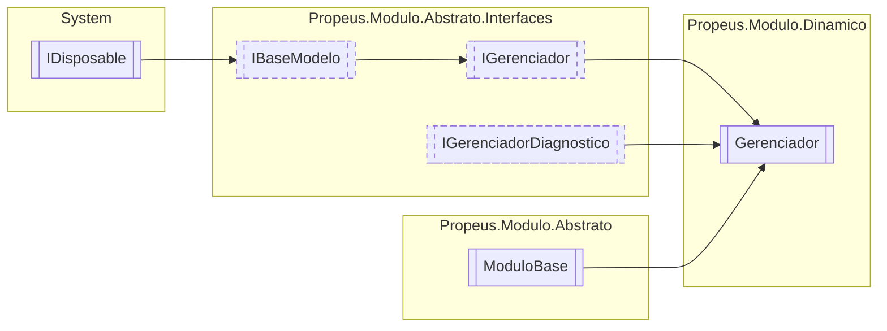

# Gerenciador `class`

## Diagram


## Members
### Properties
#### Public  properties
| Type | Name | Methods |
| --- | --- | --- |
| `DateTime` | [`DataInicio`](#datainicio) | `get` |
| `string` | [`DiretorioModulo`](#diretoriomodulo) | `get, set` |
| `int` | [`ModulosInicializados`](#modulosinicializados) | `get` |
| `DateTime` | [`UltimaAtualizacao`](#ultimaatualizacao) | `get` |

### Methods
#### Public  methods
| Returns | Name |
| --- | --- |
| `T` | [`Criar`](#criar-13)(`...`) |
| `bool` | [`Existe`](#existe-13)(`...`) |
| `IEnumerable`&lt;[`IModulo`](../abstrato/interfaces/IModulo.md)&gt; | [`Listar`](#listar)() |
| `Task` | [`ManterVivoAsync`](#mantervivoasync)() |
| `T` | [`Obter`](#obter-13)(`...`) |
| `T` | [`Reiniciar`](#reiniciar-12)(`...`) |
| `void` | [`Remover`](#remover-12)(`...`) |
| `void` | [`RemoverTodos`](#removertodos)() |
| `string` | [`ToString`](#tostring)() |

#### Protected  methods
| Returns | Name |
| --- | --- |
| `void` | [`Dispose`](#dispose)(`bool` disposing) |

## Details
### Inheritance
 - [
`IGerenciador`
](../abstrato/interfaces/IGerenciador.md)
 - [
`IBaseModelo`
](../abstrato/interfaces/IBaseModelo.md)
 - `IDisposable`
 - [
`IGerenciadorDiagnostico`
](../abstrato/interfaces/IGerenciadorDiagnostico.md)
 - [
`ModuloBase`
](../abstrato/ModuloBase.md)

### Constructors
#### Gerenciador
[*Source code*](https://github.com///blob//src/Propeus.Modulo.Dinamico/Gerenciador.cs#L95)
```csharp
public Gerenciador(IGerenciador gerenciador, bool instanciaUnica)
```
##### Arguments
| Type | Name | Description |
| --- | --- | --- |
| [`IGerenciador`](../abstrato/interfaces/IGerenciador.md) | gerenciador |   |
| `bool` | instanciaUnica |   |

### Methods
#### Criar [1/3]
[*Source code*](https://github.com///blob//src/Propeus.Modulo.Dinamico/Gerenciador.cs#L108)
```csharp
public virtual T Criar<T>(object[] args)
where T : IModulo
```
##### Arguments
| Type | Name | Description |
| --- | --- | --- |
| `object``[]` | args |   |

#### Criar [2/3]
[*Source code*](https://github.com///blob//src/Propeus.Modulo.Dinamico/Gerenciador.cs#L16707566)
```csharp
public virtual IModulo Criar(string nomeModulo, object[] args)
```
##### Arguments
| Type | Name | Description |
| --- | --- | --- |
| `string` | nomeModulo |   |
| `object``[]` | args |   |

#### Criar [3/3]
[*Source code*](https://github.com///blob//src/Propeus.Modulo.Dinamico/Gerenciador.cs#L118)
```csharp
public virtual IModulo Criar(Type modulo, object[] args)
```
##### Arguments
| Type | Name | Description |
| --- | --- | --- |
| `Type` | modulo |   |
| `object``[]` | args |   |

#### Remover [1/2]
[*Source code*](https://github.com///blob//src/Propeus.Modulo.Dinamico/Gerenciador.cs#L178)
```csharp
public virtual void Remover<T>(T modulo)
where T : IModulo
```
##### Arguments
| Type | Name | Description |
| --- | --- | --- |
| `T` | modulo |   |

#### Remover [2/2]
[*Source code*](https://github.com///blob//src/Propeus.Modulo.Dinamico/Gerenciador.cs#L182)
```csharp
public virtual void Remover(string id)
```
##### Arguments
| Type | Name | Description |
| --- | --- | --- |
| `string` | id |   |

#### RemoverTodos
[*Source code*](https://github.com///blob//src/Propeus.Modulo.Dinamico/Gerenciador.cs#L189)
```csharp
public virtual void RemoverTodos()
```

#### Reiniciar [1/2]
[*Source code*](https://github.com///blob//src/Propeus.Modulo.Dinamico/Gerenciador.cs#L195)
```csharp
public virtual T Reiniciar<T>(T modulo)
where T : IModulo
```
##### Arguments
| Type | Name | Description |
| --- | --- | --- |
| `T` | modulo |   |

#### Reiniciar [2/2]
[*Source code*](https://github.com///blob//src/Propeus.Modulo.Dinamico/Gerenciador.cs#L200)
```csharp
public virtual IModulo Reiniciar(string id)
```
##### Arguments
| Type | Name | Description |
| --- | --- | --- |
| `string` | id |   |

#### Obter [1/3]
[*Source code*](https://github.com///blob//src/Propeus.Modulo.Dinamico/Gerenciador.cs#L213)
```csharp
public virtual T Obter<T>()
where T : IModulo
```

#### Obter [2/3]
[*Source code*](https://github.com///blob//src/Propeus.Modulo.Dinamico/Gerenciador.cs#L218)
```csharp
public virtual IModulo Obter(Type modulo)
```
##### Arguments
| Type | Name | Description |
| --- | --- | --- |
| `Type` | modulo |   |

#### Obter [3/3]
[*Source code*](https://github.com///blob//src/Propeus.Modulo.Dinamico/Gerenciador.cs#L227)
```csharp
public virtual IModulo Obter(string id)
```
##### Arguments
| Type | Name | Description |
| --- | --- | --- |
| `string` | id |   |

#### Existe [1/3]
[*Source code*](https://github.com///blob//src/Propeus.Modulo.Dinamico/Gerenciador.cs#L233)
```csharp
public virtual bool Existe(Type modulo)
```
##### Arguments
| Type | Name | Description |
| --- | --- | --- |
| `Type` | modulo |   |

#### Existe [2/3]
[*Source code*](https://github.com///blob//src/Propeus.Modulo.Dinamico/Gerenciador.cs#L242)
```csharp
public virtual bool Existe(IModulo modulo)
```
##### Arguments
| Type | Name | Description |
| --- | --- | --- |
| [`IModulo`](../abstrato/interfaces/IModulo.md) | modulo |   |

#### Existe [3/3]
[*Source code*](https://github.com///blob//src/Propeus.Modulo.Dinamico/Gerenciador.cs#L246)
```csharp
public virtual bool Existe(string id)
```
##### Arguments
| Type | Name | Description |
| --- | --- | --- |
| `string` | id |   |

#### Listar
[*Source code*](https://github.com///blob//src/Propeus.Modulo.Dinamico/Gerenciador.cs#L251)
```csharp
public virtual IEnumerable<IModulo> Listar()
```

#### ManterVivoAsync
[*Source code*](https://github.com///blob//src/Propeus.Modulo.Abstrato/ModuloTipo.cs#L41)
```csharp
public virtual async Task ManterVivoAsync()
```

#### Dispose
[*Source code*](https://github.com///blob//src/Propeus.Modulo.Dinamico/Gerenciador.cs#L262)
```csharp
protected override void Dispose(bool disposing)
```
##### Arguments
| Type | Name | Description |
| --- | --- | --- |
| `bool` | disposing |   |

#### ToString
[*Source code*](https://github.com///blob//src/Propeus.Modulo.Dinamico/Gerenciador.cs#L268)
```csharp
public override string ToString()
```

### Properties
#### DataInicio
```csharp
public virtual DateTime DataInicio { get; }
```

#### UltimaAtualizacao
```csharp
public virtual DateTime UltimaAtualizacao { get; }
```

#### ModulosInicializados
```csharp
public virtual int ModulosInicializados { get; }
```

#### DiretorioModulo
```csharp
public string DiretorioModulo { get; set; }
```

### Events
#### OnEvento
```csharp
public event Evento OnEvento
```

*Generated with* [*ModularDoc*](https://github.com/hailstorm75/ModularDoc)
