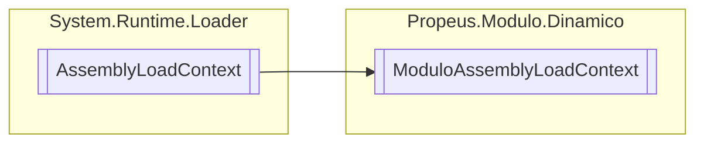

# ModuloAssemblyLoadContext `class`

## Description
AssemblyLoadContext customizado

## Diagram


## Details
### Summary
AssemblyLoadContext customizado

### Inheritance
 - `AssemblyLoadContext`

### Constructors
#### ModuloAssemblyLoadContext
[*Source code*](https://github.com///blob//src/Propeus.Modulo.Dinamico/ModuloAssemblyLoadContext.cs#L13)
```csharp
public ModuloAssemblyLoadContext()
```
##### Summary
Construtor padrão

*Generated with* [*ModularDoc*](https://github.com/hailstorm75/ModularDoc)
