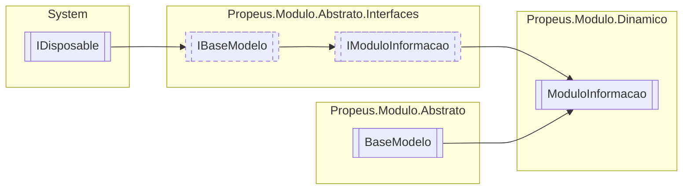

# ModuloInformacao `class`

## Description
Modelo para detalhar informações sobre o modulo

## Diagram


## Members
### Properties
#### Public  properties
| Type | Name | Methods |
| --- | --- | --- |
| `Assembly` | [`Assembly`](#assembly)<br>Assembly a qual o modulo pertence | `get` |
| `AssemblyName` | [`AssemblyName`](#assemblyname)<br>Informações sobre o assembly do modulo | `get` |
| `string` | [`Caminho`](#caminho)<br>Caminho do modulo em disco | `get` |
| `string` | [`Hash`](#hash) | `get` |
| [`IModuloTipo`](../abstrato/interfaces/IModuloTipo.md) | [`Item`](#item) | `get, set` |
| `Dictionary`&lt;`string`, [`IModuloTipo`](../abstrato/interfaces/IModuloTipo.md)&gt; | [`Modulos`](#modulos)<br>ModuloInformacao mapeados do assembly | `get` |
| `int` | [`ModulosCarregados`](#moduloscarregados) | `get` |
| `int` | [`ModulosDescobertos`](#modulosdescobertos) | `get` |
| `int` | [`NumeroVersaoAssembly`](#numeroversaoassembly)<br>Obtem o numero de versão do assembly mapeado | `get` |
| `string` | [`Versao`](#versao) | `get` |

### Methods
#### Public  methods
| Returns | Name |
| --- | --- |
| `void` | [`AdicionarContrato`](#adicionarcontrato)(`string` nomeModulo, `Type` contrato)<br>Adiciona um contrato atrelado a um modulo |
| `Type` | [`CarregarTipoModulo`](#carregartipomodulo)(`string` nomeModulo) |
| `List`&lt;`Type`&gt; | [`ObterContratos`](#obtercontratos)(`string` nomeModulo)<br>Obtem a lista de contratos do modulo informado |
| `bool` | [`PossuiModulo`](#possuimodulo)(`string` nomeModulo) |
| `string` | [`ToString`](#tostring)() |

#### Protected  methods
| Returns | Name |
| --- | --- |
| `void` | [`Dispose`](#dispose)(`bool` disposing) |

#### Public Static methods
| Returns | Name |
| --- | --- |
| `bool` | [`PossuiModuloValido`](#possuimodulovalido)([`IModuloBinario`](../abstrato/interfaces/IModuloBinario.md) path, [`IRegra`](../abstrato/interfaces/IRegra.md)`[]` regra)<br>Metodo estatico para validação de modulo |

## Details
### Summary
Modelo para detalhar informações sobre o modulo

### Inheritance
 - [
`IModuloInformacao`
](../abstrato/interfaces/IModuloInformacao.md)
 - [
`IBaseModelo`
](../abstrato/interfaces/IBaseModelo.md)
 - `IDisposable`
 - [
`BaseModelo`
](../abstrato/BaseModelo.md)

### Constructors
#### ModuloInformacao
[*Source code*](https://github.com///blob//src/Propeus.Modulo.Dinamico/ModuloInformacao.cs#L23)
```csharp
public ModuloInformacao(IModuloBinario moduloBinario)
```
##### Arguments
| Type | Name | Description |
| --- | --- | --- |
| [`IModuloBinario`](../abstrato/interfaces/IModuloBinario.md) | moduloBinario |   |

### Methods
#### AdicionarContrato
[*Source code*](https://github.com///blob//src/Propeus.Modulo.Dinamico/ModuloInformacao.cs#L118)
```csharp
public virtual void AdicionarContrato(string nomeModulo, Type contrato)
```
##### Arguments
| Type | Name | Description |
| --- | --- | --- |
| `string` | nomeModulo |   |
| `Type` | contrato |  |

##### Summary
Adiciona um contrato atrelado a um modulo

#### ObterContratos
[*Source code*](https://github.com///blob//src/Propeus.Modulo.Dinamico/ModuloInformacao.cs#L150)
```csharp
public virtual List<Type> ObterContratos(string nomeModulo)
```
##### Arguments
| Type | Name | Description |
| --- | --- | --- |
| `string` | nomeModulo |  |

##### Summary
Obtem a lista de contratos do modulo informado

##### Returns


#### PossuiModulo
[*Source code*](https://github.com///blob//src/Propeus.Modulo.Dinamico/ModuloInformacao.cs#L157)
```csharp
public virtual bool PossuiModulo(string nomeModulo)
```
##### Arguments
| Type | Name | Description |
| --- | --- | --- |
| `string` | nomeModulo |   |

#### CarregarTipoModulo
[*Source code*](https://github.com///blob//src/Propeus.Modulo.Dinamico/ModuloInformacao.cs#L16707566)
```csharp
public virtual Type CarregarTipoModulo(string nomeModulo)
```
##### Arguments
| Type | Name | Description |
| --- | --- | --- |
| `string` | nomeModulo |   |

#### ToString
[*Source code*](https://github.com///blob//src/Propeus.Modulo.Dinamico/ModuloInformacao.cs#L168)
```csharp
public override string ToString()
```

#### Dispose
[*Source code*](https://github.com///blob//src/Propeus.Modulo.Dinamico/ModuloInformacao.cs#L179)
```csharp
protected override void Dispose(bool disposing)
```
##### Arguments
| Type | Name | Description |
| --- | --- | --- |
| `bool` | disposing |   |

#### PossuiModuloValido
[*Source code*](https://github.com///blob//src/Propeus.Modulo.Dinamico/ModuloInformacao.cs#L207)
```csharp
public static bool PossuiModuloValido(IModuloBinario path, IRegra[] regra)
```
##### Arguments
| Type | Name | Description |
| --- | --- | --- |
| [`IModuloBinario`](../abstrato/interfaces/IModuloBinario.md) | path |  |
| [`IRegra`](../abstrato/interfaces/IRegra.md)`[]` | regra |  |

##### Summary
Metodo estatico para validação de modulo

##### Returns


### Properties
#### Versao
```csharp
public override string Versao { get; }
```

#### Item
```csharp
public virtual IModuloTipo Item { get; set; }
```

#### Assembly
```csharp
public virtual Assembly Assembly { get; }
```
##### Summary
Assembly a qual o modulo pertence

#### AssemblyName
```csharp
public virtual AssemblyName AssemblyName { get; }
```
##### Summary
Informações sobre o assembly do modulo

#### Modulos
```csharp
public virtual Dictionary<string, IModuloTipo> Modulos { get; }
```
##### Summary
ModuloInformacao mapeados do assembly

#### Caminho
```csharp
public virtual string Caminho { get; }
```
##### Summary
Caminho do modulo em disco

#### NumeroVersaoAssembly
```csharp
public virtual int NumeroVersaoAssembly { get; }
```
##### Summary
Obtem o numero de versão do assembly mapeado

#### Hash
```csharp
public virtual string Hash { get; }
```

#### ModulosDescobertos
```csharp
public virtual int ModulosDescobertos { get; }
```

#### ModulosCarregados
```csharp
public virtual int ModulosCarregados { get; }
```

*Generated with* [*ModularDoc*](https://github.com/hailstorm75/ModularDoc)
