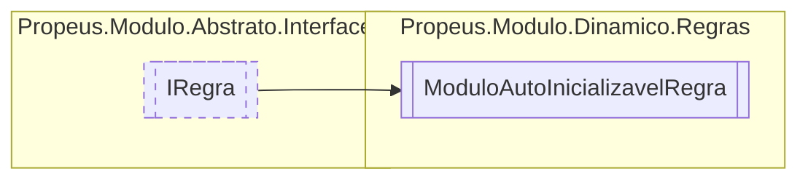

# ModuloAutoInicializavelRegra `class`

## Diagram


## Members
### Properties
#### Public  properties
| Type | Name | Methods |
| --- | --- | --- |
| `IEnumerable`&lt;`TypeInfo`&gt; | [`modulosValidos`](#modulosvalidos) | `get` |

### Methods
#### Public  methods
| Returns | Name |
| --- | --- |
| `bool` | [`Executar`](#executar)(`object``[]` args) |

## Details
### Inheritance
 - [
`IRegra`
](../../abstrato/interfaces/IRegra.md)

### Constructors
#### ModuloAutoInicializavelRegra
[*Source code*](https://github.com///blob//src/Propeus.Modulo.Dinamico/Regras/ModuloAutoInicializavelRegra.cs#L13)
```csharp
public ModuloAutoInicializavelRegra()
```

### Methods
#### Executar
[*Source code*](https://github.com///blob//src/Propeus.Modulo.Dinamico/Regras/ModuloAutoInicializavelRegra.cs#L15)
```csharp
public virtual bool Executar(object[] args)
```
##### Arguments
| Type | Name | Description |
| --- | --- | --- |
| `object``[]` | args |   |

### Properties
#### modulosValidos
```csharp
public IEnumerable<TypeInfo> modulosValidos { get; }
```

*Generated with* [*ModularDoc*](https://github.com/hailstorm75/ModularDoc)
