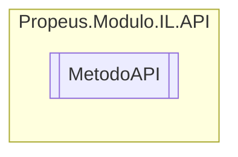

# MetodoAPI `class`

## Diagram


## Members
### Methods
#### Public Static methods
| Returns | Name |
| --- | --- |
| `void` | [`ArmazenarValorCampo`](#armazenarvalorcampo)([`ILMetodo`](../geradores/ILMetodo.md) metodo, [`ILCampo`](../geradores/ILCampo.md) campo) |
| `void` | [`ArmazenarValorVariavel`](#armazenarvalorvariavel)([`ILMetodo`](../geradores/ILMetodo.md) metodo, [`ILVariavel`](../geradores/ILVariavel.md) variavel) |
| `void` | [`CarregarArgumento`](#carregarargumento-12)(`...`) |
| `void` | [`CarregarValorBoolean`](#carregarvalorboolean)([`ILMetodo`](../geradores/ILMetodo.md) metodo, `bool` valor) |
| `void` | [`CarregarValorByte`](#carregarvalorbyte)([`ILMetodo`](../geradores/ILMetodo.md) metodo, `byte` valor) |
| `void` | [`CarregarValorCampo`](#carregarvalorcampo)([`ILMetodo`](../geradores/ILMetodo.md) metodo, [`ILCampo`](../geradores/ILCampo.md) campo) |
| `void` | [`CarregarValorChar`](#carregarvalorchar)([`ILMetodo`](../geradores/ILMetodo.md) metodo, `char` valor) |
| `void` | [`CarregarValorDecimal`](#carregarvalordecimal)([`ILMetodo`](../geradores/ILMetodo.md) metodo, `decimal` valor) |
| `void` | [`CarregarValorDouble`](#carregarvalordouble)([`ILMetodo`](../geradores/ILMetodo.md) metodo, `double` valor) |
| `void` | [`CarregarValorFloat`](#carregarvalorfloat)([`ILMetodo`](../geradores/ILMetodo.md) metodo, `float` valor) |
| `void` | [`CarregarValorInt`](#carregarvalorint)([`ILMetodo`](../geradores/ILMetodo.md) metodo, `int` valor) |
| `void` | [`CarregarValorLong`](#carregarvalorlong)([`ILMetodo`](../geradores/ILMetodo.md) metodo, `long` valor) |
| `void` | [`CarregarValorSbyte`](#carregarvalorsbyte)([`ILMetodo`](../geradores/ILMetodo.md) metodo, `sbyte` valor) |
| `void` | [`CarregarValorShort`](#carregarvalorshort)([`ILMetodo`](../geradores/ILMetodo.md) metodo, `short` valor) |
| `void` | [`CarregarValorString`](#carregarvalorstring)([`ILMetodo`](../geradores/ILMetodo.md) metodo, `string` valor) |
| `void` | [`CarregarValorUint`](#carregarvaloruint)([`ILMetodo`](../geradores/ILMetodo.md) metodo, `uint` valor) |
| `void` | [`CarregarValorUlong`](#carregarvalorulong)([`ILMetodo`](../geradores/ILMetodo.md) metodo, `ulong` valor) |
| `void` | [`CarregarValorUshort`](#carregarvalorushort)([`ILMetodo`](../geradores/ILMetodo.md) metodo, `ushort` valor) |
| `void` | [`ChamarFuncao`](#chamarfuncao-12)(`...`) |
| `void` | [`ChamarFuncaoVirtual`](#chamarfuncaovirtual)([`ILMetodo`](../geradores/ILMetodo.md) iLMetodo, `MethodInfo` methodInfo) |
| `void` | [`CriarArray`](#criararray)([`ILMetodo`](../geradores/ILMetodo.md) iLMetodo, `Type` tipo) |
| `void` | [`CriarInstancia`](#criarinstancia)([`ILMetodo`](../geradores/ILMetodo.md) iLMetodo, `ConstructorInfo` constructorInfo) |
| `void` | [`CriarObjeto`](#criarobjeto)([`ILMetodo`](../geradores/ILMetodo.md) iLMetodo, `ConstructorInfo` constructorInfo) |
| `void` | [`CriarPonteiro`](#criarponteiro)([`ILMetodo`](../geradores/ILMetodo.md) iLMetodo, `MethodInfo` methodInfo) |
| `void` | [`CriarRetorno`](#criarretorno)([`ILMetodo`](../geradores/ILMetodo.md) iLMetodo) |
| `void` | [`CriarVariavel`](#criarvariavel)([`ILMetodo`](../geradores/ILMetodo.md) iLMetodo, `Type` tipo, `string` nome) |
| `void` | [`Diferente`](#diferente)([`ILMetodo`](../geradores/ILMetodo.md) iLMetodo) |
| `void` | [`Dividir`](#dividir)([`ILMetodo`](../geradores/ILMetodo.md) iLMetodo) |
| `void` | [`Igual`](#igual)([`ILMetodo`](../geradores/ILMetodo.md) iLMetodo) |
| `void` | [`MaiorOuIgualQue`](#maiorouigualque)([`ILMetodo`](../geradores/ILMetodo.md) iLMetodo) |
| `void` | [`MaiorQue`](#maiorque)([`ILMetodo`](../geradores/ILMetodo.md) iLMetodo) |
| `void` | [`MenorOuIgualQue`](#menorouigualque)([`ILMetodo`](../geradores/ILMetodo.md) iLMetodo) |
| `void` | [`MenorQue`](#menorque)([`ILMetodo`](../geradores/ILMetodo.md) iLMetodo) |
| `void` | [`Multiplicar`](#multiplicar)([`ILMetodo`](../geradores/ILMetodo.md) iLMetodo) |
| `void` | [`Se`](#se)([`ILMetodo`](../geradores/ILMetodo.md) iLMetodo) |
| `void` | [`SeFim`](#sefim)([`ILMetodo`](../geradores/ILMetodo.md) iLMetodo) |
| `void` | [`Soma`](#soma)([`ILMetodo`](../geradores/ILMetodo.md) iLMetodo) |
| `void` | [`Subitrair`](#subitrair)([`ILMetodo`](../geradores/ILMetodo.md) iLMetodo) |

## Details
### Constructors
#### MetodoAPI
```csharp
public MetodoAPI()
```

### Methods
#### ArmazenarValorCampo
[*Source code*](https://github.com///blob//src/Propeus.Modulo.IL/API/MetodoAPI.cs#L22)
```csharp
public static void ArmazenarValorCampo(ILMetodo metodo, ILCampo campo)
```
##### Arguments
| Type | Name | Description |
| --- | --- | --- |
| [`ILMetodo`](../geradores/ILMetodo.md) | metodo |   |
| [`ILCampo`](../geradores/ILCampo.md) | campo |   |

#### ArmazenarValorVariavel
[*Source code*](https://github.com///blob//src/Propeus.Modulo.IL/API/MetodoAPI.cs#L26)
```csharp
public static void ArmazenarValorVariavel(ILMetodo metodo, ILVariavel variavel)
```
##### Arguments
| Type | Name | Description |
| --- | --- | --- |
| [`ILMetodo`](../geradores/ILMetodo.md) | metodo |   |
| [`ILVariavel`](../geradores/ILVariavel.md) | variavel |   |

#### CarregarArgumento [1/2]
[*Source code*](https://github.com///blob//src/Propeus.Modulo.IL/API/MetodoAPI.cs#L33)
```csharp
public static void CarregarArgumento(ILMetodo metodo)
```
##### Arguments
| Type | Name | Description |
| --- | --- | --- |
| [`ILMetodo`](../geradores/ILMetodo.md) | metodo |   |

#### CarregarArgumento [2/2]
[*Source code*](https://github.com///blob//src/Propeus.Modulo.IL/API/MetodoAPI.cs#L37)
```csharp
public static void CarregarArgumento(ILMetodo metodo, int indice)
```
##### Arguments
| Type | Name | Description |
| --- | --- | --- |
| [`ILMetodo`](../geradores/ILMetodo.md) | metodo |   |
| `int` | indice |   |

#### CarregarValorBoolean
[*Source code*](https://github.com///blob//src/Propeus.Modulo.IL/API/MetodoAPI.cs#L45)
```csharp
public static void CarregarValorBoolean(ILMetodo metodo, bool valor)
```
##### Arguments
| Type | Name | Description |
| --- | --- | --- |
| [`ILMetodo`](../geradores/ILMetodo.md) | metodo |   |
| `bool` | valor |   |

#### CarregarValorByte
[*Source code*](https://github.com///blob//src/Propeus.Modulo.IL/API/MetodoAPI.cs#L49)
```csharp
public static void CarregarValorByte(ILMetodo metodo, byte valor)
```
##### Arguments
| Type | Name | Description |
| --- | --- | --- |
| [`ILMetodo`](../geradores/ILMetodo.md) | metodo |   |
| `byte` | valor |   |

#### CarregarValorChar
[*Source code*](https://github.com///blob//src/Propeus.Modulo.IL/API/MetodoAPI.cs#L53)
```csharp
public static void CarregarValorChar(ILMetodo metodo, char valor)
```
##### Arguments
| Type | Name | Description |
| --- | --- | --- |
| [`ILMetodo`](../geradores/ILMetodo.md) | metodo |   |
| `char` | valor |   |

#### CarregarValorDecimal
[*Source code*](https://github.com///blob//src/Propeus.Modulo.IL/API/MetodoAPI.cs#L57)
```csharp
public static void CarregarValorDecimal(ILMetodo metodo, decimal valor)
```
##### Arguments
| Type | Name | Description |
| --- | --- | --- |
| [`ILMetodo`](../geradores/ILMetodo.md) | metodo |   |
| `decimal` | valor |   |

#### CarregarValorDouble
[*Source code*](https://github.com///blob//src/Propeus.Modulo.IL/API/MetodoAPI.cs#L61)
```csharp
public static void CarregarValorDouble(ILMetodo metodo, double valor)
```
##### Arguments
| Type | Name | Description |
| --- | --- | --- |
| [`ILMetodo`](../geradores/ILMetodo.md) | metodo |   |
| `double` | valor |   |

#### CarregarValorFloat
[*Source code*](https://github.com///blob//src/Propeus.Modulo.IL/API/MetodoAPI.cs#L65)
```csharp
public static void CarregarValorFloat(ILMetodo metodo, float valor)
```
##### Arguments
| Type | Name | Description |
| --- | --- | --- |
| [`ILMetodo`](../geradores/ILMetodo.md) | metodo |   |
| `float` | valor |   |

#### CarregarValorInt
[*Source code*](https://github.com///blob//src/Propeus.Modulo.IL/API/MetodoAPI.cs#L69)
```csharp
public static void CarregarValorInt(ILMetodo metodo, int valor)
```
##### Arguments
| Type | Name | Description |
| --- | --- | --- |
| [`ILMetodo`](../geradores/ILMetodo.md) | metodo |   |
| `int` | valor |   |

#### CarregarValorLong
[*Source code*](https://github.com///blob//src/Propeus.Modulo.IL/API/MetodoAPI.cs#L73)
```csharp
public static void CarregarValorLong(ILMetodo metodo, long valor)
```
##### Arguments
| Type | Name | Description |
| --- | --- | --- |
| [`ILMetodo`](../geradores/ILMetodo.md) | metodo |   |
| `long` | valor |   |

#### CarregarValorSbyte
[*Source code*](https://github.com///blob//src/Propeus.Modulo.IL/API/MetodoAPI.cs#L77)
```csharp
public static void CarregarValorSbyte(ILMetodo metodo, sbyte valor)
```
##### Arguments
| Type | Name | Description |
| --- | --- | --- |
| [`ILMetodo`](../geradores/ILMetodo.md) | metodo |   |
| `sbyte` | valor |   |

#### CarregarValorShort
[*Source code*](https://github.com///blob//src/Propeus.Modulo.IL/API/MetodoAPI.cs#L81)
```csharp
public static void CarregarValorShort(ILMetodo metodo, short valor)
```
##### Arguments
| Type | Name | Description |
| --- | --- | --- |
| [`ILMetodo`](../geradores/ILMetodo.md) | metodo |   |
| `short` | valor |   |

#### CarregarValorUint
[*Source code*](https://github.com///blob//src/Propeus.Modulo.IL/API/MetodoAPI.cs#L85)
```csharp
public static void CarregarValorUint(ILMetodo metodo, uint valor)
```
##### Arguments
| Type | Name | Description |
| --- | --- | --- |
| [`ILMetodo`](../geradores/ILMetodo.md) | metodo |   |
| `uint` | valor |   |

#### CarregarValorUlong
[*Source code*](https://github.com///blob//src/Propeus.Modulo.IL/API/MetodoAPI.cs#L89)
```csharp
public static void CarregarValorUlong(ILMetodo metodo, ulong valor)
```
##### Arguments
| Type | Name | Description |
| --- | --- | --- |
| [`ILMetodo`](../geradores/ILMetodo.md) | metodo |   |
| `ulong` | valor |   |

#### CarregarValorUshort
[*Source code*](https://github.com///blob//src/Propeus.Modulo.IL/API/MetodoAPI.cs#L93)
```csharp
public static void CarregarValorUshort(ILMetodo metodo, ushort valor)
```
##### Arguments
| Type | Name | Description |
| --- | --- | --- |
| [`ILMetodo`](../geradores/ILMetodo.md) | metodo |   |
| `ushort` | valor |   |

#### CarregarValorString
[*Source code*](https://github.com///blob//src/Propeus.Modulo.IL/API/MetodoAPI.cs#L97)
```csharp
public static void CarregarValorString(ILMetodo metodo, string valor)
```
##### Arguments
| Type | Name | Description |
| --- | --- | --- |
| [`ILMetodo`](../geradores/ILMetodo.md) | metodo |   |
| `string` | valor |   |

#### CarregarValorCampo
[*Source code*](https://github.com///blob//src/Propeus.Modulo.IL/API/MetodoAPI.cs#L102)
```csharp
public static void CarregarValorCampo(ILMetodo metodo, ILCampo campo)
```
##### Arguments
| Type | Name | Description |
| --- | --- | --- |
| [`ILMetodo`](../geradores/ILMetodo.md) | metodo |   |
| [`ILCampo`](../geradores/ILCampo.md) | campo |   |

#### CriarRetorno
[*Source code*](https://github.com///blob//src/Propeus.Modulo.IL/API/MetodoAPI.cs#L110)
```csharp
public static void CriarRetorno(ILMetodo iLMetodo)
```
##### Arguments
| Type | Name | Description |
| --- | --- | --- |
| [`ILMetodo`](../geradores/ILMetodo.md) | iLMetodo |   |

#### CriarVariavel
[*Source code*](https://github.com///blob//src/Propeus.Modulo.IL/API/MetodoAPI.cs#L114)
```csharp
public static void CriarVariavel(ILMetodo iLMetodo, Type tipo, string nome)
```
##### Arguments
| Type | Name | Description |
| --- | --- | --- |
| [`ILMetodo`](../geradores/ILMetodo.md) | iLMetodo |   |
| `Type` | tipo |   |
| `string` | nome |   |

#### CriarObjeto
[*Source code*](https://github.com///blob//src/Propeus.Modulo.IL/API/MetodoAPI.cs#L118)
```csharp
public static void CriarObjeto(ILMetodo iLMetodo, ConstructorInfo constructorInfo)
```
##### Arguments
| Type | Name | Description |
| --- | --- | --- |
| [`ILMetodo`](../geradores/ILMetodo.md) | iLMetodo |   |
| `ConstructorInfo` | constructorInfo |   |

#### CriarArray
[*Source code*](https://github.com///blob//src/Propeus.Modulo.IL/API/MetodoAPI.cs#L122)
```csharp
public static void CriarArray(ILMetodo iLMetodo, Type tipo)
```
##### Arguments
| Type | Name | Description |
| --- | --- | --- |
| [`ILMetodo`](../geradores/ILMetodo.md) | iLMetodo |   |
| `Type` | tipo |   |

#### CriarPonteiro
[*Source code*](https://github.com///blob//src/Propeus.Modulo.IL/API/MetodoAPI.cs#L126)
```csharp
public static void CriarPonteiro(ILMetodo iLMetodo, MethodInfo methodInfo)
```
##### Arguments
| Type | Name | Description |
| --- | --- | --- |
| [`ILMetodo`](../geradores/ILMetodo.md) | iLMetodo |   |
| `MethodInfo` | methodInfo |   |

#### CriarInstancia
[*Source code*](https://github.com///blob//src/Propeus.Modulo.IL/API/MetodoAPI.cs#L130)
```csharp
public static void CriarInstancia(ILMetodo iLMetodo, ConstructorInfo constructorInfo)
```
##### Arguments
| Type | Name | Description |
| --- | --- | --- |
| [`ILMetodo`](../geradores/ILMetodo.md) | iLMetodo |   |
| `ConstructorInfo` | constructorInfo |   |

#### ChamarFuncao [1/2]
[*Source code*](https://github.com///blob//src/Propeus.Modulo.IL/API/MetodoAPI.cs#L137)
```csharp
public static void ChamarFuncao(ILMetodo iLMetodo, ConstructorInfo constructorInfo)
```
##### Arguments
| Type | Name | Description |
| --- | --- | --- |
| [`ILMetodo`](../geradores/ILMetodo.md) | iLMetodo |   |
| `ConstructorInfo` | constructorInfo |   |

#### ChamarFuncao [2/2]
[*Source code*](https://github.com///blob//src/Propeus.Modulo.IL/API/MetodoAPI.cs#L141)
```csharp
public static void ChamarFuncao(ILMetodo iLMetodo, MethodInfo methodInfo)
```
##### Arguments
| Type | Name | Description |
| --- | --- | --- |
| [`ILMetodo`](../geradores/ILMetodo.md) | iLMetodo |   |
| `MethodInfo` | methodInfo |   |

#### ChamarFuncaoVirtual
[*Source code*](https://github.com///blob//src/Propeus.Modulo.IL/API/MetodoAPI.cs#L145)
```csharp
public static void ChamarFuncaoVirtual(ILMetodo iLMetodo, MethodInfo methodInfo)
```
##### Arguments
| Type | Name | Description |
| --- | --- | --- |
| [`ILMetodo`](../geradores/ILMetodo.md) | iLMetodo |   |
| `MethodInfo` | methodInfo |   |

#### Soma
[*Source code*](https://github.com///blob//src/Propeus.Modulo.IL/API/MetodoAPI.cs#L152)
```csharp
public static void Soma(ILMetodo iLMetodo)
```
##### Arguments
| Type | Name | Description |
| --- | --- | --- |
| [`ILMetodo`](../geradores/ILMetodo.md) | iLMetodo |   |

#### Subitrair
[*Source code*](https://github.com///blob//src/Propeus.Modulo.IL/API/MetodoAPI.cs#L156)
```csharp
public static void Subitrair(ILMetodo iLMetodo)
```
##### Arguments
| Type | Name | Description |
| --- | --- | --- |
| [`ILMetodo`](../geradores/ILMetodo.md) | iLMetodo |   |

#### Dividir
[*Source code*](https://github.com///blob//src/Propeus.Modulo.IL/API/MetodoAPI.cs#L160)
```csharp
public static void Dividir(ILMetodo iLMetodo)
```
##### Arguments
| Type | Name | Description |
| --- | --- | --- |
| [`ILMetodo`](../geradores/ILMetodo.md) | iLMetodo |   |

#### Multiplicar
[*Source code*](https://github.com///blob//src/Propeus.Modulo.IL/API/MetodoAPI.cs#L164)
```csharp
public static void Multiplicar(ILMetodo iLMetodo)
```
##### Arguments
| Type | Name | Description |
| --- | --- | --- |
| [`ILMetodo`](../geradores/ILMetodo.md) | iLMetodo |   |

#### Se
[*Source code*](https://github.com///blob//src/Propeus.Modulo.IL/API/MetodoAPI.cs#L171)
```csharp
public static void Se(ILMetodo iLMetodo)
```
##### Arguments
| Type | Name | Description |
| --- | --- | --- |
| [`ILMetodo`](../geradores/ILMetodo.md) | iLMetodo |   |

#### SeFim
[*Source code*](https://github.com///blob//src/Propeus.Modulo.IL/API/MetodoAPI.cs#L177)
```csharp
public static void SeFim(ILMetodo iLMetodo)
```
##### Arguments
| Type | Name | Description |
| --- | --- | --- |
| [`ILMetodo`](../geradores/ILMetodo.md) | iLMetodo |   |

#### Diferente
[*Source code*](https://github.com///blob//src/Propeus.Modulo.IL/API/MetodoAPI.cs#L190)
```csharp
public static void Diferente(ILMetodo iLMetodo)
```
##### Arguments
| Type | Name | Description |
| --- | --- | --- |
| [`ILMetodo`](../geradores/ILMetodo.md) | iLMetodo |   |

#### Igual
[*Source code*](https://github.com///blob//src/Propeus.Modulo.IL/API/MetodoAPI.cs#L204)
```csharp
public static void Igual(ILMetodo iLMetodo)
```
##### Arguments
| Type | Name | Description |
| --- | --- | --- |
| [`ILMetodo`](../geradores/ILMetodo.md) | iLMetodo |   |

#### MaiorOuIgualQue
[*Source code*](https://github.com///blob//src/Propeus.Modulo.IL/API/MetodoAPI.cs#L215)
```csharp
public static void MaiorOuIgualQue(ILMetodo iLMetodo)
```
##### Arguments
| Type | Name | Description |
| --- | --- | --- |
| [`ILMetodo`](../geradores/ILMetodo.md) | iLMetodo |   |

#### MenorOuIgualQue
[*Source code*](https://github.com///blob//src/Propeus.Modulo.IL/API/MetodoAPI.cs#L229)
```csharp
public static void MenorOuIgualQue(ILMetodo iLMetodo)
```
##### Arguments
| Type | Name | Description |
| --- | --- | --- |
| [`ILMetodo`](../geradores/ILMetodo.md) | iLMetodo |   |

#### MaiorQue
[*Source code*](https://github.com///blob//src/Propeus.Modulo.IL/API/MetodoAPI.cs#L242)
```csharp
public static void MaiorQue(ILMetodo iLMetodo)
```
##### Arguments
| Type | Name | Description |
| --- | --- | --- |
| [`ILMetodo`](../geradores/ILMetodo.md) | iLMetodo |   |

#### MenorQue
[*Source code*](https://github.com///blob//src/Propeus.Modulo.IL/API/MetodoAPI.cs#L253)
```csharp
public static void MenorQue(ILMetodo iLMetodo)
```
##### Arguments
| Type | Name | Description |
| --- | --- | --- |
| [`ILMetodo`](../geradores/ILMetodo.md) | iLMetodo |   |

*Generated with* [*ModularDoc*](https://github.com/hailstorm75/ModularDoc)
