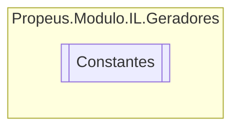

# Constantes `class`

## Diagram


## Members
### Methods
#### Public Static methods
| Returns | Name |
| --- | --- |
| `string` | [`GerarNome`](#gerarnome)(`string` const) |
| `string` | [`GerarNomeCampo`](#gerarnomecampo)(`string` nomeClasse) |
| `string` | [`GerarNomeMetodo`](#gerarnomemetodo)(`string` nomeClasse) |
| `string` | [`GerarNomeModulo`](#gerarnomemodulo)() |
| `string` | [`GerarNomeParametro`](#gerarnomeparametro)(`string` nomeMetodo) |
| `string` | [`GerarNomePropriedade`](#gerarnomepropriedade)(`string` nomeClasse) |
| `string` | [`GerarNomeVariavel`](#gerarnomevariavel)(`string` nomeClasse) |

## Details
### Methods
#### GerarNomeCampo
[*Source code*](https://github.com///blob//src/Propeus.Modulo.IL/Geradores/ILCampo.cs#L21)
```csharp
public static string GerarNomeCampo(string nomeClasse)
```
##### Arguments
| Type | Name | Description |
| --- | --- | --- |
| `string` | nomeClasse |   |

#### GerarNomeModulo
[*Source code*](https://github.com///blob//src/Propeus.Modulo.IL/Geradores/ILGerador.cs#L15)
```csharp
public static string GerarNomeModulo()
```

#### GerarNome
[*Source code*](https://github.com///blob//src/Propeus.Modulo.Abstrato/Atributos/ModuloContratoAttribute.cs#L18)
```csharp
public static string GerarNome(string const)
```
##### Arguments
| Type | Name | Description |
| --- | --- | --- |
| `string` | const |   |

#### GerarNomeMetodo
[*Source code*](https://github.com///blob//src/Propeus.Modulo.Abstrato/Atributos/ModuloContratoAttribute.cs#L33)
```csharp
public static string GerarNomeMetodo(string nomeClasse)
```
##### Arguments
| Type | Name | Description |
| --- | --- | --- |
| `string` | nomeClasse |   |

#### GerarNomeParametro
[*Source code*](https://github.com///blob//src/Propeus.Modulo.Abstrato/Atributos/ModuloContratoAttribute.cs#L47)
```csharp
public static string GerarNomeParametro(string nomeMetodo)
```
##### Arguments
| Type | Name | Description |
| --- | --- | --- |
| `string` | nomeMetodo |   |

#### GerarNomePropriedade
[*Source code*](https://github.com///blob//src/Propeus.Modulo.Abstrato/Atributos/ModuloOpcionalAttribute.cs#L11)
```csharp
public static string GerarNomePropriedade(string nomeClasse)
```
##### Arguments
| Type | Name | Description |
| --- | --- | --- |
| `string` | nomeClasse |   |

#### GerarNomeVariavel
[*Source code*](https://github.com///blob//src/Propeus.Modulo.IL/Geradores/ILVariavel.cs#L18)
```csharp
public static string GerarNomeVariavel(string nomeClasse)
```
##### Arguments
| Type | Name | Description |
| --- | --- | --- |
| `string` | nomeClasse |   |

*Generated with* [*ModularDoc*](https://github.com/hailstorm75/ModularDoc)
