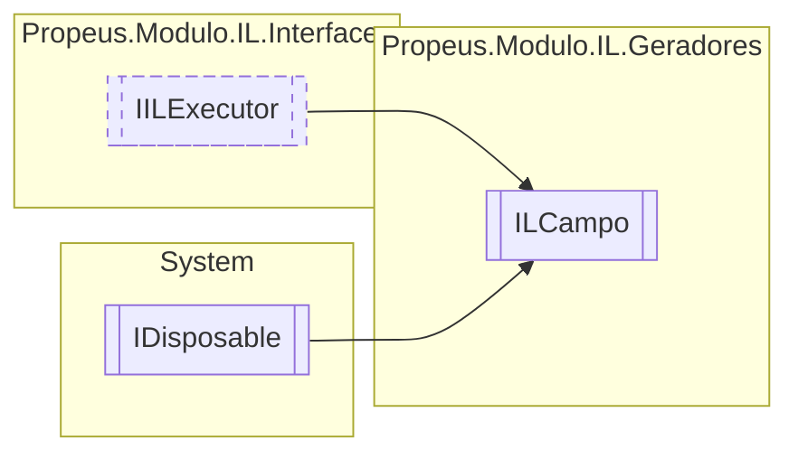

# ILCampo `class`

## Description
Cria um campo

## Diagram


## Members
### Properties
#### Public  properties
| Type | Name | Methods |
| --- | --- | --- |
| [`Token`](../enums/Token.md)`[]` | [`Acessadores`](#acessadores) | `get` |
| `string` | [`Nome`](#nome) | `get` |
| `Type` | [`Retorno`](#retorno) | `get` |

### Methods
#### Public  methods
| Returns | Name |
| --- | --- |
| `void` | [`Dispose`](#dispose-22)() |
| `void` | [`Executar`](#executar)()<br>Executa a montagem do código IL |
| `string` | [`ToString`](#tostring)() |

#### Protected  methods
| Returns | Name |
| --- | --- |
| `void` | [`Dispose`](#dispose-12)(`bool` disposing) |

## Details
### Summary
Cria um campo

### Inheritance
 - [
`IILExecutor`
](../interfaces/IILExecutor.md)
 - `IDisposable`

### Constructors
#### ILCampo
[*Source code*](https://github.com///blob//src/Propeus.Modulo.Abstrato/Util/Reflections/Helper.cs#L59)
```csharp
public ILCampo(ILBuilderProxy builderProxy, string nomeClasse, Token[] acessadores, Type tipo, string nome)
```
##### Arguments
| Type | Name | Description |
| --- | --- | --- |
| [`ILBuilderProxy`](../proxy/ILBuilderProxy.md) | builderProxy |   |
| `string` | nomeClasse |   |
| [`Token`](../enums/Token.md)`[]` | acessadores |   |
| `Type` | tipo |   |
| `string` | nome |   |

### Methods
#### Executar
[*Source code*](https://github.com///blob//src/Propeus.Modulo.Abstrato/Util/Reflections/Helper.cs#L72)
```csharp
public virtual void Executar()
```
##### Summary
Executa a montagem do código IL

#### ToString
[*Source code*](https://github.com///blob//src/Propeus.Modulo.Abstrato/Util/Reflections/Helper.cs#L85)
```csharp
public override string ToString()
```

#### Dispose [1/2]
[*Source code*](https://github.com///blob//src/Propeus.Modulo.Abstrato/Util/Strings/Helper.cs#L135)
```csharp
protected virtual void Dispose(bool disposing)
```
##### Arguments
| Type | Name | Description |
| --- | --- | --- |
| `bool` | disposing |   |

#### Dispose [2/2]
[*Source code*](https://github.com///blob//src/Propeus.Modulo.Abstrato/Util/Strings/Helper.cs#L139)
```csharp
public virtual void Dispose()
```

### Properties
#### Nome
```csharp
public string Nome { get; }
```

#### Retorno
```csharp
public Type Retorno { get; }
```

#### Acessadores
```csharp
public Token Acessadores { get; }
```

*Generated with* [*ModularDoc*](https://github.com/hailstorm75/ModularDoc)
