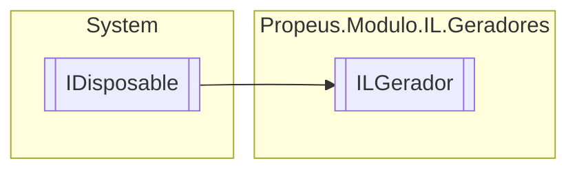

# ILGerador `class`

## Description
Classe para montagem inicial do Assembly

## Diagram


## Members
### Properties
#### Internal  properties
| Type | Name | Methods |
| --- | --- | --- |
| [`ILModulo`](./ILModulo.md) | [`Modulo`](#modulo) | `get` |

### Methods
#### Public  methods
| Returns | Name |
| --- | --- |
| [`ILModulo`](./ILModulo.md) | [`CriarModulo`](#criarmodulo)(`string` nomeModulo) |
| `void` | [`Dispose`](#dispose-22)() |
| `string` | [`ToString`](#tostring)() |

#### Protected  methods
| Returns | Name |
| --- | --- |
| `void` | [`Dispose`](#dispose-12)(`bool` disposing) |

## Details
### Summary
Classe para montagem inicial do Assembly

### Inheritance
 - `IDisposable`

### Constructors
#### ILGerador
[*Source code*](https://github.com///blob//src/Propeus.Modulo.Abstrato/Util/Tipos/Helper.cs#L301)
```csharp
public ILGerador(string nomeAssembly)
```
##### Arguments
| Type | Name | Description |
| --- | --- | --- |
| `string` | nomeAssembly | Nome do assembly |

##### Summary
Construtor do gerador de IL

### Methods
#### CriarModulo
[*Source code*](https://github.com///blob//src/Propeus.Modulo.IL/Geradores/ILGerador.cs#L58)
```csharp
public ILModulo CriarModulo(string nomeModulo)
```
##### Arguments
| Type | Name | Description |
| --- | --- | --- |
| `string` | nomeModulo |   |

#### ToString
[*Source code*](https://github.com///blob//src/Propeus.Modulo.IL/Geradores/ILGerador.cs#L81)
```csharp
public override string ToString()
```

#### Dispose [1/2]
[*Source code*](https://github.com///blob//src/Propeus.Modulo.Abstrato/Util/Listas/Helper.cs#L16707566)
```csharp
protected virtual void Dispose(bool disposing)
```
##### Arguments
| Type | Name | Description |
| --- | --- | --- |
| `bool` | disposing |   |

#### Dispose [2/2]
[*Source code*](https://github.com///blob//src/Propeus.Modulo.IL/Geradores/ILGerador.cs#L113)
```csharp
public virtual void Dispose()
```

### Properties
#### Modulo
```csharp
internal ILModulo Modulo { get; }
```

*Generated with* [*ModularDoc*](https://github.com/hailstorm75/ModularDoc)
