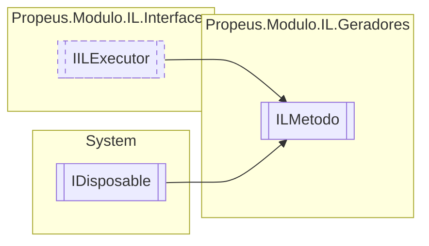

# ILMetodo `class`

## Description
Gerador de metodos

## Diagram


## Members
### Properties
#### Public  properties
| Type | Name | Methods |
| --- | --- | --- |
| [`Token`](../enums/Token.md)`[]` | [`Acessadores`](#acessadores) | `get` |
| `MethodInfo` | [`MethodInfo`](#methodinfo) | `get` |
| `string` | [`Nome`](#nome)<br>Nome do metodo | `get` |
| [`ILParametro`](./ILParametro.md)`[]` | [`Parametros`](#parametros) | `get` |
| `Type` | [`Retorno`](#retorno)<br>Retorno do metodo | `get` |

#### Internal  properties
| Type | Name | Methods |
| --- | --- | --- |
| `List`&lt;[`IILPilha`](../interfaces/IILPilha.md)&gt; | [`PilhaExecucao`](#pilhaexecucao) | `get` |
| `Stack`&lt;[`IILPilha`](../interfaces/IILPilha.md)&gt; | [`PilhasAuxiliares`](#pilhasauxiliares) | `get` |
| `List`&lt;[`ILVariavel`](./ILVariavel.md)&gt; | [`Variaveis`](#variaveis) | `get` |

### Methods
#### Public  methods
| Returns | Name |
| --- | --- |
| `void` | [`Dispose`](#dispose-22)() |
| `void` | [`Executar`](#executar)()<br>Executa a montagem do código IL |
| `string` | [`ToString`](#tostring)()<br>Exibe o metodo em IL |

#### Protected  methods
| Returns | Name |
| --- | --- |
| `void` | [`Dispose`](#dispose-12)(`bool` disposing) |

## Details
### Summary
Gerador de metodos

### Inheritance
 - [
`IILExecutor`
](../interfaces/IILExecutor.md)
 - `IDisposable`

### Constructors
#### ILMetodo
[*Source code*](https://github.com///blob//src/Propeus.Modulo.Abstrato/Util/Thread/TaskJob.cs#L56)
```csharp
public ILMetodo(ILBuilderProxy builderProxy, string nomeCLasse, string nomeMetodo, Token[] acessadores, Type retorno, ILParametro[] parametros)
```
##### Arguments
| Type | Name | Description |
| --- | --- | --- |
| [`ILBuilderProxy`](../proxy/ILBuilderProxy.md) | builderProxy |  |
| `string` | nomeCLasse |  |
| `string` | nomeMetodo |  |
| [`Token`](../enums/Token.md)`[]` | acessadores |  |
| `Type` | retorno |  |
| [`ILParametro`](./ILParametro.md)`[]` | parametros |  |

##### Summary
Cria um novo metodo

### Methods
#### Executar
[*Source code*](https://github.com///blob//src/Propeus.Modulo.Abstrato/Util/Thread/TaskJob.cs#L56)
```csharp
public virtual void Executar()
```
##### Summary
Executa a montagem do código IL

#### ToString
[*Source code*](https://github.com///blob//src/Propeus.Modulo.Abstrato/Util/Thread/TaskJob.cs#L103)
```csharp
public override string ToString()
```
##### Summary
Exibe o metodo em IL

##### Returns


#### Dispose [1/2]
[*Source code*](https://github.com///blob//src/Propeus.Modulo.IL/Geradores/ILMetodo.cs#L232)
```csharp
protected virtual void Dispose(bool disposing)
```
##### Arguments
| Type | Name | Description |
| --- | --- | --- |
| `bool` | disposing |   |

#### Dispose [2/2]
[*Source code*](https://github.com///blob//src/Propeus.Modulo.Abstrato/Util/Thread/TaskJob.cs#L68)
```csharp
public virtual void Dispose()
```

### Properties
#### Nome
```csharp
public string Nome { get; }
```
##### Summary
Nome do metodo

#### Retorno
```csharp
public Type Retorno { get; }
```
##### Summary
Retorno do metodo

#### Parametros
```csharp
public ILParametro Parametros { get; }
```

#### Acessadores
```csharp
public Token Acessadores { get; }
```

#### MethodInfo
```csharp
public MethodInfo MethodInfo { get; }
```

#### PilhaExecucao
```csharp
internal List<IILPilha> PilhaExecucao { get; }
```

#### Variaveis
```csharp
internal List<ILVariavel> Variaveis { get; }
```

#### PilhasAuxiliares
```csharp
internal Stack<IILPilha> PilhasAuxiliares { get; }
```

*Generated with* [*ModularDoc*](https://github.com/hailstorm75/ModularDoc)
