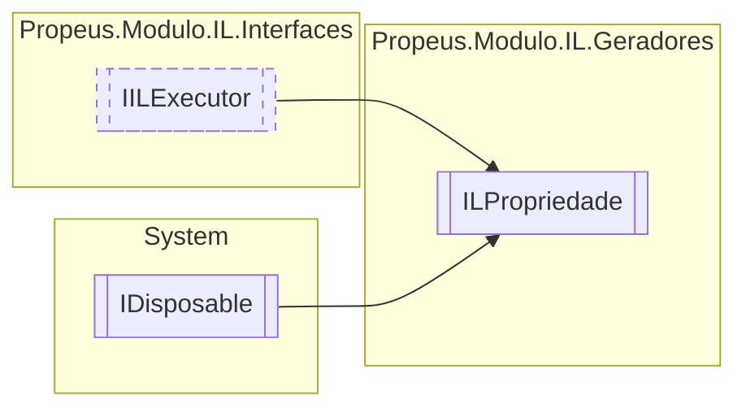

# ILPropriedade `class`

## Diagram


## Members
### Properties
#### Public  properties
| Type | Name | Methods |
| --- | --- | --- |
| `string` | [`Nome`](#nome)<br>Nome do metodo | `get` |
| `Type``[]` | [`Parametros`](#parametros) | `get` |
| `Type` | [`Retorno`](#retorno)<br>Retorno do metodo | `get` |

#### Internal  properties
| Type | Name | Methods |
| --- | --- | --- |
| [`ILCampo`](./ILCampo.md) | [`Campo`](#campo) | `get, set` |
| [`ILMetodo`](./ILMetodo.md) | [`Getter`](#getter) | `get, set` |
| `bool` | [`IsProxy`](#isproxy) | `get, set` |
| [`ILMetodo`](./ILMetodo.md) | [`Setter`](#setter) | `get, set` |

### Methods
#### Public  methods
| Returns | Name |
| --- | --- |
| `void` | [`Dispose`](#dispose-22)() |
| `void` | [`Executar`](#executar)()<br>Executa a montagem do código IL |
| `string` | [`ToString`](#tostring)() |

#### Protected  methods
| Returns | Name |
| --- | --- |
| `void` | [`Dispose`](#dispose-12)(`bool` disposing) |

## Details
### Inheritance
 - [
`IILExecutor`
](../interfaces/IILExecutor.md)
 - `IDisposable`

### Constructors
#### ILPropriedade
[*Source code*](https://github.com///blob//src/Propeus.Modulo.IL/Geradores/ILPropriedade.cs#L57)
```csharp
public ILPropriedade(ILBuilderProxy builderProxy, string nomeClasse, string nomePropriedade, Type retorno, Type[] parametros)
```
##### Arguments
| Type | Name | Description |
| --- | --- | --- |
| [`ILBuilderProxy`](../proxy/ILBuilderProxy.md) | builderProxy |  |
| `string` | nomeClasse |  |
| `string` | nomePropriedade |  |
| `Type` | retorno |  |
| `Type``[]` | parametros |  |

##### Summary


##### Exceptions
| Name | Description |
| --- | --- |
| ArgumentNullException |  |
| ArgumentException |  |

### Methods
#### Executar
[*Source code*](https://github.com///blob//src/Propeus.Modulo.IL/Geradores/ILPropriedade.cs#L98)
```csharp
public virtual void Executar()
```
##### Summary
Executa a montagem do código IL

#### ToString
[*Source code*](https://github.com///blob//src/Propeus.Modulo.IL/Geradores/ILPropriedade.cs#L131)
```csharp
public override string ToString()
```

#### Dispose [1/2]
[*Source code*](https://github.com///blob//src/Propeus.Modulo.IL/Geradores/ILPropriedade.cs#L197)
```csharp
protected virtual void Dispose(bool disposing)
```
##### Arguments
| Type | Name | Description |
| --- | --- | --- |
| `bool` | disposing |   |

#### Dispose [2/2]
[*Source code*](https://github.com///blob//src/Propeus.Modulo.IL/Geradores/ILPropriedade.cs#L227)
```csharp
public virtual void Dispose()
```

### Properties
#### Nome
```csharp
public string Nome { get; }
```
##### Summary
Nome do metodo

#### Retorno
```csharp
public Type Retorno { get; }
```
##### Summary
Retorno do metodo

#### IsProxy
```csharp
internal bool IsProxy { get; set; }
```

#### Campo
```csharp
internal ILCampo Campo { get; set; }
```

#### Getter
```csharp
internal ILMetodo Getter { get; set; }
```

#### Setter
```csharp
internal ILMetodo Setter { get; set; }
```

#### Parametros
```csharp
public Type Parametros { get; }
```

*Generated with* [*ModularDoc*](https://github.com/hailstorm75/ModularDoc)
