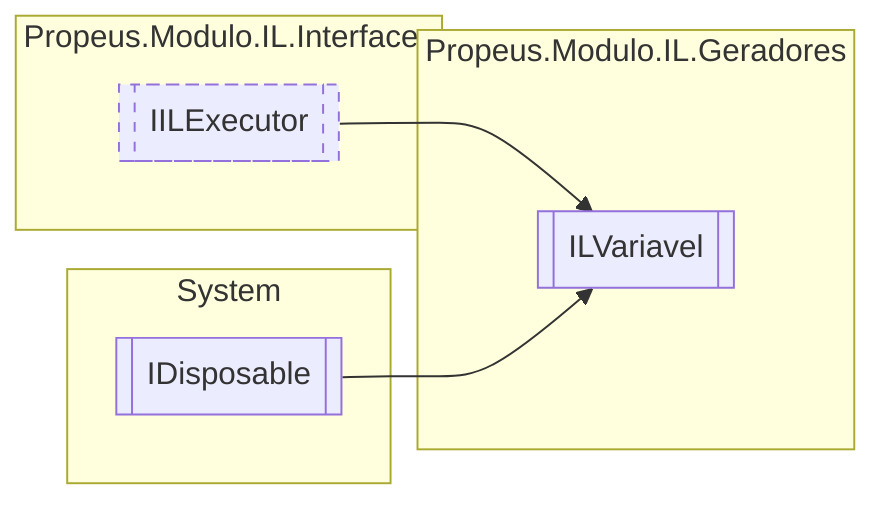

# ILVariavel `class`

## Diagram


## Members
### Properties
#### Public  properties
| Type | Name | Methods |
| --- | --- | --- |
| `int` | [`Indice`](#indice) | `get` |
| `string` | [`Nome`](#nome) | `get` |
| `Type` | [`Retorno`](#retorno) | `get` |

### Methods
#### Public  methods
| Returns | Name |
| --- | --- |
| `void` | [`Dispose`](#dispose-22)() |
| `void` | [`Executar`](#executar)() |
| `string` | [`ToString`](#tostring)() |

#### Protected  methods
| Returns | Name |
| --- | --- |
| `void` | [`Dispose`](#dispose-12)(`bool` disposing) |

## Details
### Inheritance
 - [
`IILExecutor`
](../interfaces/IILExecutor.md)
 - `IDisposable`

### Constructors
#### ILVariavel
[*Source code*](https://github.com///blob//src/Propeus.Modulo.IL/Geradores/ILVariavel.cs#L32)
```csharp
public ILVariavel(ILBuilderProxy builderProxy, string nomeMetodo, Type retorno, string nome)
```
##### Arguments
| Type | Name | Description |
| --- | --- | --- |
| [`ILBuilderProxy`](../proxy/ILBuilderProxy.md) | builderProxy |   |
| `string` | nomeMetodo |   |
| `Type` | retorno |   |
| `string` | nome |   |

### Methods
#### Executar
[*Source code*](https://github.com///blob//src/Propeus.Modulo.IL/Geradores/ILVariavel.cs#L65)
```csharp
public virtual void Executar()
```

#### ToString
[*Source code*](https://github.com///blob//src/Propeus.Modulo.IL/Geradores/ILVariavel.cs#L75)
```csharp
public override string ToString()
```

#### Dispose [1/2]
[*Source code*](https://github.com///blob//src/Propeus.Modulo.IL/Geradores/ILVariavel.cs#L92)
```csharp
protected virtual void Dispose(bool disposing)
```
##### Arguments
| Type | Name | Description |
| --- | --- | --- |
| `bool` | disposing |   |

#### Dispose [2/2]
[*Source code*](https://github.com///blob//src/Propeus.Modulo.IL/Geradores/ILVariavel.cs#L115)
```csharp
public virtual void Dispose()
```

### Properties
#### Indice
```csharp
public int Indice { get; }
```

#### Nome
```csharp
public string Nome { get; }
```

#### Retorno
```csharp
public Type Retorno { get; }
```

*Generated with* [*ModularDoc*](https://github.com/hailstorm75/ModularDoc)
