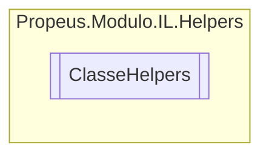

# ClasseHelpers `class`

## Diagram


## Members
### Methods
#### Public Static methods
| Returns | Name |
| --- | --- |
| [`ILClasseProvider`](../geradores/ILClasseProvider.md) | [`CriarClasse`](#criarclasse)([`ILModulo`](../geradores/ILModulo.md) iLGerador, `string` nome, `string` namespace, `Type` tipoBase, `Type``[]` interfaces, [`Token`](../enums/Token.md)`[]` token) |
| [`ILDelegate`](../geradores/ILDelegate.md) | [`CriarDelegate`](#criardelegate-12)(`...`) |
| [`ILClasseProvider`](../geradores/ILClasseProvider.md) | [`CriarProxyClasse`](#criarproxyclasse-12)(`...`) |
| [`ILClasseProvider`](../geradores/ILClasseProvider.md) | [`ObterClasseProvider`](#obterclasseprovider)([`ILModulo`](../geradores/ILModulo.md) iLModulo, `string` nome, `string` namespace) |
| `dynamic` | [`ObterInstancia`](#obterinstancia-12)(`...`) |
| `Type` | [`ObterTipoGerado`](#obtertipogerado)([`ILClasseProvider`](../geradores/ILClasseProvider.md) iLClasseProvider) |

## Details
### Methods
#### CriarProxyClasse [1/2]
[*Source code*](https://github.com///blob//src/Propeus.Modulo.IL/Helpers/ClasseHelpers.cs#L18)
```csharp
public static ILClasseProvider CriarProxyClasse(ILModulo iLGerador, Type classe, Type[] interfaces)
```
##### Arguments
| Type | Name | Description |
| --- | --- | --- |
| [`ILModulo`](../geradores/ILModulo.md) | iLGerador |   |
| `Type` | classe |   |
| `Type``[]` | interfaces |   |

#### CriarProxyClasse [2/2]
[*Source code*](https://github.com///blob//src/Propeus.Modulo.IL/Helpers/ClasseHelpers.cs#L158)
```csharp
public static ILClasseProvider CriarProxyClasse<TClasse>(ILModulo iLGerador, Type[] interfaces)
where TClasse : 
```
##### Arguments
| Type | Name | Description |
| --- | --- | --- |
| [`ILModulo`](../geradores/ILModulo.md) | iLGerador |   |
| `Type``[]` | interfaces |   |

#### CriarClasse
[*Source code*](https://github.com///blob//src/Propeus.Modulo.IL/Helpers/ClasseHelpers.cs#L162)
```csharp
public static ILClasseProvider CriarClasse(ILModulo iLGerador, string nome, string namespace, Type tipoBase, Type[] interfaces, Token[] token)
```
##### Arguments
| Type | Name | Description |
| --- | --- | --- |
| [`ILModulo`](../geradores/ILModulo.md) | iLGerador |   |
| `string` | nome |   |
| `string` | namespace |   |
| `Type` | tipoBase |   |
| `Type``[]` | interfaces |   |
| [`Token`](../enums/Token.md)`[]` | token |   |

#### CriarDelegate [1/2]
[*Source code*](https://github.com///blob//src/Propeus.Modulo.IL/Helpers/ClasseHelpers.cs#L168)
```csharp
public static ILDelegate CriarDelegate(ILModulo ilGerador, Type tipoSaida, string nomeDelegate, ILParametro[] parametros)
```
##### Arguments
| Type | Name | Description |
| --- | --- | --- |
| [`ILModulo`](../geradores/ILModulo.md) | ilGerador |   |
| `Type` | tipoSaida |   |
| `string` | nomeDelegate |   |
| [`ILParametro`](../geradores/ILParametro.md)`[]` | parametros |   |

#### CriarDelegate [2/2]
[*Source code*](https://github.com///blob//src/Propeus.Modulo.IL/Helpers/ClasseHelpers.cs#L192)
```csharp
public static ILDelegate CriarDelegate(ILClasseProvider iLClasse, Type tipoSaida, string nomeDelegate, ILParametro[] parametros)
```
##### Arguments
| Type | Name | Description |
| --- | --- | --- |
| [`ILClasseProvider`](../geradores/ILClasseProvider.md) | iLClasse |   |
| `Type` | tipoSaida |   |
| `string` | nomeDelegate |   |
| [`ILParametro`](../geradores/ILParametro.md)`[]` | parametros |   |

#### ObterClasseProvider
[*Source code*](https://github.com///blob//src/Propeus.Modulo.IL/Helpers/ClasseHelpers.cs#L222)
```csharp
public static ILClasseProvider ObterClasseProvider(ILModulo iLModulo, string nome, string namespace)
```
##### Arguments
| Type | Name | Description |
| --- | --- | --- |
| [`ILModulo`](../geradores/ILModulo.md) | iLModulo |   |
| `string` | nome |   |
| `string` | namespace |   |

#### ObterInstancia [1/2]
[*Source code*](https://github.com///blob//src/Propeus.Modulo.IL/Helpers/ClasseHelpers.cs#L226)
```csharp
public static dynamic ObterInstancia(ILClasseProvider iLClasse, object[] args)
```
##### Arguments
| Type | Name | Description |
| --- | --- | --- |
| [`ILClasseProvider`](../geradores/ILClasseProvider.md) | iLClasse |   |
| `object``[]` | args |   |

#### ObterInstancia [2/2]
[*Source code*](https://github.com///blob//src/Propeus.Modulo.IL/Helpers/ClasseHelpers.cs#L230)
```csharp
public static TInterface ObterInstancia<TInterface>(ILClasseProvider iLClasse, object[] args)
where TInterface : 
```
##### Arguments
| Type | Name | Description |
| --- | --- | --- |
| [`ILClasseProvider`](../geradores/ILClasseProvider.md) | iLClasse |   |
| `object``[]` | args |   |

#### ObterTipoGerado
[*Source code*](https://github.com///blob//src/Propeus.Modulo.IL/Helpers/ClasseHelpers.cs#L236)
```csharp
public static Type ObterTipoGerado(ILClasseProvider iLClasseProvider)
```
##### Arguments
| Type | Name | Description |
| --- | --- | --- |
| [`ILClasseProvider`](../geradores/ILClasseProvider.md) | iLClasseProvider |   |

*Generated with* [*ModularDoc*](https://github.com/hailstorm75/ModularDoc)
