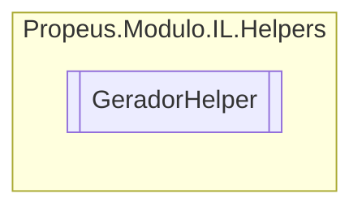

# GeradorHelper `class`

## Diagram


## Members
### Methods
#### Public Static methods
| Returns | Name |
| --- | --- |
| [`ILGerador`](../geradores/ILGerador.md) | [`ObterGerador`](#obtergerador)() |
| [`ILModulo`](../geradores/ILModulo.md) | [`ObterModuloGenerico`](#obtermodulogenerico)() |

## Details
### Methods
#### ObterGerador
[*Source code*](https://github.com///blob//src/Propeus.Modulo.IL/Helpers/GeradorHelper.cs#L11)
```csharp
public static ILGerador ObterGerador()
```

#### ObterModuloGenerico
[*Source code*](https://github.com///blob//src/Propeus.Modulo.IL/Helpers/GeradorHelper.cs#L18)
```csharp
public static ILModulo ObterModuloGenerico()
```

*Generated with* [*ModularDoc*](https://github.com/hailstorm75/ModularDoc)
