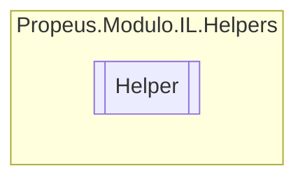

# Helper `class`

## Description
Classe de ajuda para montagem de classes

## Diagram


## Members
### Methods
#### Public Static methods
| Returns | Name |
| --- | --- |
| [`ILMetodo`](../geradores/ILMetodo.md) | [`AtribuirMetodoEmDelegate`](#atribuirmetodoemdelegate)([`ILMetodo`](../geradores/ILMetodo.md) iLMetodo, [`ILDelegate`](../geradores/ILDelegate.md) iLDelegate, [`ILMetodo`](../geradores/ILMetodo.md) metodoDelegate) |
| [`ILMetodo`](../geradores/ILMetodo.md) | [`CarregarFalse`](#carregarfalse)([`ILMetodo`](../geradores/ILMetodo.md) iLMetodo) |
| [`ILMetodo`](../geradores/ILMetodo.md) | [`CarregarParametro`](#carregarparametro)([`ILMetodo`](../geradores/ILMetodo.md) iLMetodo, [`ILParametro`](../geradores/ILParametro.md) iLParametro) |
| [`ILMetodo`](../geradores/ILMetodo.md) | [`CarregarTrue`](#carregartrue)([`ILMetodo`](../geradores/ILMetodo.md) iLMetodo) |
| [`ILMetodo`](../geradores/ILMetodo.md) | [`ChamarFuncao`](#chamarfuncao)([`ILMetodo`](../geradores/ILMetodo.md) iLMetodo, `MethodInfo` methodInfo) |
| [`ILCampo`](../geradores/ILCampo.md) | [`CriarCampoArray`](#criarcampoarray)([`ILClasseProvider`](../geradores/ILClasseProvider.md) iLClasse, [`Token`](../enums/Token.md)`[]` acessadores, `Type` tipo, `string` nome, `int` comprimento)<br>Cria e inicializa um campo |
| [`ILMetodo`](../geradores/ILMetodo.md) | [`CriarConstrutor`](#criarconstrutor)([`ILDelegate`](../geradores/ILDelegate.md) iLClasseProvider, [`Token`](../enums/Token.md)`[]` acessadores, [`ILParametro`](../geradores/ILParametro.md)`[]` parametros) |
| [`ILMetodo`](../geradores/ILMetodo.md) | [`CriarMetodo`](#criarmetodo-12)(`...`) |
| [`ILMetodo`](../geradores/ILMetodo.md) | [`CriarRetorno`](#criarretorno)([`ILMetodo`](../geradores/ILMetodo.md) iLMetodo) |
| [`ILMetodo`](../geradores/ILMetodo.md) | [`Diferente`](#diferente)([`ILMetodo`](../geradores/ILMetodo.md) iLMetodo, [`ILParametro`](../geradores/ILParametro.md) iLParametro1, [`ILParametro`](../geradores/ILParametro.md) iLParametro2) |
| [`ILMetodo`](../geradores/ILMetodo.md) | [`Dividir`](#dividir-12)(`...`) |
| [`ILMetodo`](../geradores/ILMetodo.md) | [`E`](#e)([`ILMetodo`](../geradores/ILMetodo.md) iLMetodo, [`ILParametro`](../geradores/ILParametro.md) iLParametro1, `Func`&lt;[`ILParametro`](../geradores/ILParametro.md), [`ILParametro`](../geradores/ILParametro.md), [`ILMetodo`](../geradores/ILMetodo.md)&gt; operador, [`ILParametro`](../geradores/ILParametro.md) iLParametro2) |
| [`ILMetodo`](../geradores/ILMetodo.md) | [`Igual`](#igual)([`ILMetodo`](../geradores/ILMetodo.md) iLMetodo, [`ILParametro`](../geradores/ILParametro.md) iLParametro1, [`ILParametro`](../geradores/ILParametro.md) iLParametro2) |
| `IEnumerable`&lt;[`ILMetodo`](../geradores/ILMetodo.md)&gt; | [`ImplementarMetodoInterface`](#implementarmetodointerface)([`ILClasseProvider`](../geradores/ILClasseProvider.md) iLClasse) |
| [`ILMetodo`](../geradores/ILMetodo.md) | [`InvocarDelegate`](#invocardelegate)([`ILMetodo`](../geradores/ILMetodo.md) iLMetodo, [`ILDelegate`](../geradores/ILDelegate.md) iLDelegate, [`ILParametro`](../geradores/ILParametro.md)`[]` iLParametros) |
| [`ILMetodo`](../geradores/ILMetodo.md) | [`MaiorOuIgualQue`](#maiorouigualque)([`ILMetodo`](../geradores/ILMetodo.md) iLMetodo, [`ILParametro`](../geradores/ILParametro.md) iLParametro1, [`ILParametro`](../geradores/ILParametro.md) iLParametro2) |
| [`ILMetodo`](../geradores/ILMetodo.md) | [`MaiorQue`](#maiorque)([`ILMetodo`](../geradores/ILMetodo.md) iLMetodo, [`ILParametro`](../geradores/ILParametro.md) iLParametro1, [`ILParametro`](../geradores/ILParametro.md) iLParametro2) |
| [`ILMetodo`](../geradores/ILMetodo.md) | [`MenorOuIgualQue`](#menorouigualque)([`ILMetodo`](../geradores/ILMetodo.md) iLMetodo, [`ILParametro`](../geradores/ILParametro.md) iLParametro1, [`ILParametro`](../geradores/ILParametro.md) iLParametro2) |
| [`ILMetodo`](../geradores/ILMetodo.md) | [`MenorQue`](#menorque)([`ILMetodo`](../geradores/ILMetodo.md) iLMetodo, [`ILParametro`](../geradores/ILParametro.md) iLParametro1, [`ILParametro`](../geradores/ILParametro.md) iLParametro2) |
| [`ILMetodo`](../geradores/ILMetodo.md) | [`Multiplicar`](#multiplicar-12)(`...`) |
| [`ILMetodo`](../geradores/ILMetodo.md) | [`Ou`](#ou)([`ILMetodo`](../geradores/ILMetodo.md) iLMetodo, [`ILParametro`](../geradores/ILParametro.md) iLParametro1, `Func`&lt;[`ILParametro`](../geradores/ILParametro.md), [`ILParametro`](../geradores/ILParametro.md), [`ILMetodo`](../geradores/ILMetodo.md)&gt; operador, [`ILParametro`](../geradores/ILParametro.md) iLParametro2) |
| [`ILMetodo`](../geradores/ILMetodo.md) | [`Se`](#se)([`ILMetodo`](../geradores/ILMetodo.md) iLMetodo, [`ILParametro`](../geradores/ILParametro.md) iLParametro1, `Func`&lt;[`ILParametro`](../geradores/ILParametro.md), [`ILParametro`](../geradores/ILParametro.md), [`ILMetodo`](../geradores/ILMetodo.md)&gt; operador, [`ILParametro`](../geradores/ILParametro.md) iLParametro2) |
| [`ILMetodo`](../geradores/ILMetodo.md) | [`SeFim`](#sefim)([`ILMetodo`](../geradores/ILMetodo.md) iLMetodo) |
| [`ILMetodo`](../geradores/ILMetodo.md) | [`Soma`](#soma-12)(`...`) |
| [`ILMetodo`](../geradores/ILMetodo.md) | [`Subitrair`](#subitrair-12)(`...`) |

## Details
### Summary
Classe de ajuda para montagem de classes

### Methods
#### CriarCampoArray
[*Source code*](https://github.com///blob//src/Propeus.Modulo.IL/Helpers/CampoHelpers.cs#L26)
```csharp
public static ILCampo CriarCampoArray(ILClasseProvider iLClasse, Token[] acessadores, Type tipo, string nome, int comprimento)
```
##### Arguments
| Type | Name | Description |
| --- | --- | --- |
| [`ILClasseProvider`](../geradores/ILClasseProvider.md) | iLClasse |  |
| [`Token`](../enums/Token.md)`[]` | acessadores |  |
| `Type` | tipo |  |
| `string` | nome |  |
| `int` | comprimento |  |

##### Summary
Cria e inicializa um campo

##### Example
public int a = new int[99];

##### Returns


#### ImplementarMetodoInterface
```csharp
public static IEnumerable<ILMetodo> ImplementarMetodoInterface<TInterface>(ILClasseProvider iLClasse)
where TInterface : 
```
##### Arguments
| Type | Name | Description |
| --- | --- | --- |
| [`ILClasseProvider`](../geradores/ILClasseProvider.md) | iLClasse |   |

#### CriarMetodo [1/2]
[*Source code*](https://github.com///blob//src/Propeus.Modulo.IL/Helpers/MetodoHelper.cs#L59)
```csharp
public static ILMetodo CriarMetodo(ILClasseProvider iLClasseProvider, Token[] acessadores, Type retorno, string nome, ILParametro[] parametros)
```
##### Arguments
| Type | Name | Description |
| --- | --- | --- |
| [`ILClasseProvider`](../geradores/ILClasseProvider.md) | iLClasseProvider |   |
| [`Token`](../enums/Token.md)`[]` | acessadores |   |
| `Type` | retorno |   |
| `string` | nome |   |
| [`ILParametro`](../geradores/ILParametro.md)`[]` | parametros |   |

#### CriarMetodo [2/2]
[*Source code*](https://github.com///blob//src/Propeus.Modulo.IL/Helpers/MetodoHelper.cs#L64)
```csharp
public static ILMetodo CriarMetodo(ILDelegate iLClasseProvider, Token[] acessadores, Type retorno, string nome, ILParametro[] parametros)
```
##### Arguments
| Type | Name | Description |
| --- | --- | --- |
| [`ILDelegate`](../geradores/ILDelegate.md) | iLClasseProvider |   |
| [`Token`](../enums/Token.md)`[]` | acessadores |   |
| `Type` | retorno |   |
| `string` | nome |   |
| [`ILParametro`](../geradores/ILParametro.md)`[]` | parametros |   |

#### CriarConstrutor
[*Source code*](https://github.com///blob//src/Propeus.Modulo.IL/Helpers/MetodoHelper.cs#L71)
```csharp
public static ILMetodo CriarConstrutor(ILDelegate iLClasseProvider, Token[] acessadores, ILParametro[] parametros)
```
##### Arguments
| Type | Name | Description |
| --- | --- | --- |
| [`ILDelegate`](../geradores/ILDelegate.md) | iLClasseProvider |   |
| [`Token`](../enums/Token.md)`[]` | acessadores |   |
| [`ILParametro`](../geradores/ILParametro.md)`[]` | parametros |   |

#### Soma [1/2]
[*Source code*](https://github.com///blob//src/Propeus.Modulo.IL/Helpers/MetodoHelper.cs#L82)
```csharp
public static ILMetodo Soma(ILMetodo iLMetodo, ILVariavel iLVariavel1, ILVariavel iLVariavel2)
```
##### Arguments
| Type | Name | Description |
| --- | --- | --- |
| [`ILMetodo`](../geradores/ILMetodo.md) | iLMetodo |   |
| [`ILVariavel`](../geradores/ILVariavel.md) | iLVariavel1 |   |
| [`ILVariavel`](../geradores/ILVariavel.md) | iLVariavel2 |   |

#### Soma [2/2]
[*Source code*](https://github.com///blob//src/Propeus.Modulo.IL/Helpers/MetodoHelper.cs#L89)
```csharp
public static ILMetodo Soma(ILMetodo iLMetodo, ILParametro iLParametro1, ILParametro iLParametro2)
```
##### Arguments
| Type | Name | Description |
| --- | --- | --- |
| [`ILMetodo`](../geradores/ILMetodo.md) | iLMetodo |   |
| [`ILParametro`](../geradores/ILParametro.md) | iLParametro1 |   |
| [`ILParametro`](../geradores/ILParametro.md) | iLParametro2 |   |

#### Subitrair [1/2]
[*Source code*](https://github.com///blob//src/Propeus.Modulo.IL/Helpers/MetodoHelper.cs#L96)
```csharp
public static ILMetodo Subitrair(ILMetodo iLMetodo, ILVariavel iLVariavel1, ILVariavel iLVariavel2)
```
##### Arguments
| Type | Name | Description |
| --- | --- | --- |
| [`ILMetodo`](../geradores/ILMetodo.md) | iLMetodo |   |
| [`ILVariavel`](../geradores/ILVariavel.md) | iLVariavel1 |   |
| [`ILVariavel`](../geradores/ILVariavel.md) | iLVariavel2 |   |

#### Subitrair [2/2]
[*Source code*](https://github.com///blob//src/Propeus.Modulo.IL/Helpers/MetodoHelper.cs#L103)
```csharp
public static ILMetodo Subitrair(ILMetodo iLMetodo, ILParametro iLParametro1, ILParametro iLParametro2)
```
##### Arguments
| Type | Name | Description |
| --- | --- | --- |
| [`ILMetodo`](../geradores/ILMetodo.md) | iLMetodo |   |
| [`ILParametro`](../geradores/ILParametro.md) | iLParametro1 |   |
| [`ILParametro`](../geradores/ILParametro.md) | iLParametro2 |   |

#### Dividir [1/2]
[*Source code*](https://github.com///blob//src/Propeus.Modulo.IL/Helpers/MetodoHelper.cs#L110)
```csharp
public static ILMetodo Dividir(ILMetodo iLMetodo, ILVariavel iLVariavel1, ILVariavel iLVariavel2)
```
##### Arguments
| Type | Name | Description |
| --- | --- | --- |
| [`ILMetodo`](../geradores/ILMetodo.md) | iLMetodo |   |
| [`ILVariavel`](../geradores/ILVariavel.md) | iLVariavel1 |   |
| [`ILVariavel`](../geradores/ILVariavel.md) | iLVariavel2 |   |

#### Dividir [2/2]
[*Source code*](https://github.com///blob//src/Propeus.Modulo.IL/Helpers/MetodoHelper.cs#L117)
```csharp
public static ILMetodo Dividir(ILMetodo iLMetodo, ILParametro iLParametro1, ILParametro iLParametro2)
```
##### Arguments
| Type | Name | Description |
| --- | --- | --- |
| [`ILMetodo`](../geradores/ILMetodo.md) | iLMetodo |   |
| [`ILParametro`](../geradores/ILParametro.md) | iLParametro1 |   |
| [`ILParametro`](../geradores/ILParametro.md) | iLParametro2 |   |

#### Multiplicar [1/2]
[*Source code*](https://github.com///blob//src/Propeus.Modulo.IL/Helpers/MetodoHelper.cs#L124)
```csharp
public static ILMetodo Multiplicar(ILMetodo iLMetodo, ILVariavel iLVariavel1, ILVariavel iLVariavel2)
```
##### Arguments
| Type | Name | Description |
| --- | --- | --- |
| [`ILMetodo`](../geradores/ILMetodo.md) | iLMetodo |   |
| [`ILVariavel`](../geradores/ILVariavel.md) | iLVariavel1 |   |
| [`ILVariavel`](../geradores/ILVariavel.md) | iLVariavel2 |   |

#### Multiplicar [2/2]
[*Source code*](https://github.com///blob//src/Propeus.Modulo.IL/Helpers/MetodoHelper.cs#L131)
```csharp
public static ILMetodo Multiplicar(ILMetodo iLMetodo, ILParametro iLParametro1, ILParametro iLParametro2)
```
##### Arguments
| Type | Name | Description |
| --- | --- | --- |
| [`ILMetodo`](../geradores/ILMetodo.md) | iLMetodo |   |
| [`ILParametro`](../geradores/ILParametro.md) | iLParametro1 |   |
| [`ILParametro`](../geradores/ILParametro.md) | iLParametro2 |   |

#### Igual
[*Source code*](https://github.com///blob//src/Propeus.Modulo.IL/Helpers/MetodoHelper.cs#L140)
```csharp
public static ILMetodo Igual(ILMetodo iLMetodo, ILParametro iLParametro1, ILParametro iLParametro2)
```
##### Arguments
| Type | Name | Description |
| --- | --- | --- |
| [`ILMetodo`](../geradores/ILMetodo.md) | iLMetodo |   |
| [`ILParametro`](../geradores/ILParametro.md) | iLParametro1 |   |
| [`ILParametro`](../geradores/ILParametro.md) | iLParametro2 |   |

#### Diferente
[*Source code*](https://github.com///blob//src/Propeus.Modulo.IL/Helpers/MetodoHelper.cs#L148)
```csharp
public static ILMetodo Diferente(ILMetodo iLMetodo, ILParametro iLParametro1, ILParametro iLParametro2)
```
##### Arguments
| Type | Name | Description |
| --- | --- | --- |
| [`ILMetodo`](../geradores/ILMetodo.md) | iLMetodo |   |
| [`ILParametro`](../geradores/ILParametro.md) | iLParametro1 |   |
| [`ILParametro`](../geradores/ILParametro.md) | iLParametro2 |   |

#### MaiorQue
[*Source code*](https://github.com///blob//src/Propeus.Modulo.IL/Helpers/MetodoHelper.cs#L155)
```csharp
public static ILMetodo MaiorQue(ILMetodo iLMetodo, ILParametro iLParametro1, ILParametro iLParametro2)
```
##### Arguments
| Type | Name | Description |
| --- | --- | --- |
| [`ILMetodo`](../geradores/ILMetodo.md) | iLMetodo |   |
| [`ILParametro`](../geradores/ILParametro.md) | iLParametro1 |   |
| [`ILParametro`](../geradores/ILParametro.md) | iLParametro2 |   |

#### MenorQue
[*Source code*](https://github.com///blob//src/Propeus.Modulo.IL/Helpers/MetodoHelper.cs#L162)
```csharp
public static ILMetodo MenorQue(ILMetodo iLMetodo, ILParametro iLParametro1, ILParametro iLParametro2)
```
##### Arguments
| Type | Name | Description |
| --- | --- | --- |
| [`ILMetodo`](../geradores/ILMetodo.md) | iLMetodo |   |
| [`ILParametro`](../geradores/ILParametro.md) | iLParametro1 |   |
| [`ILParametro`](../geradores/ILParametro.md) | iLParametro2 |   |

#### MaiorOuIgualQue
[*Source code*](https://github.com///blob//src/Propeus.Modulo.IL/Helpers/MetodoHelper.cs#L169)
```csharp
public static ILMetodo MaiorOuIgualQue(ILMetodo iLMetodo, ILParametro iLParametro1, ILParametro iLParametro2)
```
##### Arguments
| Type | Name | Description |
| --- | --- | --- |
| [`ILMetodo`](../geradores/ILMetodo.md) | iLMetodo |   |
| [`ILParametro`](../geradores/ILParametro.md) | iLParametro1 |   |
| [`ILParametro`](../geradores/ILParametro.md) | iLParametro2 |   |

#### MenorOuIgualQue
[*Source code*](https://github.com///blob//src/Propeus.Modulo.IL/Helpers/MetodoHelper.cs#L176)
```csharp
public static ILMetodo MenorOuIgualQue(ILMetodo iLMetodo, ILParametro iLParametro1, ILParametro iLParametro2)
```
##### Arguments
| Type | Name | Description |
| --- | --- | --- |
| [`ILMetodo`](../geradores/ILMetodo.md) | iLMetodo |   |
| [`ILParametro`](../geradores/ILParametro.md) | iLParametro1 |   |
| [`ILParametro`](../geradores/ILParametro.md) | iLParametro2 |   |

#### SeFim
[*Source code*](https://github.com///blob//src/Propeus.Modulo.IL/Helpers/MetodoHelper.cs#L184)
```csharp
public static ILMetodo SeFim(ILMetodo iLMetodo)
```
##### Arguments
| Type | Name | Description |
| --- | --- | --- |
| [`ILMetodo`](../geradores/ILMetodo.md) | iLMetodo |   |

#### Se
[*Source code*](https://github.com///blob//src/Propeus.Modulo.IL/Helpers/MetodoHelper.cs#L189)
```csharp
public static ILMetodo Se(ILMetodo iLMetodo, ILParametro iLParametro1, Func<ILParametro, ILParametro, ILMetodo> operador, ILParametro iLParametro2)
```
##### Arguments
| Type | Name | Description |
| --- | --- | --- |
| [`ILMetodo`](../geradores/ILMetodo.md) | iLMetodo |   |
| [`ILParametro`](../geradores/ILParametro.md) | iLParametro1 |   |
| `Func`&lt;[`ILParametro`](../geradores/ILParametro.md), [`ILParametro`](../geradores/ILParametro.md), [`ILMetodo`](../geradores/ILMetodo.md)&gt; | operador |   |
| [`ILParametro`](../geradores/ILParametro.md) | iLParametro2 |   |

#### E
[*Source code*](https://github.com///blob//src/Propeus.Modulo.IL/Helpers/MetodoHelper.cs#L196)
```csharp
public static ILMetodo E(ILMetodo iLMetodo, ILParametro iLParametro1, Func<ILParametro, ILParametro, ILMetodo> operador, ILParametro iLParametro2)
```
##### Arguments
| Type | Name | Description |
| --- | --- | --- |
| [`ILMetodo`](../geradores/ILMetodo.md) | iLMetodo |   |
| [`ILParametro`](../geradores/ILParametro.md) | iLParametro1 |   |
| `Func`&lt;[`ILParametro`](../geradores/ILParametro.md), [`ILParametro`](../geradores/ILParametro.md), [`ILMetodo`](../geradores/ILMetodo.md)&gt; | operador |   |
| [`ILParametro`](../geradores/ILParametro.md) | iLParametro2 |   |

#### Ou
[*Source code*](https://github.com///blob//src/Propeus.Modulo.IL/Helpers/MetodoHelper.cs#L201)
```csharp
public static ILMetodo Ou(ILMetodo iLMetodo, ILParametro iLParametro1, Func<ILParametro, ILParametro, ILMetodo> operador, ILParametro iLParametro2)
```
##### Arguments
| Type | Name | Description |
| --- | --- | --- |
| [`ILMetodo`](../geradores/ILMetodo.md) | iLMetodo |   |
| [`ILParametro`](../geradores/ILParametro.md) | iLParametro1 |   |
| `Func`&lt;[`ILParametro`](../geradores/ILParametro.md), [`ILParametro`](../geradores/ILParametro.md), [`ILMetodo`](../geradores/ILMetodo.md)&gt; | operador |   |
| [`ILParametro`](../geradores/ILParametro.md) | iLParametro2 |   |

#### CarregarParametro
[*Source code*](https://github.com///blob//src/Propeus.Modulo.IL/Helpers/MetodoHelper.cs#L217)
```csharp
public static ILMetodo CarregarParametro(ILMetodo iLMetodo, ILParametro iLParametro)
```
##### Arguments
| Type | Name | Description |
| --- | --- | --- |
| [`ILMetodo`](../geradores/ILMetodo.md) | iLMetodo |   |
| [`ILParametro`](../geradores/ILParametro.md) | iLParametro |   |

#### CarregarTrue
[*Source code*](https://github.com///blob//src/Propeus.Modulo.IL/Helpers/MetodoHelper.cs#L222)
```csharp
public static ILMetodo CarregarTrue(ILMetodo iLMetodo)
```
##### Arguments
| Type | Name | Description |
| --- | --- | --- |
| [`ILMetodo`](../geradores/ILMetodo.md) | iLMetodo |   |

#### CarregarFalse
[*Source code*](https://github.com///blob//src/Propeus.Modulo.IL/Helpers/MetodoHelper.cs#L227)
```csharp
public static ILMetodo CarregarFalse(ILMetodo iLMetodo)
```
##### Arguments
| Type | Name | Description |
| --- | --- | --- |
| [`ILMetodo`](../geradores/ILMetodo.md) | iLMetodo |   |

#### CriarRetorno
[*Source code*](https://github.com///blob//src/Propeus.Modulo.IL/Helpers/MetodoHelper.cs#L232)
```csharp
public static ILMetodo CriarRetorno(ILMetodo iLMetodo)
```
##### Arguments
| Type | Name | Description |
| --- | --- | --- |
| [`ILMetodo`](../geradores/ILMetodo.md) | iLMetodo |   |

#### ChamarFuncao
[*Source code*](https://github.com///blob//src/Propeus.Modulo.IL/Helpers/MetodoHelper.cs#L237)
```csharp
public static ILMetodo ChamarFuncao(ILMetodo iLMetodo, MethodInfo methodInfo)
```
##### Arguments
| Type | Name | Description |
| --- | --- | --- |
| [`ILMetodo`](../geradores/ILMetodo.md) | iLMetodo |   |
| `MethodInfo` | methodInfo |   |

#### AtribuirMetodoEmDelegate
[*Source code*](https://github.com///blob//src/Propeus.Modulo.IL/Helpers/MetodoHelper.cs#L245)
```csharp
public static ILMetodo AtribuirMetodoEmDelegate(ILMetodo iLMetodo, ILDelegate iLDelegate, ILMetodo metodoDelegate)
```
##### Arguments
| Type | Name | Description |
| --- | --- | --- |
| [`ILMetodo`](../geradores/ILMetodo.md) | iLMetodo |   |
| [`ILDelegate`](../geradores/ILDelegate.md) | iLDelegate |   |
| [`ILMetodo`](../geradores/ILMetodo.md) | metodoDelegate |   |

#### InvocarDelegate
[*Source code*](https://github.com///blob//src/Propeus.Modulo.IL/Helpers/MetodoHelper.cs#L253)
```csharp
public static ILMetodo InvocarDelegate(ILMetodo iLMetodo, ILDelegate iLDelegate, ILParametro[] iLParametros)
```
##### Arguments
| Type | Name | Description |
| --- | --- | --- |
| [`ILMetodo`](../geradores/ILMetodo.md) | iLMetodo |   |
| [`ILDelegate`](../geradores/ILDelegate.md) | iLDelegate |   |
| [`ILParametro`](../geradores/ILParametro.md)`[]` | iLParametros |   |

*Generated with* [*ModularDoc*](https://github.com/hailstorm75/ModularDoc)
