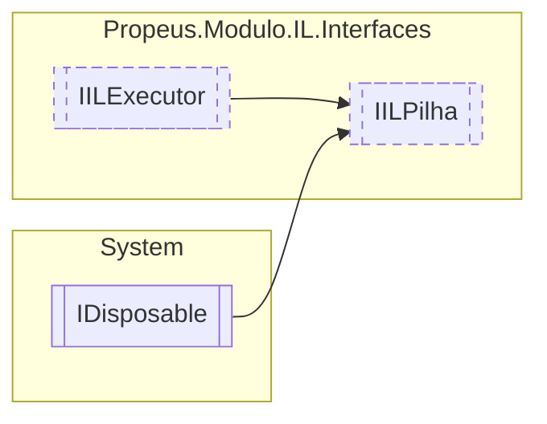

# IILPilha `interface`

## Diagram


## Members
### Properties
#### Public  properties
| Type | Name | Methods |
| --- | --- | --- |
| `OpCode` | [`Code`](#code) | `get` |
| [`ILBuilderProxy`](../proxy/ILBuilderProxy.md) | [`Proxy`](#proxy) | `get` |

## Details
### Inheritance
 - [
`IILExecutor`
](./IILExecutor.md)
 - `IDisposable`

### Properties
#### Code
```csharp
public OpCode Code { get; }
```

#### Proxy
```csharp
public ILBuilderProxy Proxy { get; }
```

*Generated with* [*ModularDoc*](https://github.com/hailstorm75/ModularDoc)
