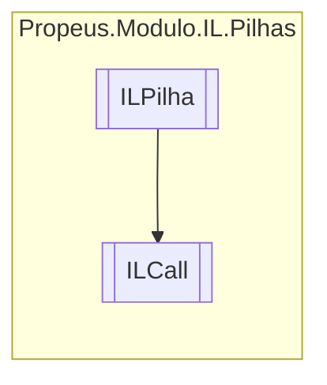

# ILCall `class`

## Description
Chama uma função

## Diagram


## Members
### Properties
#### Public  properties
| Type | Name | Methods |
| --- | --- | --- |
| `MemberInfo` | [`Valor`](#valor) | `get` |

### Methods
#### Public  methods
| Returns | Name |
| --- | --- |
| `void` | [`Executar`](#executar)() |
| `string` | [`ToString`](#tostring)() |

#### Protected  methods
| Returns | Name |
| --- | --- |
| `void` | [`Dispose`](#dispose)(`bool` disposing) |

## Details
### Summary
Chama uma função

### Inheritance
 - [
`ILPilha`
](./ILPilha.md)

### Constructors
#### ILCall [1/4]
[*Source code*](https://github.com///blob//src/Propeus.Modulo.Dinamico/ModuloInformacao.cs#L102)
```csharp
public ILCall(ILBuilderProxy proxy, Type metodo)
```
##### Arguments
| Type | Name | Description |
| --- | --- | --- |
| [`ILBuilderProxy`](../proxy/ILBuilderProxy.md) | proxy |   |
| `Type` | metodo |   |

#### ILCall [2/4]
[*Source code*](https://github.com///blob//src/Propeus.Modulo.Dinamico/ModuloInformacao.cs#L106)
```csharp
public ILCall(ILBuilderProxy proxy, MethodInfo metodo)
```
##### Arguments
| Type | Name | Description |
| --- | --- | --- |
| [`ILBuilderProxy`](../proxy/ILBuilderProxy.md) | proxy |   |
| `MethodInfo` | metodo |   |

#### ILCall [3/4]
[*Source code*](https://github.com///blob//src/Propeus.Modulo.Dinamico/ModuloInformacao.cs#L106)
```csharp
public ILCall(ILBuilderProxy proxy, ConstructorInfo metodo)
```
##### Arguments
| Type | Name | Description |
| --- | --- | --- |
| [`ILBuilderProxy`](../proxy/ILBuilderProxy.md) | proxy |   |
| `ConstructorInfo` | metodo |   |

#### ILCall [4/4]
[*Source code*](https://github.com///blob//src/Propeus.Modulo.Dinamico/ModuloInformacao.cs#L108)
```csharp
public ILCall(ILBuilderProxy proxy, FieldInfo metodo)
```
##### Arguments
| Type | Name | Description |
| --- | --- | --- |
| [`ILBuilderProxy`](../proxy/ILBuilderProxy.md) | proxy |   |
| `FieldInfo` | metodo |   |

### Methods
#### Executar
[*Source code*](https://github.com///blob//src/Propeus.Modulo.Dinamico/ModuloInformacao.cs#L118)
```csharp
public override void Executar()
```

#### Dispose
[*Source code*](https://github.com///blob//src/Propeus.Modulo.Dinamico/ModuloInformacao.cs#L150)
```csharp
protected override void Dispose(bool disposing)
```
##### Arguments
| Type | Name | Description |
| --- | --- | --- |
| `bool` | disposing |   |

#### ToString
[*Source code*](https://github.com///blob//src/Propeus.Modulo.Dinamico/ModuloInformacao.cs#L157)
```csharp
public override string ToString()
```

### Properties
#### Valor
```csharp
public MemberInfo Valor { get; }
```

*Generated with* [*ModularDoc*](https://github.com/hailstorm75/ModularDoc)
