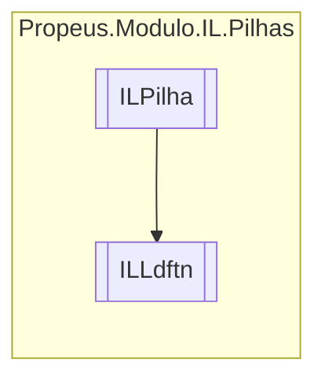

# ILLdftn `class`

## Description
Cria um ponteiro para um metodo

## Diagram


## Members
### Properties
#### Public  properties
| Type | Name | Methods |
| --- | --- | --- |
| `MethodInfo` | [`MethodInfo`](#methodinfo) | `get` |

### Methods
#### Public  methods
| Returns | Name |
| --- | --- |
| `void` | [`Executar`](#executar)() |
| `string` | [`ToString`](#tostring)() |

## Details
### Summary
Cria um ponteiro para um metodo

### Inheritance
 - [
`ILPilha`
](./ILPilha.md)

### Constructors
#### ILLdftn
[*Source code*](https://github.com///blob//src/Propeus.Modulo.Dinamico/Regras/ModuloComAtributoRegra.cs#L12)
```csharp
public ILLdftn(ILBuilderProxy iLBuilderProxy, MethodInfo methodInfo)
```
##### Arguments
| Type | Name | Description |
| --- | --- | --- |
| [`ILBuilderProxy`](../proxy/ILBuilderProxy.md) | iLBuilderProxy |   |
| `MethodInfo` | methodInfo |   |

### Methods
#### Executar
[*Source code*](https://github.com///blob//src/Propeus.Modulo.Dinamico/Regras/ModuloIgnorarRegra.cs#L11)
```csharp
public override void Executar()
```

#### ToString
[*Source code*](https://github.com///blob//src/Propeus.Modulo.Abstrato/Util/Objetos/Helper.cs#L131)
```csharp
public override string ToString()
```

### Properties
#### MethodInfo
```csharp
public MethodInfo MethodInfo { get; }
```

*Generated with* [*ModularDoc*](https://github.com/hailstorm75/ModularDoc)
