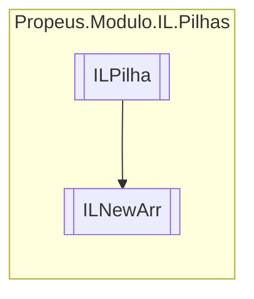

# ILNewArr `class`

## Diagram


## Members
### Properties
#### Public  properties
| Type | Name | Methods |
| --- | --- | --- |
| `Type` | [`Valor`](#valor) | `get` |

### Methods
#### Public  methods
| Returns | Name |
| --- | --- |
| `void` | [`Executar`](#executar)() |
| `string` | [`ToString`](#tostring)() |

#### Protected  methods
| Returns | Name |
| --- | --- |
| `void` | [`Dispose`](#dispose)(`bool` disposing) |

## Details
### Inheritance
 - [
`ILPilha`
](./ILPilha.md)

### Constructors
#### ILNewArr
[*Source code*](https://github.com///blob//src/Propeus.Modulo.Dinamico/Properties/Resources.Designer.cs#L32)
```csharp
public ILNewArr(ILBuilderProxy proxy, Type type)
```
##### Arguments
| Type | Name | Description |
| --- | --- | --- |
| [`ILBuilderProxy`](../proxy/ILBuilderProxy.md) | proxy |   |
| `Type` | type |   |

### Methods
#### Executar
[*Source code*](https://github.com///blob//src/Propeus.Modulo.Dinamico/Properties/Resources.Designer.cs#L58)
```csharp
public override void Executar()
```

#### Dispose
[*Source code*](https://github.com///blob//src/Propeus.Modulo.Dinamico/Properties/Resources.Designer.cs#L67)
```csharp
protected override void Dispose(bool disposing)
```
##### Arguments
| Type | Name | Description |
| --- | --- | --- |
| `bool` | disposing |   |

#### ToString
[*Source code*](https://github.com///blob//src/Propeus.Modulo.Dinamico/Properties/Resources.Designer.cs#L76)
```csharp
public override string ToString()
```

### Properties
#### Valor
```csharp
public Type Valor { get; }
```

*Generated with* [*ModularDoc*](https://github.com/hailstorm75/ModularDoc)
